This document is the source of truth for the resource function it describes. The frontmatter above is the [Function Repository](https://resources.wolframcloud.com/FunctionRepository/) metadata; the Definition section below inlines the implementation from a local `.wl` file; and the example cells are evaluated (with caching) to build the resource's documentation. Running the function on this very file reproduces its own definition notebook, so it publishes itself.

## Definition

The implementation lives across three plain `.wl` files - a tiny shared module that defines the stash protocol used by both this function and its inverse ([NotebookToMarkdown](https://github.com/sw1sh/MarkdownToNotebook/blob/main/NotebookToMarkdown.md)), and the main forward converter. Each cell below inlines one file at conversion time via the `file` option, a general mechanism: any code cell with `#| file: path` is replaced by the contents of that local file or URL, resolved relative to this document. The deployed resource therefore carries both files inline.

```wl
(* MarkdownTools - the tiny shared library used by both MarkdownToNotebook
   (the forward converter, markdown -> notebook) and NotebookToMarkdown (the
   inverse, notebook -> markdown). At the moment it carries one thing - the
   stash protocol that lets a notebook MarkdownToNotebook produced carry the
   original source markdown in its TaggingRules so the inverse can recover it
   verbatim (round-trip without a cell walker). Both converters Get this file
   in so the stash key and read/write helpers stay in agreement; either
   resource can be loaded on its own.

   Deliberately plain top-level definitions (no BeginPackage), the same shape
   as both consumers, so a resource definition notebook can inline this file
   with a "#| file: MarkdownTools.wl" cell and have it work on Get. *)

(* Single source of truth for the TaggingRules key the stash lives under. *)
$markdownSourceKey = "MarkdownToNotebook"

(* Forward direction: stamp a notebook with the original markdown source and
   chosen template name. The forward converter calls this once at the end of
   its build pipeline, so every notebook this code base produces is self-
   contained (the rendered view + the source it came from in one file).
   Merges with existing TaggingRules - the Symbol/Guide path already writes a
   "Metadata" entry, and we add ours alongside without clobbering it. *)
withMarkdownSource[Notebook[cells_, o : OptionsPattern[]], src_String, tmpl_String] := Block[
    {oldRules = Lookup[{o}, TaggingRules, {}], newEntry},
    newEntry = $markdownSourceKey -> <|"Source" -> src, "Template" -> tmpl|>;
    Notebook[cells,
        TaggingRules -> If[ListQ[oldRules],
            Append[DeleteCases[oldRules, $markdownSourceKey -> _], newEntry],
            {newEntry}
        ],
        Sequence @@ FilterRules[{o}, Except[TaggingRules]]
    ]
]
withMarkdownSource[other_, _, _] := other

(* Inverse direction: given a notebook (or its option sequence), return the
   stashed entry as <|"Source" -> ..., "Template" -> ...|>, or a Missing[...]
   that says why the lookup failed. Callers test AssociationQ on the result.
   Implemented through `Replace[key, rules]` (no third argument - that is a
   level spec; a literal default would crash the call when it is an association)
   and then a fallback for the no-match case where Replace returns the key
   itself. *)
markdownSourceOf[Notebook[_, o : OptionsPattern[]]] := markdownSourceOf[{o}]
markdownSourceOf[opts_List] := Block[{tr = Lookup[opts, TaggingRules, {}], hit},
    If[ListQ[tr],
        hit = Replace[$markdownSourceKey, tr];
        If[hit === $markdownSourceKey, Missing["KeyAbsent", $markdownSourceKey], hit],
        Missing["NoTaggingRules"]
    ]
]
markdownSourceOf[_] := Missing["NoSource"]
```

```wl
(* MarkdownToNotebook - convert a literate-markdown document into a Wolfram
   notebook, choosing the layout from a template.

   The source can be a local file path, an http(s) URL, or a raw markdown
   string. The Template frontmatter key selects a registry entry:
     FunctionResource - fill the slots of the official Function Repository
        definition template (its stylesheet and docked Deploy/Submit toolbar
        are preserved), so the .nb is publishable as-is.
     Symbol, Guide - fill the DocumentationTools authoring templates.
     Default - map headings and code directly to standard notebook styles.
   Frontmatter drives metadata; the Definition section is the code; example
   sections become evaluated + cached Input/Output cells.

   Deliberately plain top-level definitions (no BeginPackage): the converter
   Gets this file into a freshly generated private context so converting a
   document cannot clobber the live definition doing the converting. *)

Needs["GeneralUtilities`"]

(* Pull in the shared TaggingRules stash protocol from the sibling
   MarkdownTools.wl. Quiet'd so a deployed resource notebook (which inlines
   MarkdownTools.wl as a separate "## Definition" cell that runs first) does
   not fire Get::noopen when there is no file on disk to load. *)
Quiet @ Get[FileNameJoin[{Directory[], "MarkdownTools.wl"}]]

mdSep = "\n(*--cell--*)\n"

(* === frontmatter === *)

stripQuotes[s_String] := StringReplace[StringTrim[s], {
    StartOfString ~~ "\"" ~~ v___ ~~ "\"" ~~ EndOfString :> v,
    StartOfString ~~ "'" ~~ v___ ~~ "'" ~~ EndOfString :> v
}]

(* split a bracketed list body on commas that are not inside double quotes, so a
   quoted item (e.g. a citation) keeps its internal commas *)
splitListItems[s_String] := Block[{acc = {}, cur = "", inQ = False},
    Do[
        Which[
            c === "\"", inQ = ! inQ; cur = cur <> c,
            c === "," && ! inQ, AppendTo[acc, cur]; cur = "",
            True, cur = cur <> c
        ],
        {c, Characters[s]}
    ];
    Append[acc, cur]
]

parseFmValue[s_String] := Block[{t = StringTrim[s]},
    Which[
        StringMatchQ[t, "[" ~~ ___ ~~ "]"],
            stripQuotes /@ Select[StringTrim /@ splitListItems[StringTake[t, {2, -2}]], # =!= "" &]
        ,
        MemberQ[{"true", "false"}, ToLowerCase[t]],
            ToLowerCase[t] === "true"
        ,
        True,
            stripQuotes[t]
    ]
]

yamlLine[line_String] := Block[{parts = StringSplit[line, ":", 2]},
    StringTrim[First[parts]] -> parseFmValue[Last[parts]]
]

parseYamlish[lines_List] := Association @ Map[yamlLine, Select[lines, StringContainsQ[#, ":"] &]]

extractFrontmatter[text_String] := Block[{lines, close},
    lines = StringSplit[text, "\n"];
    If[ lines === {} || StringTrim[First[lines]] =!= "---",
        Return[{<||>, text}]
    ];
    close = SelectFirst[Range[2, Length[lines]], StringTrim[lines[[#]]] === "---" &, 0];
    If[ close === 0,
        Return[{<||>, text}]
    ];
    {parseYamlish[lines[[2 ;; close - 1]]], StringRiffle[lines[[close + 1 ;;]], "\n"]}
]

(* === block parsing === *)

fenceQ[line_String] := StringMatchQ[StringTrim[line], "```" ~~ ___]

headingQ[line_String] := StringMatchQ[line, ("#" ..) ~~ " " ~~ ___]

headingBlock[line_String] := Block[{hashes},
    hashes = First @ StringCases[StringTrim[line], StartOfString ~~ h : ("#" ..) :> h];
    <|
        "Type" -> "Heading",
        "Level" -> StringLength[hashes],
        "Text" -> StringTrim @ StringReplace[StringTrim[line], StartOfString ~~ ("#" ..) ~~ " " -> ""]
    |>
]

parseOptionValue[s_String] := Which[
    MemberQ[{"true", "yes"}, ToLowerCase[StringTrim[s]]], True,
    MemberQ[{"false", "no"}, ToLowerCase[StringTrim[s]]], False,
    True, stripQuotes[s]
]

cellOptionLine[line_String] := Block[{parts = StringSplit[StringReplace[StringTrim[line], StartOfString ~~ "#|" -> ""], ":", 2]},
    StringTrim[First[parts]] -> parseOptionValue[Last[parts]]
]

parseCellOptions[lines_List] := Association @ Map[cellOptionLine, Select[lines, StringContainsQ[#, ":"] &]]

codeBlock[info_String, bodyLines_List] := Block[{optLines, codeLines},
    optLines = TakeWhile[bodyLines, StringMatchQ[StringTrim[#], "#|" ~~ ___] &];
    codeLines = Drop[bodyLines, Length[optLines]];
    <|
        "Type" -> "Code",
        "Lang" -> First[StringSplit[ToLowerCase @ StringDelete[info, {"{", "}"}]], ""],
        "Options" -> parseCellOptions[optLines],
        "Code" -> StringRiffle[codeLines, "\n"]
    |>
]

fenceSplit[{}, collected_] := {Reverse[collected], {}}
fenceSplit[lines_List, collected_] := If[ fenceQ[First[lines]],
    {Reverse[collected], Rest[lines]},
    fenceSplit[Rest[lines], Prepend[collected, First[lines]]]
]

paraSplit[{}, collected_] := {Reverse[collected], {}}
paraSplit[lines_List, collected_] := Block[{line = First[lines]},
    If[ StringTrim[line] === "" || fenceQ[line] || headingQ[line] || listItemQ[line] ||
            orderedItemQ[line] || blockquoteQ[line] || mathBlockOpenQ[line],
        {Reverse[collected], lines},
        paraSplit[Rest[lines], Prepend[collected, line]]
    ]
]

(* markdown list items: "- ", "* " or "+ " (the marker is stripped). Tested by
   explicit character checks, not a string pattern: a bare "*" in a
   StringExpression is the wildcard metacharacter, not a literal asterisk. *)
listItemQ[line_String] := Block[{t = StringTrim[line]},
    StringLength[t] >= 2 && MemberQ[{"-", "*", "+"}, StringTake[t, 1]] && StringTake[t, {2}] === " "
]

listText[line_String] := taskCheckbox @ StringTrim @ StringDrop[StringTrim[line], 2]

(* a GitHub task-list item "[ ] ..." / "[x] ..." -> a ballot-box glyph before the
   text (unchecked U+2610, checked U+2611), so the checkbox renders instead of a
   literal "[ ]". *)
taskCheckbox[t_String] := Which[
    StringStartsQ[t, "[ ] "], "\:2610 " <> StringDrop[t, 4],
    StringStartsQ[t, "[x] " | "[X] "], "\:2611 " <> StringDrop[t, 4],
    True, t
]

(* ordered list items: "1. ", "2) ", ... (a run of digits, then "." or ")", then a
   space). The marker is dropped; the List block is tagged "Ordered" so it renders
   numbered. *)
orderedItemQ[line_String] := StringMatchQ[StringTrim[line], DigitCharacter .. ~~ ("." | ")") ~~ " " ~~ ___]
orderedText[line_String] := StringTrim @ StringReplace[StringTrim[line], StartOfString ~~ DigitCharacter .. ~~ ("." | ")") ~~ " " -> ""]
orderedSplit[{}, collected_] := {Reverse[collected], {}}
orderedSplit[lines_List, collected_] := With[{line = First[lines]},
    Which[
        orderedItemQ[line],
            orderedSplit[Rest[lines], Prepend[collected, orderedText[line]]],
        collected =!= {} && listContinuationQ[line],
            orderedSplit[Rest[lines],
                Prepend[Rest[collected], First[collected] <> " " <> StringTrim[line]]],
        True,
            {Reverse[collected], lines}
    ]
]

(* a "$$ ... $$" line (or a "$$"-fenced block across multiple lines) is display math.
   Detected separately from inline "$math$" so it can become a centered DisplayFormula
   block rather than be mis-parsed as broken inline math on either side. *)
mathBlockOpenQ[line_String] := StringStartsQ[StringTrim[line], "$$"]
mathBlockClosedQ[line_String] := Block[{t = StringTrim[line]}, StringLength[t] >= 4 && StringStartsQ[t, "$$"] && StringEndsQ[t, "$$"]]

mathBlockGather[lines_List] := Block[{first = StringTrim @ First[lines], rest = Rest[lines], idx},
    If[ mathBlockClosedQ[First[lines]],
        {StringTrim @ StringTake[first, {3, -3}], rest},
        idx = FirstPosition[rest, l_String /; StringEndsQ[StringTrim[l], "$$"], {0}, {1}, Heads -> False];
        If[ idx === {0},
            (* unterminated: take everything after the opening "$$" as content *)
            {StringTrim @ StringDrop[first, 2], rest},
            With[{n = First[idx]},
                {StringTrim @ StringRiffle[Join[
                    {StringDrop[first, 2]},
                    rest[[1 ;; n - 1]],
                    {StringDrop[StringTrim[rest[[n]]], -2]}
                ], "\n"], rest[[n + 1 ;;]]}
            ]
        ]
    ]
]

(* blockquote lines start with ">". Consecutive lines are gathered and the marker
   ("> " or ">") stripped; the joined text becomes a "Quote" block. *)
blockquoteQ[line_String] := StringStartsQ[StringTrim[line], ">"]
quoteText[line_String] := StringReplace[StringTrim[line], StartOfString ~~ ">" ~~ (" " | "") -> ""]
quoteSplit[{}, collected_] := {Reverse[collected], {}}
quoteSplit[lines_List, collected_] := If[ blockquoteQ[First[lines]],
    quoteSplit[Rest[lines], Prepend[collected, quoteText[First[lines]]]],
    {Reverse[collected], lines}
]

(* a thematic break - a line of only "-", "_" or "*" (3+) between blank lines -
   is an explicit example separator (an ExampleDelimiter). Frontmatter "---" is
   already stripped, and "|---|" table rules contain "|", so neither matches.
   Tested by explicit character checks: in a string pattern a bare "*" is the
   wildcard metacharacter, so StringMatchQ[t, "*"..] would match anything. *)
separatorQ[line_String] := Block[{chars = Characters[StringTrim[line]]},
    Length[chars] >= 3 && MemberQ[{"-", "_", "*"}, First[chars, ""]] && Length[DeleteDuplicates[chars]] === 1
]

(* a continuation line under a list item: any non-empty, non-marker-starting
   line that does not itself open a new block. Standard markdown indents the
   continuation under the bullet's text column (2-4 spaces); we accept any
   leading whitespace and fall back to a plain non-list line, so wrapped
   prose under a bullet folds into the same item instead of breaking the list
   into "one item + a paragraph + another item + a paragraph + ..." (which is
   what the user sees as "6 bullets instead of 3"). *)
listContinuationQ[line_String] := StringLength[line] > 0 &&
    StringStartsQ[line, " " | "\t"] && StringTrim[line] =!= "" &&
    ! listItemQ[line] && ! orderedItemQ[line] && ! headingQ[line] &&
    ! fenceQ[line] && ! blockquoteQ[line] && ! mathBlockOpenQ[line]

(* collect a markdown list, folding indented continuation lines into the
   current item (joined with a single space, the way a CommonMark renderer
   would). `collected` is built in reverse - the first element is the current
   item being extended, so prepending a new item makes that the new "current". *)
listSplit[{}, collected_] := {Reverse[collected], {}}
listSplit[lines_List, collected_] := With[{line = First[lines]},
    Which[
        listItemQ[line],
            listSplit[Rest[lines], Prepend[collected, listText[line]]],
        collected =!= {} && listContinuationQ[line],
            listSplit[Rest[lines],
                Prepend[Rest[collected], First[collected] <> " " <> StringTrim[line]]],
        True,
            {Reverse[collected], lines}
    ]
]

(* GitHub-flavored tables: a "| a | b |" row whose next line is a "|---|---|"
   separator. Cells are split on "|" with the outer pipes trimmed. *)
tableRowLineQ[line_String] := StringContainsQ[line, "|"] && StringTrim[line] =!= "" && ! fenceQ[line] && ! headingQ[line]

tableSepQ[line_String] := StringContainsQ[line, "-"] && StringContainsQ[line, "|"] &&
    StringMatchQ[StringTrim[line], ("|" | ":" | "-" | " ") ..]

splitTableRow[line_String] := StringTrim /@ StringSplit[StringTrim[StringTrim[line], "|"], "|"]

tableSplit[{}, collected_] := {Reverse[collected], {}}
tableSplit[lines_List, collected_] := If[ tableRowLineQ[First[lines]],
    tableSplit[Rest[lines], Prepend[collected, First[lines]]],
    {Reverse[collected], lines}
]

(* markdown image on its own line:  or . The
   optional title is read as an effect keyword - "papertear" applies the front
   end's Paper Tear background to the inlined image's cell. *)
imageLineQ[line_String] := StringMatchQ[StringTrim[line], ""]

parseImageTarget[rest_String] := Block[{
    m = StringCases[StringTrim[rest],
        StartOfString ~~ p : Shortest[Except["\""] ..] ~~ "\"" ~~ t : Shortest[___] ~~ "\"" ~~ EndOfString :> {StringTrim[p], t}, 1]
},
    If[m === {}, {StringTrim[rest], ""}, First[m]]
]

imageBlock[line_String] := First @ StringCases[StringTrim[line],
    "![" ~~ alt : Shortest[Except["]"] ...] ~~ "](" ~~ rest : Shortest[Except[")"] ..] ~~ ")" :>
        With[{pt = parseImageTarget[rest]}, <|"Type" -> "Image", "Alt" -> alt, "Path" -> First[pt], "Effect" -> Last[pt]|>]]

blockLoop[{}, acc_] := Reverse[acc]
blockLoop[lines_List, acc_] := Block[{line = First[lines], rest = Rest[lines], split},
    Which[
        StringTrim[line] === "",
            blockLoop[rest, acc]
        ,
        fenceQ[line],
            split = fenceSplit[rest, {}];
            blockLoop[Last[split], Prepend[acc, codeBlock[StringReplace[StringTrim[line], StartOfString ~~ "```" -> ""], First[split]]]]
        ,
        headingQ[line],
            blockLoop[rest, Prepend[acc, headingBlock[line]]]
        ,
        imageLineQ[line],
            blockLoop[rest, Prepend[acc, imageBlock[line]]]
        ,
        separatorQ[line],
            blockLoop[rest, Prepend[acc, <|"Type" -> "Separator"|>]]
        ,
        blockquoteQ[line],
            split = quoteSplit[lines, {}];
            blockLoop[Last[split], Prepend[acc, <|"Type" -> "Quote", "Text" -> StringRiffle[First[split], " "]|>]]
        ,
        mathBlockOpenQ[line],
            split = mathBlockGather[lines];
            blockLoop[Last[split], Prepend[acc, <|"Type" -> "MathBlock", "Text" -> First[split]|>]]
        ,
        tableRowLineQ[line] && rest =!= {} && tableSepQ[First[rest]],
            split = tableSplit[lines, {}];
            With[{rows = splitTableRow /@ First[split]},
                blockLoop[Last[split], Prepend[acc, <|"Type" -> "Table", "Header" -> First[rows], "Rows" -> Drop[rows, 2]|>]]
            ]
        ,
        listItemQ[line],
            split = listSplit[lines, {}];
            blockLoop[Last[split], Prepend[acc, <|"Type" -> "List", "Items" -> First[split]|>]]
        ,
        orderedItemQ[line],
            split = orderedSplit[lines, {}];
            blockLoop[Last[split], Prepend[acc, <|"Type" -> "List", "Ordered" -> True, "Items" -> First[split]|>]]
        ,
        True,
            split = paraSplit[lines, {}];
            blockLoop[Last[split], Prepend[acc, <|"Type" -> "Prose", "Text" -> StringRiffle[First[split], " "]|>]]
    ]
]

parseBlocks[body_String] := blockLoop[StringSplit[body, "\n"], {}]

(* drop HTML/markdown comments (e.g. "<!-- => 21. -->" output annotations) *)
stripComments[s_String] := StringReplace[s, "<!--" ~~ Shortest[___] ~~ "-->" -> ""]

litParse[text_String] := Block[{fm = extractFrontmatter[text]},
    <|"Metadata" -> First[fm], "Blocks" -> parseBlocks[stripComments[Last[fm]]]|>
]

(* === source resolution ===
   The entry accepts a local file path, an http(s) URL, or a raw markdown
   string. Resolution yields the text, a base for "#| file:" includes, a name
   for the default output, and whether the source is a local file. *)

urlQ[s_String] := StringMatchQ[s, ("http://" | "https://") ~~ ___]

joinSource[base_String, path_String] := If[ urlQ[base],
    StringTrim[base, "/"] <> "/" <> path,
    FileNameJoin[{base, path}]
]

resolveSource[input_String] := Which[
    urlQ[input],
        <|"Text" -> Import[input, "Text"], "Base" -> StringReplace[input, RegularExpression["/[^/]*$"] -> ""], "Name" -> FileBaseName @ Last @ StringSplit[input, "/"], "Local" -> False, "Id" -> input|>
    ,
    FileExistsQ[input],
        <|"Text" -> Import[input, "Text"], "Base" -> DirectoryName[input], "Name" -> FileBaseName[input], "Local" -> True, "Id" -> input|>
    ,
    True,
        <|"Text" -> input, "Base" -> Directory[], "Name" -> "Notebook", "Local" -> False, "Id" -> input|>
]

(* a code cell carrying a "file" option inlines that file's contents as its
   body, resolved (file or URL) relative to the document; a markdown image block
   imports its image (file or URL) relative to the document. Both resolutions
   happen here because the document base is known. *)
resolveBlock[b_Association, base_String] := Which[
    b["Type"] === "Code" && KeyExistsQ[b["Options"], "file"],
        Append[b, "Code" -> Import[joinSource[base, b["Options"]["file"]], "Text"]],
    b["Type"] === "Image",
        Append[b, "Image" -> Quiet @ Import[joinSource[base, b["Path"]]]],
    True, b
]

resolveIncludes[blocks_List, base_String] := Map[resolveBlock[#, base] &, blocks]

(* === sections === *)

sectionsFrom[blocks_List] := Block[{step, init},
    init = <|"key" -> "", "acc" -> <||>|>;
    step[state_, b_] := Which[
        b["Type"] === "Heading" && b["Level"] <= 2,
            <|"key" -> ToLowerCase[b["Text"]], "acc" -> Append[state["acc"], ToLowerCase[b["Text"]] -> {}]|>
        ,
        state["key"] === "",
            state
        ,
        True,
            <|"key" -> state["key"], "acc" -> MapAt[Append[#, b] &, state["acc"], Key[state["key"]]]|>
    ];
    Fold[step, init, blocks]["acc"]
]

executableQ[b_] := b["Type"] === "Code" && MemberQ[{"wl", "wolfram", "mathematica"}, b["Lang"]] && TrueQ[Lookup[b["Options"], "eval", True]]

sectionCells[sections_, key_] := Cases[Lookup[sections, key, {}], b_ /; executableQ[b]]

sectionCode[sections_, key_] := StringRiffle[#["Code"] & /@ sectionCells[sections, key], "\n\n"]

sectionText[sections_, key_] := StringRiffle[
    Cases[Lookup[sections, key, {}], b_ /; b["Type"] === "Prose" :> StringReplace[b["Text"], "`" -> ""]],
    " "
]

(* === notebook evaluation with a cumulative-hash cache ===
   All executable cells are evaluated in document order, threading state, so a
   cell's cache key depends on every cell before it (whole-notebook sequence). *)

cumulativeHashes[cells_List] := Map[Hash, Rest @ FoldList[#1 <> mdSep <> #2["Code"] &, "", cells]]

(* the light/dark mode example renderings are pinned to. Default light (the
   deployed notebook is light); the markdown-out twin sets it to "Dark". Guard the
   initialization with ValueQ so re-loading this file (the Definition cell inlines
   and evaluates the whole .wl during conversion) does not clobber an override. *)
If[! ValueQ[$lightDark], $lightDark = "Light"]

(* conversion nesting depth. A self-referential example (a doc whose example calls
   MarkdownToNotebook on a document, e.g. the function on its own GitHub source)
   would otherwise re-evaluate that document's examples, and so on without end. So
   only the top-level conversion evaluates examples; a nested one builds the
   notebook with its example cells left unevaluated (input only). *)
If[! ValueQ[$convertDepth], $convertDepth = 0]

(* the notebook a result stands for (a Notebook expression, or the open notebook of
   a NotebookObject), pinned to the current mode. The Resource templates
   (FunctionResource / Example / Data) come from DefinitionNotebookClient with
   LightDark -> "Light" already baked in; appending a second LightDark would
   leave both in the option sequence and the front end would honour the first
   (Light) one, so strip any existing LightDark before setting ours. *)
resultNotebook[res_] := Block[{nb = If[Head[res] === NotebookObject, NotebookGet[res], res]},
    nb /. Notebook[c_, o___] :> Notebook[c, Sequence @@ DeleteCases[{o}, LightDark -> _], LightDark -> $lightDark]
]

(* output for an evaluated cell. A whole notebook has no faithful inline form -
   inlining its cells breaks the surrounding layout (a Title/Section renders
   document-wide; a CellFrame is just a per-cell option, it does not bound a group).
   So a produced notebook is shown as a *rendered thumbnail*: a NotebookObject (the
   notebook itself, opened with NotebookPut, as published WFR functions return) is
   rasterized and closed, the WFR-canonical display; a bare Notebook *expression*
   opts into the same rasterization with "#| screenshot: true" (otherwise it is
   shown as its literal expression boxes). *)
(* keep a rasterized cell image under the resource Check's "large cell area"
   threshold (~500k pixels). Cap both the long dimension and the area to keep
   the cell from tripping LargeCellBounds while still showing the content
   readably. *)
$rasterMaxLongDim = 1200
$rasterMaxArea = 480000
capRaster[img_] := If[ ! ImageQ[img], img,
    Block[{w, h, longDim, area, scale},
        {w, h} = ImageDimensions[img];
        longDim = Max[w, h];
        area = w h;
        scale = Min[1, $rasterMaxLongDim / longDim, Sqrt[$rasterMaxArea / area]];
        If[scale < 1, ImageResize[img, Round[scale {w, h}]], img]
    ]
]

outputBoxes[res_, opts_] := Which[
    res === Null, Null,
    Head[res] === NotebookObject,
        (* a whole-notebook thumbnail can be enormous; rasterize at a lower
           resolution and cap the height so the cell does not trip the analysis
           "huge raster" / "large screen area" checks, while still showing the
           entire notebook. *)
        With[{img = Quiet @ Rasterize[resultNotebook[res], ImageResolution -> 96]},
            Quiet @ NotebookClose[res];
            ToBoxes @ capRaster[img]],
    TrueQ[Lookup[opts, "screenshot", False]] && Head[res] === Notebook,
        ToBoxes @ capRaster @ Quiet @ Rasterize[resultNotebook[res], ImageResolution -> 144],
    True, ToBoxes[res]
]

(* a captured message string -> a notebook "Message" cell. captureMessages
   redirects $Messages to a write stream and we read the printed text back
   verbatim, so the cell text is exactly the line the kernel itself printed -
   no template lookup, no arg substitution to redo. *)
messageCell[s_String] := Cell[s, "Message", "MSG"]
messageCell[hf_] := Cell[ToString[hf, InputForm], "Message", "MSG"]

(* Plain-text rendering of a captured message for the markdown twin: just a
   blockquote with each line prefixed. The message text is whatever the kernel
   itself would print to $Messages, so what shows up is exactly what an
   interactive user would see fire for that cell. *)
messageMd[s_String] := "> " <> StringReplace[StringTrim[s], "\n" -> "\n> "]
messageMd[_] := ""

(* Capture the messages the kernel would *print* during evaluation, by
   redirecting $Messages to a private write stream. This is the proper fix
   for the "ton of garbage in the twin" problem - Internal`HandlerBlock
   captures every fired message, including the 50k OptionValue::optnf and
   General::newsym Wolfram's own framework fires per Plot and which the
   kernel's normal message printer silently swallows (most of them have
   $Off-style suppression, are inside an Internal`InheritedBlock[{$Off}, ...]
   in Charting, or hit General::stop). Redirecting the print stream is the
   *one* mechanism that respects all of those: whatever the kernel decides
   to actually print, we capture verbatim. *)
captureMessages[expr_] := Module[{tmp, stream, res, txt, msgs},
    tmp = FileNameJoin[{$TemporaryDirectory,
        "mtnb-msg-" <> IntegerString[$KernelID, 36] <> "-" <>
        IntegerString[RandomInteger[10^9], 36] <> ".txt"}];
    stream = OpenWrite[tmp];
    res = Block[{$Messages = {stream}}, expr];
    Close[stream];
    txt = If[FileExistsQ[tmp], Quiet @ Import[tmp, "Text"], ""];
    Quiet @ DeleteFile[tmp];
    msgs = If[StringQ[txt] && StringTrim[txt] =!= "",
        DeleteCases[Map[StringTrim, StringSplit[txt, "\n\n"]], ""],
        {}];
    {res, msgs}
]
SetAttributes[captureMessages, HoldFirst]

accumEval[state_, b_] := Block[{code = state["code"] <> mdSep <> b["Code"], res, msgs, tmp},
    (* Get a temp package so every top-level statement runs (ToExpression on a
       multi-statement string only takes the first); Get returns the last value. *)
    tmp = FileNameJoin[{$TemporaryDirectory, "mtnb-cell-" <> IntegerString[Hash[code], 36] <> ".wl"}];
    Export[tmp, b["Code"], "Text"];
    {res, msgs} = captureMessages @ Get[tmp];
    <|"code" -> code,
      "out" -> Append[state["out"], Hash[code] -> <|"out" -> outputBoxes[res, b["Options"]], "msgs" -> msgs|>]|>
]

(* Pre-load the paclets on the context path so their auto-load chatter
   (General::newsym for each interned symbol, ::shdw for cross-context shadowing,
   Pattern::patv from package-private code) fires here, OUTSIDE the per-cell
   capture scope. Without this, the first cell that references a paclet symbol
   ends up "owning" hundreds of bookkeeping messages that have nothing to do
   with what the user wrote - the FE never shows them either, since by the time
   the user clicks Run the paclet is already loaded. Silence anything that
   leaks during the load itself via Quiet - if the paclet genuinely fails to
   load, the first cell that uses it will surface a real error. *)
preloadContextPath[ctxPath_List] :=
    Quiet @ Scan[Quiet @ Check[Needs[#], Null] &, Select[ctxPath, # =!= "System`" &]]

(* a front end is active for the whole pass so an example may open the notebook it
   produces (NotebookPut) and have its thumbnail captured (see outputBoxes). *)
evaluateAll[cells_List, ctx_String, ctxPath_List] := Block[{$Context = ctx, $ContextPath = ctxPath},
    preloadContextPath[ctxPath];
    UsingFrontEnd[Fold[accumEval, <|"code" -> "", "out" -> <||>|>, cells]]["out"]
]

(* attach each executable block's output (by cumulative hash) so builders read
   block["OutputBoxes"] / block["Messages"] directly instead of recomputing hashes.
   The cache entry is normally an Association <|"out" -> boxes, "msgs" -> {...}|>;
   accept the legacy raw-boxes form too (older cache entries with no message data). *)
annotateOutputs[blocks_List, hashes_List, outputs_] := Block[{i = 0, entry, out, msgs},
    Map[
        b |-> If[ executableQ[b],
            (i += 1;
             entry = Lookup[outputs, hashes[[i]], Missing[]];
             {out, msgs} = If[AssociationQ[entry] && KeyExistsQ[entry, "out"],
                 {entry["out"], Lookup[entry, "msgs", {}]},
                 {entry, {}}
             ];
             Append[Append[b, "OutputBoxes" -> out], "Messages" -> msgs]),
            b
        ],
        blocks
    ]
]

(* === notebook cell builders === *)

(* known example-section keys, in canonical render order. The list is the union of
   conventions across templates (FunctionResource uses Basic / Scope / Options / ... ;
   Data uses Basic / Scope & Additional Elements / Visualizations / Analysis); each
   doc supplies whatever subset is meaningful, and exampleNotebookSlot renders only
   the present sections in this order. *)
$exampleOrder = {
    "basic examples", "scope", "scope & additional elements", "options", "applications",
    "visualizations", "analysis",
    "properties and relations", "possible issues", "neat examples"
}

$exampleTitle = <|
    "basic examples" -> "Basic Examples",
    "scope" -> "Scope",
    "scope & additional elements" -> "Scope & Additional Elements",
    "options" -> "Options",
    "applications" -> "Applications",
    "visualizations" -> "Visualizations",
    "analysis" -> "Analysis",
    "properties and relations" -> "Properties and Relations",
    "possible issues" -> "Possible Issues",
    "neat examples" -> "Neat Examples"
|>

$osCanonical = <|
    "windows" -> "Windows", "mac" -> "MacOSX", "macosx" -> "MacOSX",
    "linux" -> "Unix", "unix" -> "Unix"
|>

asList[x_List] := x
asList[x_] := {x}

(* a TemplateSlot's default content, used as both the cell shape to clone and
   the fallback when the markdown supplies nothing for that slot. *)
slotDefault[opts_List] := FirstCase[opts, (DefaultValue -> v_) :> v, {}]

(* drop the markers that flag a cell as an unfilled template placeholder *)
cleanCell[cell_] := DeleteCases[
    cell /. (CellTags -> t_) :> (CellTags -> DeleteCases[Flatten[{t}], "DefaultContent"]),
    CellID -> _,
    {1}
]

fillTextCells[opts_, text_String] := Block[{def = slotDefault[opts]},
    If[ def === {} || text === "",
        def,
        {cleanCell @ ReplacePart[First[def], 1 -> text]}
    ]
]

(* like fillTextCells, but the text keeps its inline formatting (`code` spans
   become templated InlineFormula, links become hyperlinks) by replacing the
   cell content with TextData rather than a bare string. *)
fillTextDataCells[opts_, text_String] := Block[{def = slotDefault[opts]},
    If[ def === {} || StringTrim[text] === "",
        def,
        {cleanCell @ ReplacePart[First[def], 1 -> TextData @ inlineTextData[text]]}
    ]
]

fillListCells[opts_, items_List] := Block[{def = slotDefault[opts], vals = DeleteCases[items, ""]},
    If[ def === {} || vals === {},
        def,
        Map[cleanCell @ ReplacePart[First[def], 1 -> #] &, vals]
    ]
]

(* like fillListCells, but an item may be a markdown link [label](url), rendered
   as a labeled hyperlink (the resource Check asks for labeled links, not raw
   URLs); a plain string stays as text. The ButtonBox sits directly in TextData
   (not inside BoxData) so the label stays a String literal - inside BoxData the
   front end would reparse a multi-word label into a RowBox, which the resource
   scraper's ButtonBox[_String, ...] link pattern would then miss. *)
linkItemContent[item_String] := Block[{
    m = StringCases[item, "[" ~~ t : Shortest[Except["]"] ..] ~~ "](" ~~ u : Shortest[Except[")"] ..] ~~ ")" :> {t, u}, 1]
},
    If[ m === {},
        item,
        TextData[{ButtonBox[First @ First @ m, BaseStyle -> "Hyperlink", ButtonData -> {URL[Last @ First @ m], None}]}]
    ]
]

fillLinkCells[opts_, items_List] := Block[{def = slotDefault[opts], vals = DeleteCases[items, ""]},
    If[ def === {} || vals === {},
        def,
        Map[cleanCell @ ReplacePart[First[def], 1 -> linkItemContent[#]] &, vals]
    ]
]

fillCheckbox[property_String, checked_List, type_String : "Function"] := {
    DefinitionNotebookClient`CheckboxesCell[<|
        "ResourceType" -> type, "Property" -> property, "Checked" -> checked
    |>]
}

(* literal input boxes for a code string: parse it through the front end the way
   typing it would (ReparseBoxStructurePacket), so the boxes are the *code*.
   ToBoxes[Defer[...]] instead *renders* display heads (Framed, Style, Grid, Row,
   RGBColor, ...) into frames/swatches, corrupting the Input cell. Fall back to
   the Defer parse, then the raw string, if the front end is unavailable. *)
inputBoxes[code_String] := Block[{boxes, parsed},
    boxes = Quiet @ UsingFrontEnd @ MathLink`CallFrontEnd[FrontEnd`ReparseBoxStructurePacket[StringTrim[code]]];
    If[ FreeQ[boxes, $Failed] && (StringQ[boxes] || ! AtomQ[boxes]),
        boxes,
        parsed = Quiet @ ToExpression[code, StandardForm, Defer];
        If[parsed === $Failed, code, ToBoxes[parsed]]
    ]
]

(* extra options for an example's Output cell, from the code cell's "#|" options.
   "#| background: papertear" sets BackgroundAppearance -> "PaperTear", the cell
   option the front end's Convert To > Paper Tear menu item toggles - a torn-paper
   edge, used to make a generated-notebook screenshot look like a screenshot. *)
(* "#| tear: ..." gives an output cell the front end's torn-paper appearance. The
   tear only shows once the cell is height-constrained, so it also sets a CellSize:
   "#| tear: h" keeps the top h points visible (smaller tears more off), while
   "#| tear: true" (or yes / auto) uses a default height. "#| tear: false" (or no
   tear option) leaves the output untorn. *)
$defaultTearHeight = 200

paperTearQ[block_] := Lookup[block["Options"], "tear", False] =!= False

tearHeight[block_] := With[{v = Lookup[block["Options"], "tear", True]},
    Which[
        NumberQ[v], v,
        StringQ[v] && NumberQ[Quiet @ ToExpression[v]], ToExpression[v],
        True, $defaultTearHeight
    ]
]

extraOutputOpts[block_] := If[
    paperTearQ[block],
    {BackgroundAppearance -> "PaperTear", CellSize -> {Automatic, tearHeight[block]}},
    {}
]

exampleIO[code_String, outBoxes_, n_Integer, outOpts_List : {}, msgs_List : {}] := Block[{
    inCell = Cell[BoxData[inputBoxes[code]], "Input", CellLabel -> "In[" <> ToString[n] <> "]:= "],
    msgCells = messageCell /@ msgs,
    outCell
},
    If[ MissingQ[outBoxes] || outBoxes === Null,
        Join[{inCell}, msgCells],
        outCell = Cell[BoxData[outBoxes], "Output", CellLabel -> "Out[" <> ToString[n] <> "]= ", Sequence @@ outOpts];
        {Cell[CellGroupData[Flatten[{inCell, msgCells, outCell}], Open]]}
    ]
]

(* a documentation *flag* - the front end's Futurize / Excise / ... toolbar
   buttons, which mark a page or cell for the doc build (DocumentationBuild reads
   these flag-styled banner cells to include, hide, or defer content). A
   document-level flag is the "Flag" frontmatter key; a per-cell flag is a code
   cell's "#| flag: ..." option. The value is a friendly name mapped to the build's
   flag cell style and its spaced-out banner text. *)
$flagStyles = <|
    "future" -> "FutureFlag", "futurize" -> "FutureFlag",
    "excised" -> "ExcisedFlag", "excise" -> "ExcisedFlag",
    "obsolete" -> "ObsoleteFlag",
    "temporary" -> "TemporaryFlag",
    "preview" -> "PreviewFlag",
    "internal" -> "InternalFlag"
|>
$flagBanners = <|
    "FutureFlag" -> "F  U  T  U  R  E",
    "ExcisedFlag" -> "E  X  C  I  S  E  D",
    "ObsoleteFlag" -> "O  B  S  O  L  E  T  E",
    "TemporaryFlag" -> "T  E  M  P  O  R  A  R  Y",
    "PreviewFlag" -> "P  R  E  V  I  E  W",
    "InternalFlag" -> "I  N  T  E  R  N  A  L"
|>
flagCell[v_String] := With[{s = Lookup[$flagStyles, ToLowerCase[StringTrim[v]], None]},
    If[s === None, Nothing, Cell[$flagBanners[s], s]]]
flagCell[_] := Nothing

(* prefix a list of cells with the block's per-cell flag banner ("#| flag: ...") *)
withCellFlag[block_, cells_List] := With[{f = flagCell[Lookup[block["Options"], "flag", ""]]},
    If[f === Nothing, cells, Prepend[cells, f]]]

(* an example's cells (Input / Output), prefixed with its per-cell flag banner *)
exampleIOFor[block_, n_Integer] :=
    withCellFlag[block, exampleIO[block["Code"], block["OutputBoxes"], n, extraOutputOpts[block], Lookup[block, "Messages", {}]]]

(* a document-level flag banner ("Flag" frontmatter) prepended to the notebook *)
applyDocFlag[nb_, ""] := nb
applyDocFlag[Notebook[cells_, o___], v_String] := With[{f = flagCell[v]},
    If[f === Nothing, Notebook[cells, o], Notebook[Prepend[cells, f], o]]]
applyDocFlag[nb_, _] := nb

(* the filled function-definition cell. It must carry the "DefaultContent" cell
   tag the official template puts on every content cell, or the resource scraper
   (and the submission Check) does not recognize it as the function's definition. *)
functionSlot[opts_, defCode_String] := If[ defCode === "",
    slotDefault[opts],
    {Cell[BoxData[defCode], "Code", CellTags -> {"DefaultContent"}, InitializationCell -> True]}
]

(* the content-defining cells of an Example Repository resource (the "ContentElements"
   slot). An Example resource exposes named content via ResourceData, so each
   executable cell in a "## Content" section is the literal defining assignment
   (typically ResourceData[ResourceObject[EvaluationNotebook[]], "name"] = value) and
   becomes an Input cell carrying the "DefaultContent" tag the scraper needs. *)
codeBlockQ[b_] := b["Type"] === "Code" && MemberQ[{"wl", "wolfram", "mathematica"}, b["Lang"]]

contentSlot[opts_, sections_] := Block[{cells = Cases[Lookup[sections, "content", {}], b_ /; codeBlockQ[b]]},
    If[ cells === {},
        slotDefault[opts],
        Map[Cell[BoxData[inputBoxes[#["Code"]]], "Input", CellTags -> {"DefaultContent"}] &, cells]
    ]
]

(* === single-cell-from-section helpers, used by Prompt and Demonstration ===
   Each fills a TemplateSlot with one cell built from the FIRST code block (or
   prose block) of a given markdown section. They mirror contentSlot's pattern
   but for slots that take a single value rather than a list, and tag the cell
   with "DefaultContent" so the resource scraper picks it up. *)

(* Pull the first executable WL block from a section, or Missing[] if none. *)
firstCodeOf[sections_, key_] := FirstCase[Lookup[sections, key, {}], b_ /; codeBlockQ[b], Missing[]]

(* All executable WL blocks in a section, in order. *)
allCodeOf[sections_, key_] := Cases[Lookup[sections, key, {}], b_ /; codeBlockQ[b]]

(* All prose / list / quote / table blocks of a section, in order, as ordinary
   Text cells - the format the Demonstration template's Caption / Details /
   References slots expect. *)
proseBlockCells[blocks_, style_String : "Text"] := Catenate @ Map[
    b |-> Switch[b["Type"],
        "Prose", {Cell[TextData @ inlineTextData[b["Text"]], style]},
        "List",  listItemCells[b, style],
        "Table", {tableCell[b]},
        "Quote", {quoteCell[b["Text"]]},
        "MathBlock", {mathBlockCell[b["Text"]]},
        _, {}
    ],
    blocks
]

(* Fill a slot with a single Input cell built from the first code block of the
   named section; falls back to the template default if the section is empty.
   The cell carries "DefaultContent" so the official scraper finds it. *)
codeSlot[opts_, sections_, key_String] := Block[{b = firstCodeOf[sections, key]},
    If[ MissingQ[b],
        slotDefault[opts],
        {Cell[BoxData[inputBoxes[b["Code"]]], "Input", CellTags -> {"DefaultContent"}]}
    ]
]

(* Fill a slot with one Input cell per code block of the named section. Used for
   Snapshot groups (>= 3 panel-producing inputs) and similar list-of-cells slots. *)
multiCodeSlot[opts_, sections_, key_String] := Block[{cells = allCodeOf[sections, key]},
    If[ cells === {},
        slotDefault[opts],
        Map[Cell[BoxData[inputBoxes[#["Code"]]], "Input", CellTags -> {"DefaultContent"}] &, cells]
    ]
]

(* Fill a slot with one Text (or other styled) cell per prose / list / quote
   block of the named section. Used for CaptionCells / DetailCells /
   ReferenceCells in the Demonstration template, and PromptTemplate in the
   Prompt template (whose body is plain prose). *)
proseSectionSlot[opts_, sections_, key_String, style_String : "Text"] := Block[{cells},
    cells = proseBlockCells[Lookup[sections, key, {}], style];
    If[cells === {}, slotDefault[opts], cells]
]

(* A Manipulate slot needs the Input cell AND its evaluated Manipulate output
   (the live panel), grouped so the published demo shows the panel. The cached
   OutputBoxes from the example-evaluation pass provide the output; without it
   we leave the Input alone and let the front end produce the output on open. *)
manipulateSlot[opts_, sections_] := Block[{b = firstCodeOf[sections, "manipulate"]},
    If[ MissingQ[b], Return[slotDefault[opts]] ];
    Block[{out = Lookup[b, "OutputBoxes", Missing[]]},
        If[ MissingQ[out] || out === Null,
            {Cell[BoxData[inputBoxes[b["Code"]]], "Input", CellTags -> {"DefaultContent"}]},
            {Cell[CellGroupData[{
                Cell[BoxData[inputBoxes[b["Code"]]], "Input", CellTags -> {"DefaultContent"}],
                Cell[BoxData[out], "Output"]
            }, Open]]}
        ]
    ]
]

(* a Usage section is a sequence of usage statements, one per prose paragraph
   that begins with a `code` span: the code is the signature (e.g.
   `MarkdownToNotebook[source]`) and the rest is its description. The signature
   is templated like the "Template Input" button (arguments italic, head linked)
   and the description keeps its inline formatting. *)
(* a usage statement is either a backticked code-span signature (legacy form,
   `Name[c$1, c$2]`) or a prose signature with inline-math arguments (the
   pandoc-friendly form, "Name[$c_1$, $c_2$]"). The math form renders correctly
   in pandoc / GitHub since markdown forbids nested formatting inside code spans;
   for our notebook output, "$c_1$" is rewritten to the ParseTextTemplate
   subscript form "c$1" and fed through templateBox. *)
mathArgsToTemplate[s_String] := StringReplace[s, {
    "$" ~~ base:(LetterCharacter ~~ (WordCharacter ...)) ~~ "_" ~~ "{" ~~ sub:Shortest[Except["}"]..] ~~ "}" ~~ "$" :> base <> "$" <> sub,
    "$" ~~ base:(LetterCharacter ~~ (WordCharacter ...)) ~~ "_" ~~ sub:(DigitCharacter | LetterCharacter) ~~ "$" :> base <> "$" <> ToString[sub],
    "$" ~~ ident:(LetterCharacter ~~ (WordCharacter ...)) ~~ "$" :> ident
}]

(* Sanitize the markdown styling out of a usage signature, leaving the plain WL
   signature string that templateBox / ParseTextTemplate can render. Strips
   inferred-link wrappers in both forms - the canonical bare "[Name](url)" and
   the legacy backtick-wrapped "[`Name`](url)" - and "*italic*" markers. The
   "$x_i$" math and "<sub>i</sub>" / "~i~" subscript forms pass through to
   mathArgsToTemplate / mdToTemplateSubs which already know how to template
   them. The backticked rule runs first so a "[`X`](url)" does not part-match
   the bare rule and leak its surrounding backticks. *)
unwrapMarkdownSig[s_String] := StringReplace[s, {
    "[`" ~~ n : Shortest[Except["`"] ..] ~~ "`](" ~~ Shortest[Except[")"] ...] ~~ ")" :> n,
    "[" ~~ n : Shortest[Except["]" | "`" | "\n"] ..] ~~ "](" ~~ Shortest[Except[")"] ...] ~~ ")" :> n,
    "*" ~~ w : Shortest[Except["*" | " "] ..] ~~ "*" :> w
}]

usageStatement[text_String] := Block[{trimmed = StringTrim[text], m},
    (* the canonical wrapper: <code>...</code>. GitHub / Pandoc process markdown
       *inside* an inline HTML tag, so the inferred-link head, italic args, math
       subscripts, etc. all render naturally while the whole span is code-styled.
       Strip the code wrapper and the inner markdown to recover the plain WL
       signature; the templateBox / ParseTextTemplate pipeline does the rest. *)
    m = StringCases[trimmed,
        StartOfString ~~ "<code>" ~~ sig : Shortest[__] ~~ "</code>" ~~ rest___ :>
            {mathArgsToTemplate[unwrapMarkdownSig[sig]], StringTrim[rest]}, 1];
    If[m =!= {}, Return[m]];
    (* hybrid form (pandoc-friendly): a backticked head followed *immediately* by a
       "[...]" bracket group whose args use inline math. *)
    m = StringCases[trimmed,
        StartOfString ~~ "`" ~~ name : Shortest[Except["`"] ..] ~~ "`" ~~ args : ("[" ~~ Shortest[Except["\n"] ..] ~~ "]") ~~ rest___ :>
            {name <> mathArgsToTemplate[args], StringTrim[rest]}, 1];
    If[m =!= {}, Return[m]];
    (* legacy form: the whole signature inside one code span ("`f[x~1~, x~2~]`"). *)
    m = StringCases[trimmed,
        StartOfString ~~ "`" ~~ c : Shortest[__] ~~ "`" ~~ rest___ :> {c, StringTrim[rest]}, 1];
    If[m =!= {}, Return[m]];
    (* prose form: an identifier head, then [ ... ] balanced once, then prose. *)
    StringCases[trimmed,
        StartOfString ~~ name : (LetterCharacter ~~ (WordCharacter | "`") ...) ~~ args : ("[" ~~ Shortest[Except["\n"] ..] ~~ "]") ~~ rest___ :>
            {name <> mathArgsToTemplate[args], StringTrim[rest]},
        1]
]

usagePair[{code_String, desc_String}] := {
    Cell[BoxData[stripLinks @ templateBox[code]], "UsageInputs", FontFamily -> "Source Sans Pro"],
    Cell[TextData @ inlineTextData[desc], "UsageDescription"]
}

usageSlot[opts_, sections_] := Block[{pairs},
    pairs = Flatten[
        usageStatement /@ Cases[Lookup[sections, "usage", {}], b_ /; b["Type"] === "Prose" :> b["Text"]],
        1
    ];
    If[ pairs === {}, Return[slotDefault[opts]] ];
    {Cell[CellGroupData[Catenate[usagePair /@ pairs], Open]]}
]

(* the Details & Options notes: one "Notes" cell per item, so each renders as its
   own bullet (the reference-page convention) - a paragraph is one note, a markdown
   list is one note per item, a table becomes a grid. *)
(* a blockquote -> a Text cell set off by a left rule and indent, the way GitHub
   renders "> ...". Self-styled (CellFrame / CellMargins), so it does not depend on
   a Quote cell style being present in the template's stylesheet. *)
quoteCell[text_String] := Cell[TextData @ inlineTextData[text], "Text",
    FontSlant -> "Italic", FontColor -> LightDarkSwitched[GrayLevel[0.45], GrayLevel[0.65]],
    CellFrame -> {{3, 0}, {0, 0}}, CellFrameColor -> GrayLevel[0.55], CellFrameMargins -> 10,
    CellMargins -> {{40, 10}, {7, 7}},
    Background -> LightDarkSwitched[GrayLevel[0.96], GrayLevel[0.2]]]

(* list items as cells of the given bullet style, numbered ("ItemNumbered") when the
   block is an ordered list. *)
listItemCells[block_, base_String] := With[{style = If[TrueQ[block["Ordered"]], "ItemNumbered", base]},
    Map[Cell[TextData @ inlineTextData[#], style] &, block["Items"]]
]

detailsCells[sections_] := Catenate @ Map[
    block |-> Switch[block["Type"],
        "Prose", {Cell[TextData @ inlineTextData[block["Text"]], "Notes"]},
        "List", listItemCells[block, "Notes"],
        "Table", {tableCell[block]},
        "Quote", {quoteCell[block["Text"]]},
        "MathBlock", {mathBlockCell[block["Text"]]},
        _, {}
    ],
    Lookup[sections, "details & options", {}]
]

notesSlot[opts_, sections_] := With[{cells = detailsCells[sections]},
    If[cells === {}, slotDefault[opts], cells]
]

(* the landing-page hero image: a "## Hero Image" section's first executable cell
   is evaluated; the rendered output is the visible image and the generating code
   is kept beneath it in a Closed cell group (a closed group shows only its first
   cell, so the image shows and the code stays available but hidden). Replaces
   the template's "Image Placeholder".
   Standard Input/Output group with the open state {2}, which shows only cell 2
   (the Output image) and collapses the code Input - the idiom working paclet
   definition notebooks use for a hero, so the scrape sees the image and the code
   stays available but hidden. *)
heroSlot[opts_, sections_] := Block[{cells = sectionCells[sections, "hero image"], out, code},
    If[ cells === {}, Return[slotDefault[opts]] ];
    out = First[cells]["OutputBoxes"];
    code = First[cells]["Code"];
    If[ MissingQ[out] || out === Null, Return[slotDefault[opts]] ];
    {Cell[CellGroupData[{
        Cell[BoxData[inputBoxes[code]], "Input"],
        Cell[BoxData[out], "Output"]
    }, {2}]]}
]

(* The FunctionResource template's VerificationTests slot accepts both Input /
   Output cell pairs and symbolic VerificationTest expressions. We always emit
   the explicit VerificationTest form: each wl code block in a "## Tests"
   section is expected to be a `VerificationTest[code, expected, TestID -> "..."]`
   expression (the docked Run Tests button evaluates these directly), so the
   slot just wraps each code block as a single Input cell tagged
   DefaultContent. Authors write the assertion explicitly - what is tested
   and what is expected - rather than relying on an Input/Output pair the
   scraper would otherwise infer the assertion from. *)
testsSlot[opts_, sections_] := Block[
    {cells = Cases[Lookup[sections, "tests", {}], b_ /; codeBlockQ[b]]},
    If[ cells === {}, Return[slotDefault[opts]] ];
    Map[
        Cell[BoxData[inputBoxes[#["Code"]]], "Input", CellTags -> {"DefaultContent"}] &,
        cells
    ]
]

examplesSlot[opts_, sections_] := Block[{keys, body},
    (* a document may put everything under a single "## Examples" section (the
       natural shape for an Example Repository resource, whose template has one
       Examples slot rather than the Function template's named example sections);
       fill the slot with that section's content directly, no subsection wrapper. *)
    If[ KeyExistsQ[sections, "examples"],
        body = exampleContent[Lookup[sections, "examples", {}], "Text"];
        If[body =!= {}, Return[body]]
    ];
    keys = Select[$exampleOrder, KeyExistsQ[sections, #] &];
    If[ keys === {}, Return[slotDefault[opts]] ];
    Map[
        key |-> Cell[CellGroupData[
            Prepend[
                exampleContent[Lookup[sections, key, {}], "Text"],
                Cell[Lookup[$exampleTitle, key, Capitalize[key]], "Subsection"]
            ],
            Open
        ]],
        keys
    ]
]

(* the cell that separates two examples within a section. The In[]/Out[] counter
   restarts at 1 for each example via the reset in exampleContent (the authored
   InterpretationBox[..., $Line=0] reset matters only when a reader re-evaluates;
   we do not embed it because $Line=0 would evaluate at construction). *)
exampleDelimiterCell := Cell["\t", "ExampleDelimiter"]

(* shared example-content builder: prose -> a text cell of the given style,
   tables -> a GridBox, executable cells -> evaluated Input/Output. Examples are
   separated explicitly by a thematic-break line (--- or ___), which becomes an
   ExampleDelimiter and restarts the In[]/Out[] counter - never inserted
   automatically. A "### Heading" becomes a subsubsection (an ExampleSubsection on
   doc pages) and likewise restarts the counter. *)
exampleSubStyle["ExampleText"] = "ExampleSubsection"
exampleSubStyle[_] = "Subsubsection"

exampleContent[sectionBlocks_, textStyle_String] := Block[{counter = 0, out = {}},
    Do[
        Which[
            block["Type"] === "Heading",
                AppendTo[out, Cell[TextData @ inlineTextData[block["Text"]], exampleSubStyle[textStyle]]];
                counter = 0,
            block["Type"] === "Separator",
                AppendTo[out, exampleDelimiterCell]; counter = 0,
            block["Type"] === "Prose",
                AppendTo[out, Cell[TextData @ inlineTextData[block["Text"]], textStyle]],
            block["Type"] === "Table",
                AppendTo[out, tableCell[block]],
            block["Type"] === "List",
                out = Join[out, listItemCells[block, "Item"]],
            block["Type"] === "Quote",
                AppendTo[out, quoteCell[block["Text"]]],
            block["Type"] === "MathBlock",
                AppendTo[out, mathBlockCell[block["Text"]]],
            block["Type"] === "Image",
                AppendTo[out, imageCell[block]],
            executableQ[block],
                counter += 1; out = Join[out, exampleIOFor[block, counter]]
        ],
        {block, sectionBlocks}
    ];
    out
]

(* Paclet "ExampleNotebook" slot: unlike the Function template's "Examples" slot,
   the example sub-sections are literal Subsection/Text/Input/Output cells (not a
   slot). Keep the template's ExampleInitialization group (the PacletDirectoryLoad
   + Needs cells, filled from PacletDirectory/Context), then build one Subsection
   group per example section with the markdown's prose and evaluated I/O. *)
exampleNotebookSlot[opts_, sections_] := Block[{def = slotDefault[opts], initGroup, keys},
    keys = Select[$exampleOrder, KeyExistsQ[sections, #] && exampleContent[Lookup[sections, #, {}], "Text"] =!= {} &];
    If[ keys === {}, Return[def] ];
    initGroup = FirstCase[def,
        g : Cell[CellGroupData[{Cell[_, "Subsection", "Excluded", ___], _TemplateSlot, ___}, _], ___] :> g,
        Nothing, Infinity];
    MapIndexed[
        Function[{key, pos},
            Cell[CellGroupData[
                Join[
                    If[First[pos] === 1, Flatten[{initGroup}], {}],
                    {Cell[Lookup[$exampleTitle, key, Capitalize[key]], "Subsection"]},
                    exampleContent[Lookup[sections, key, {}], "Text"]
                ],
                Open
            ]]
        ],
        keys
    ]
]

(* === slot dispatch === *)

fillSlot[name_, opts_, data_] := Block[{meta = data["meta"]},
    Switch[name,
        "Name", fillTextCells[opts, Lookup[meta, "Name", ""]],
        "Description", fillTextCells[opts, Lookup[meta, "Description", ""]],
        "Contributed By", fillTextCells[opts, Lookup[meta, "ContributedBy", ""]],
        "ContributorInformation", fillTextCells[opts, Lookup[meta, "ContributedBy", ""]],
        "ContentElements", contentSlot[opts, data["sections"]],
        "Keywords", fillListCells[opts, asList @ Lookup[meta, "Keywords", {}]],
        "Links", fillLinkCells[opts, asList @ Lookup[meta, "Links", {}]],
        "SourceControlURL", fillTextCells[opts, Lookup[meta, "SourceControlURL", ""]],
        "Source/Reference Citation", fillListCells[opts, asList @ Lookup[meta, "Sources", {}]],
        "Related Symbols", fillListCells[opts, asList @ Lookup[meta, "RelatedSymbols", Lookup[meta, "SeeAlso", {}]]],
        "RelatedSymbols", fillListCells[opts, asList @ Lookup[meta, "RelatedSymbols", Lookup[meta, "SeeAlso", {}]]],
        "Related Resource Objects", fillListCells[opts, asList @ Lookup[meta, "RelatedResources", {}]],
        "Categories",
            If[ KeyExistsQ[meta, "Categories"],
                fillCheckbox["Categories", asList @ meta["Categories"], Lookup[data, "resourceType", "Function"]],
                slotDefault[opts]
            ],
        "CompatibilityOperatingSystem",
            If[ KeyExistsQ[meta, "OperatingSystems"],
                fillCheckbox["CompatibilityOperatingSystem",
                    Lookup[$osCanonical, ToLowerCase /@ asList[meta["OperatingSystems"]], Nothing]],
                slotDefault[opts]
            ],
        "CompatibilityEvaluationEnvironment",
            If[ KeyExistsQ[meta, "Environments"],
                fillCheckbox["CompatibilityEvaluationEnvironment", asList @ meta["Environments"]],
                slotDefault[opts]
            ],
        "CompatibilityCloudSupport",
            If[ KeyExistsQ[meta, "CloudSupport"],
                fillCheckbox["CompatibilityCloudSupport", If[TrueQ @ meta["CloudSupport"], {True}, {}]],
                slotDefault[opts]
            ],
        "Function", functionSlot[opts, data["defCode"]],
        "HeroImage", heroSlot[opts, data["sections"]],
        "Usage", usageSlot[opts, data["sections"]],
        "Notes", notesSlot[opts, data["sections"]],
        "Details", notesSlot[opts, data["sections"]],
        "LongDescription", fillTextDataCells[opts, rawSectionText[data["sections"], "usage"]],
        "PrimaryContext", fillTextCells[opts, Lookup[meta, "Context", ""]],
        "Examples", examplesSlot[opts, data["sections"]],
        "ExampleNotebook", exampleNotebookSlot[opts, data["sections"]],
        "VerificationTests", testsSlot[opts, data["sections"]],
        "Author Notes",
            With[{an = sectionText[data["sections"], "author notes"]},
                If[an === "", slotDefault[opts], {cleanCell @ ReplacePart[First[slotDefault[opts]], 1 -> an]}]
            ],
        "CompatibilityFeatures",
            If[ KeyExistsQ[meta, "Features"],
                fillCheckbox["CompatibilityFeatures", asList @ meta["Features"]],
                slotDefault[opts]
            ],
        "CompatibilityWolframLanguageVersionRequired",
            fillTextCells[opts, Lookup[meta, "WolframVersion", "14.0+"]],
        (* Data Repository: statistical-metadata fields. Each is a Text cell; accept
           either the SMD-prefixed key or the cleaner alias (Author / Title / ...). *)
        "SMDAuthor", fillTextCells[opts, Lookup[meta, "Author", Lookup[meta, "SMDAuthor", Lookup[meta, "ContributedBy", ""]]]],
        "SMDTitle", fillTextCells[opts, Lookup[meta, "Title", Lookup[meta, "SMDTitle", Lookup[meta, "Name", ""]]]],
        "SMDDate", fillTextCells[opts, Lookup[meta, "Date", Lookup[meta, "SMDDate", ""]]],
        "SMDPublisher", fillTextCells[opts, Lookup[meta, "Publisher", Lookup[meta, "SMDPublisher", ""]]],
        "SMDGeographicCoverage", fillTextCells[opts, Lookup[meta, "GeographicCoverage", Lookup[meta, "SMDGeographicCoverage", ""]]],
        "SMDTemporalCoverage", fillTextCells[opts, Lookup[meta, "TemporalCoverage", Lookup[meta, "SMDTemporalCoverage", ""]]],
        "SMDLanguage", fillTextCells[opts, Lookup[meta, "Language", Lookup[meta, "SMDLanguage", ""]]],
        "SMDRights", fillTextCells[opts, Lookup[meta, "Rights", Lookup[meta, "SMDRights", ""]]],
        "Citation",
            fillTextCells[opts, Lookup[meta, "Citation", sectionText[data["sections"], "citation"]]],
        "ContentTypes",
            If[ KeyExistsQ[meta, "ContentTypes"],
                fillCheckbox["ContentTypes", asList @ meta["ContentTypes"], Lookup[data, "resourceType", "Data"]],
                slotDefault[opts]
            ],
        "SubmissionNotes",
            With[{sn = Lookup[meta, "SubmissionNotes", ""]},
                If[sn === "", slotDefault[opts], fillTextCells[opts, sn]]
            ],
        (* === Prompt Repository slots ===
           PromptTemplate is the prompt body (a "## Prompt" section of plain prose).
           The optional WL slots (PersonaIcon, CellProcessingFunction, ...) pull
           the first code block of the matching section into the template's input
           cell. SampleChat / Examples / Notes / Usage reuse the existing helpers. *)
        "PromptTemplate", proseSectionSlot[opts, data["sections"], "prompt", "Text"],
        "PersonaIcon", codeSlot[opts, data["sections"], "persona icon"],
        "CellProcessingFunction", codeSlot[opts, data["sections"], "cell processing function"],
        "CellPostEvaluationFunction", codeSlot[opts, data["sections"], "cell post evaluation function"],
        "PromptInterpreter", codeSlot[opts, data["sections"], "output interpreter"],
        "Tools", codeSlot[opts, data["sections"], "llm tools"],
        "LLMConfigurationExtra", codeSlot[opts, data["sections"], "llm configuration"],
        "SampleChat", multiCodeSlot[opts, data["sections"], "chat examples"],
        "Topics", fillListCells[opts, asList @ Lookup[meta, "Topics", {}]],
        (* === Demonstration slots ===
           A Demonstration's content is split across named sections rather than the
           Function template's TemplateSlots: Caption / Initialization / Manipulate /
           Snapshots / Details / References each map to one slot. AuthorNames takes
           a frontmatter list (one cell per author item, falling back to ContributedBy
           for the common single-author case). RelatedDemonstrations is the
           "see also" of other Demos. *)
        "CaptionCells", proseSectionSlot[opts, data["sections"], "caption", "Text"],
        "InitializationCode", codeSlot[opts, data["sections"], "initialization"],
        "ManipulateGroup", manipulateSlot[opts, data["sections"]],
        "SnapshotGroup", multiCodeSlot[opts, data["sections"], "snapshots"],
        "AuthorNames",
            With[{vs = asList @ Lookup[meta, "AuthorNames", Lookup[meta, "ContributedBy", ""]]},
                fillListCells[opts, DeleteCases[vs, ""]]
            ],
        "DetailCells", proseSectionSlot[opts, data["sections"], "details", "Text"],
        "ReferenceCells", proseSectionSlot[opts, data["sections"], "references", "Text"],
        "RelatedDemonstrations", fillListCells[opts, asList @ Lookup[meta, "RelatedDemonstrations", {}]],
        "ExternalLinks", fillLinkCells[opts, asList @ Lookup[meta, "Links", {}]],
        "CompatibilityARSupport",
            If[ KeyExistsQ[meta, "ARSupport"],
                fillCheckbox["CompatibilityARSupport", If[TrueQ @ meta["ARSupport"], {True}, {}]],
                slotDefault[opts]
            ],
        _, slotDefault[opts]
    ]
]

(* === documentation-page builders (Symbol / Guide) ===
   These templates are styled placeholders (no TemplateSlot): we start from the
   authoring template (which carries the page stylesheet + docked Build toolbar)
   and replace placeholder cells, then seed the build metadata. DocsBuild later
   adds the AnchorBar / FooterCell. *)

$docResourceDir := FileNameJoin[{$InstallationDirectory, "AddOns", "Applications", "DocumentationTools", "FrontEnd", "TextResources"}]

docTemplate[file_String] := Get[FileNameJoin[{$docResourceDir, file}]]

fillDocString[nb_, style_String, value_String] := If[ value === "",
    nb,
    nb /. Cell["XXXX", style, o___] :> Cell[value, style, o]
]

(* replace the placeholder cells of a style with one cell per item (first match
   expands to all items; any further placeholders of that style are dropped) *)
fillDocList[nb_, style_String, items_List] := Block[{vals = DeleteCases[items, ""], first = True},
    If[ vals === {},
        nb,
        nb /. Cell["XXXX", style, o___] :> If[ first,
            first = False; Sequence @@ Map[Cell[#, style, o] &, vals],
            Sequence @@ {}
        ]
    ]
]

(* a resolved documentation link, e.g. paclet:Wolfram/AccessibleColors/ref/WCAGLevel *)
docLinkCell[name_String, uri_String] :=
    Cell[BoxData[ButtonBox[name, BaseStyle -> "Link", ButtonData -> "paclet:" <> uri]], "InlineFormula"]

(* the link target for a See Also / More About entry. A System symbol (e.g.
   StandardRed, LightDarkSwitched) points at its system ref page; a related guide
   that is not the paclet's own (e.g. Color, Accessibility) points at the system
   guide; otherwise the link is into the paclet (the paclet's own guide is taken
   to be the last segment of Pub/Name). *)
linkURI[name_String, paclet_String, kind_String] := Which[
    kind === "ref" && symbolInContextQ[name, "System`"] && ! symbolInContextQ[name, $docContext],
        "ref/" <> name,
    kind === "guide" && paclet =!= "" && name =!= Last[StringSplit[paclet, "/"]],
        "guide/" <> name,
    True,
        paclet <> "/" <> kind <> "/" <> name
]

(* a related-guide / related-tutorial link cell: a Link ButtonBox in TextData *)
guideLinkContent[name_String, paclet_String, kind_String] :=
    TextData[ButtonBox[name, BaseStyle -> "Link", ButtonData -> "paclet:" <> linkURI[name, paclet, kind]]]

(* fill a style's XXXX placeholders with one cell per given content expression *)
fillDocCells[nb_, style_String, contents_List] := Block[{vals = contents, first = True},
    If[ vals === {},
        nb,
        nb /. Cell["XXXX", style, o___] :> If[ first,
            first = False; Sequence @@ Map[Cell[#, style, o] &, vals],
            Sequence @@ {}
        ]
    ]
]

linkRowCell[names_List, style_String, paclet_String, kind_String] := Cell[
    TextData @ Riffle[
        Map[docLinkCell[#, linkURI[#, paclet, kind]] &, names],
        " \[FilledVerySmallSquare] "
    ],
    style
]

(* === usage line rendering (matches reference-page formatting) === *)

(* prose of a section without stripping inline-code backticks *)
rawSectionText[sections_, key_] := StringRiffle[
    Cases[Lookup[sections, key, {}], b_ /; b["Type"] === "Prose" :> b["Text"]],
    " "
]

(* The DocumentationTools "Template Input" button parses the selected text into
   InlineFormula boxes (arguments italic, c$1 subscripts, ...) and lets
   DocumentationBuild linkify the known symbols at build time. The button itself
   (DocumentationTools`FunctionTemplate) is coupled to the front-end selection;
   the transformation under it is DocumentationTools`Private`ParseTextTemplate,
   which takes a plain string and the documented object's name. We call that
   directly for every `code` span, so the boxes match the button exactly. *)

(* the documented symbol's name, its paclet, and its context, set per build. The
   name is passed to ParseTextTemplate (to resolve sym::tag); the paclet+context
   pair turns symbol-name tokens into reference links. *)
$docName = ""
$docPaclet = ""
$docContext = ""
$docTemplate = ""

(* Subscripts in a usage signature use the portable HTML form "x<sub>i</sub>" (works
   in every markdown renderer and on GitHub), with "x~i~" accepted as the Pandoc
   shorthand. Both forms are rewritten to ParseTextTemplate's "x$i" template form
   so its existing subscript handling does the rest. *)
mdToTemplateSubs[s_String] := StringReplace[s, {
    "<sub>" ~~ i:Shortest[Except["<"]..] ~~ "</sub>" :> "$" <> i,
    "~" ~~ i:Shortest[Except["~"]..] ~~ "~" :> "$" <> i
}]

templateBox[code_String] := Block[{boxes, prepped = mdToTemplateSubs[StringTrim[code]]},
    Needs["DocumentationTools`"];
    boxes = Quiet @ UsingFrontEnd @ DocumentationTools`Private`ParseTextTemplate[prepped, $docName];
    (* fall back to a plain parse if the front-end template parse is unavailable *)
    If[ FreeQ[boxes, $Failed] && (StringQ[boxes] || MatchQ[Head[boxes], RowBox | StyleBox | SubscriptBox | SuperscriptBox | FractionBox | SqrtBox]),
        boxes,
        inputBoxes[prepped]
    ]
]

(* A "<code>...</code>" span: strip the markdown link / italic wrappers in the
   inner signature, run it through the same templateBox pipeline a Usage
   signature uses (italic args via ParseTextTemplate), and wrap the result in
   a single InlineFormula cell so the code styling covers the whole span -
   brackets included - and not just the linked head. The leading head is
   wrapped in a paclet-link ButtonBox via inferURL when the name resolves
   (in $docContext or System`); ParseTextTemplate by itself does not link a
   page's own symbol, but a "<code>[Self]()</code>" reference should still
   render as a tappable link to the symbol's own ref page. *)
codeInlineCell[inner_String] := Block[{sig, head, url, boxes},
    sig = mathArgsToTemplate @ unwrapMarkdownSig @ inner;
    head = First[StringCases[sig,
        StartOfString ~~ h : ((LetterCharacter | "$") ~~ (WordCharacter | "$" | "`") ...) :> h, 1], ""];
    url = If[head =!= "", inferURL[head], None];
    boxes = templateBox[sig];
    If[ url =!= None,
        boxes = Replace[boxes, {
            s_String /; s === head :> ButtonBox[s, BaseStyle -> "Link", ButtonData -> url],
            RowBox[{s_String /; s === head, rest___}] :>
                RowBox[{ButtonBox[s, BaseStyle -> "Link", ButtonData -> url], rest}]
        }]
    ];
    Cell[BoxData @ boxes, "InlineFormula"]
]

symbolInContextQ[name_String, ctx_String] := ctx =!= "" &&
    StringMatchQ[name, (LetterCharacter | "$") ~~ (WordCharacter | "$") ...] &&
    Quiet[Names[ctx <> name] =!= {}]

(* drop every ButtonBox link wrapper, keeping its content. ParseTextTemplate
   eagerly links any System symbol it recognizes (Notebook, ResourceFunction,
   ...), which renders as ugly inline links - especially a whole expression like
   ResourceFunction["..."]. We strip those so a usage signature reads as code. *)
stripLinks[boxes_] := boxes //. ButtonBox[content_, ___] :> content

(* prose inline `code`: parse it literally (inputBoxes preserves strings and adds
   no template italics or links) - never auto-linked. Symbols are linked only when
   the author asks, via an explicit markdown link with a `code`-wrapped label,
   e.g. [`WCAGContrastRatio`](paclet:Wolfram/AccessibleColors/ref/WCAGContrastRatio)
   (handled in linkInline). ParseTextTemplate is reserved for Usage signatures
   (usagePair), where italic argument styling is wanted; on full code it would
   even italicize tokens inside string literals ("doc.md" -> "...StyleBox[doc]..."). *)
codeToInline[code_String] := Cell[BoxData[inputBoxes[code]], "InlineFormula"]

(* double-backtick ``code`` -> the palette's "Code (Inline)": a literal,
   non-linkified monospace span (InlineCode), unlike Template Input. *)
(* a double-backtick verbatim span. CommonMark keeps the spaces just inside the
   backticks (`` `x` `` -> " `x` "), but those padding spaces trip the notebook
   analysis "extra whitespace" check, so trim them. *)
literalCodeInline[code_String] := Cell[BoxData[StyleBox[StringTrim[code], "InlineCode"]], "InlineCode"]

(* inline emphasis -> styled text runs. Bold is FontWeight, strikethrough a
   FontVariation; italic keeps the "TI" (text-italic) style usage descriptions
   already mark arguments with. The styled content is a plain string (not re-parsed),
   so a single emphasis level is supported, which covers ordinary prose. *)
emBoldBox[s_String] := StyleBox[s, FontWeight -> "Bold"]
emItalicBox[s_String] := StyleBox[s, "TI"]
emBoldItalicBox[s_String] := StyleBox[s, "TI", FontWeight -> "Bold"]
emStrikeBox[s_String] := StyleBox[s, FontVariations -> {"StrikeThrough" -> True}]

(* Pandoc / GFM markdown subscript "x~n~" and superscript "x^n^". The script is
   rendered as a one-character formula cell (SubscriptBox / SuperscriptBox with an
   empty base), which sits inline at the right baseline in TextData. *)
proseSubBox[s_String] := Cell[BoxData[SubscriptBox["", s]], "InlineFormula"]
proseSupBox[s_String] := Cell[BoxData[SuperscriptBox["", s]], "InlineFormula"]

(* underscore emphasis (_em_, __strong__), applied to a plain prose run *after* the
   main split has pulled out code / links / math. CommonMark only treats underscores
   as emphasis at word boundaries, so a snake_case identifier in prose is left alone;
   enforce that with lookarounds, then split on private-use sentinels (the regex
   replacement string cannot itself build boxes). *)
underscoreEm[s_String] := If[! StringContainsQ[s, "_"], {s},
    StringSplit[
        StringReplace[s, {
            RegularExpression["(?<![A-Za-z0-9_])__(\\S|\\S.*?\\S)__(?![A-Za-z0-9_])"] -> "\:f8f1$1\:f8f2",
            RegularExpression["(?<![A-Za-z0-9_])_(\\S|\\S.*?\\S)_(?![A-Za-z0-9_])"] -> "\:f8f3$1\:f8f4"
        }],
        {
            "\:f8f1" ~~ c : Shortest[__] ~~ "\:f8f2" :> emBoldBox[c],
            "\:f8f3" ~~ c : Shortest[__] ~~ "\:f8f4" :> emItalicBox[c]
        }
    ]
]

(* an inline image : embed the imported graphic, or, when it cannot be
   loaded (e.g. a path relative to a base this context does not have), fall back to a
   plain link so the text is never left with a stray "!" the way an unhandled image
   span would be. *)
inlineImage[alt_String, src_String] := Block[{img = Quiet @ Import[src]},
    If[ MatchQ[img, _Image | _Graphics | _Legended | _Graphics3D],
        Cell[BoxData @ ToBoxes[img], "InlineFormula"],
        linkButton[If[StringTrim[alt] === "", src, alt], src]
    ]
]

(* $math$ -> inline math; $$math$$ -> centered display math. The content is TeX
   (LaTeX math notation): ImportString parses it into typeset boxes (SqrtBox,
   FractionBox, ...). Fall back to a Wolfram-expression parse in TraditionalForm
   if the TeX parse fails. *)
texBoxes[math_String] := Block[{nb},
    nb = Quiet @ ImportString["$" <> math <> "$", "TeX"];
    If[Head[nb] === Notebook, FirstCase[nb, Cell[BoxData[b_], ___] :> b, $Failed, Infinity], $Failed]
]

mathInline[math_String] := Block[{boxes = texBoxes[math]},
    If[ boxes === $Failed,
        Cell[BoxData[FormBox[inputBoxes[math], TraditionalForm]], "InlineFormula"],
        Cell[BoxData[boxes], "InlineFormula"]
    ]
]

(* $$ ... $$ on its own line (or fenced across lines) -> a centered "DisplayFormula"
   cell. Stylesheets vary in whether DisplayFormula centers within the cell or
   left-indents it, so wrap the formula in a PaneBox that takes the full cell width
   and centers its content; that way the equation sits horizontally centered the way
   a markdown viewer renders display math, in any stylesheet. *)
mathBlockCell[math_String] := With[{
    boxes = Replace[texBoxes[math], $Failed -> FormBox[inputBoxes[math], TraditionalForm]]
},
    Cell[BoxData[PaneBox[boxes, ImageSize -> Full, Alignment -> Center]], "DisplayFormula"]
]

(* markdown links: [text](paclet:Pub/Name/ref/Sym) -> a reference Link (palette
   "Custom URI"); [text](http...) -> a Hyperlink (palette "Link to URL"). The
   ButtonBox sits directly in the surrounding TextData (a text hyperlink), not
   wrapped in Cell[BoxData[...], "InlineFormula"] - the latter renders the link
   text in code/formula style instead of as an inline prose link.

   A `code`-wrapped label is the explicit "link this symbol" annotation: it renders
   the label in code/formula style as the link, i.e. a reference link the way
   See Also entries look. So [`WCAGContrastRatio`](paclet:.../ref/WCAGContrastRatio)
   is a code-styled symbol link, while [the docs](https://...) is a prose link. *)
linkButton[text_String, url_String] := If[
    StringStartsQ[url, "paclet:"],
    ButtonBox[text, BaseStyle -> "Link", ButtonData -> url],
    ButtonBox[text, BaseStyle -> "Hyperlink", ButtonData -> {URL[url], None}]
]

backtickedQ[text_String] := StringMatchQ[text, "`" ~~ ___ ~~ "`"]

(* a bare label is treated as a symbol name when it looks like one - a leading
   letter or "$" followed by letters / digits / context marks. Only used for the
   empty-target inferred form [Name](), so non-symbol prose hyperlinks like
   "[click here]()" still go through unchanged. *)
symbolLikeQ[text_String] := StringMatchQ[text, (LetterCharacter | "$") ~~ (WordCharacter | "$" | "`") ...]

linkInline[text_String, url_String] := Which[
    (* an empty target - [Symbol]() (canonical) or the legacy [`Symbol`]() form -
       infers the reference. The backtick wrapping is purely decorative here, so
       both render identically; bare prose labels with an empty target are left
       as literal text. *)
    url === "" && backtickedQ[text], linkInferred[StringTake[text, {2, -2}]],
    url === "" && symbolLikeQ[text], linkInferred[text],
    url === "", text,
    (* a `code`-wrapped label is a code-styled reference link *)
    backtickedQ[text], Cell[BoxData @ linkButton[StringTake[text, {2, -2}], url], "InlineFormula"],
    (* a plain label is an ordinary prose hyperlink *)
    True, linkButton[text, url]
]

(* the ref-page URI a bare symbol name resolves to: a name in the documented
   paclet's context links to its paclet ref page, a System symbol to its system
   ref page; anything else does not resolve. *)
inferURL[name_String] := Which[
    symbolInContextQ[name, $docContext] && $docPaclet =!= "", "paclet:" <> $docPaclet <> "/ref/" <> name,
    symbolInContextQ[name, $docContext], "paclet:ref/" <> name,
    symbolInContextQ[name, "System`"], "paclet:ref/" <> name,
    True, None
]

(* the public web URL a bare symbol name resolves to. Mirrors inferURL but for the
   GitHub-renderable twin: paclet symbols point at their PacletRepository page, System
   symbols at the Wolfram Language reference site. *)
inferWebURL[name_String] := Which[
    symbolInContextQ[name, $docContext] && $docPaclet =!= "",
        "https://resources.wolframcloud.com/PacletRepository/resources/" <> $docPaclet <> "/ref/" <> name,
    symbolInContextQ[name, "System`"],
        "https://reference.wolfram.com/language/ref/" <> name <> ".html",
    True, None
]

(* translate a "paclet:..." URI (the notebook's internal link target) to the public
   web URL of the same ref/guide/tutorial. Used when serialising the markdown twin
   so the rendered page has working links on GitHub. *)
pacletToWebURL[uri_String] := Block[{rest = StringTrim[uri], paclet, kind, name, parts},
    rest = StringDelete[rest, StartOfString ~~ "paclet:"];
    parts = StringSplit[rest, "/"];
    Which[
        Length[parts] === 2 && MemberQ[{"ref", "guide", "tutorial"}, parts[[1]]],
            "https://reference.wolfram.com/language/" <> parts[[1]] <> "/" <> parts[[2]] <> If[parts[[1]] === "ref", ".html", ""],
        Length[parts] >= 3 && MemberQ[{"ref", "guide", "tutorial"}, parts[[-2]]],
            paclet = StringRiffle[parts[[;; -3]], "/"];
            kind = parts[[-2]]; name = parts[[-1]];
            "https://resources.wolframcloud.com/PacletRepository/resources/" <> paclet <> "/" <> kind <> "/" <> name,
        True, "paclet:" <> rest
    ]
]

(* rewrite inferred and paclet-scheme links in a prose run to their public web URLs
   for the GitHub-renderable twin. The notebook keeps the paclet: targets unchanged
   (linkInferred / linkInline). Three forms get expanded:
     [`Symbol`]            (bare inferred)         -> [`Symbol`](https://...)
     [`Symbol`]()          (explicit empty)        -> [`Symbol`](https://...)
     [label](paclet:...)   (explicit paclet URI)   -> [label](https://...)
   Unresolvable symbols (not in $docContext or System`) and non-paclet URLs are left
   alone, so a stray "[`SomeRandomThing`]" passes through unchanged. *)
resolveWebRefs[text_String] := Block[{s = text, resolveLink},
    (* step 1: normalise the legacy [`X`] without parens to [`X`]() so the inferred
       URL resolves uniformly with the canonical [`X`]() / [X]() forms. *)
    s = StringReplace[s, RegularExpression["\\[`([^`\\n]+)`\\](?!\\()"] -> "[`$1`]()"];
    (* step 2: rewrite every inferred link [label](url) where label is either bare
       (the canonical form) or backtick-wrapped (the legacy form). For an empty url
       look up the web URL from the bare symbol name; for "paclet:..." translate to
       the public web URL. *)
    resolveLink[sym_, url_] := Which[
        StringStartsQ[url, "paclet:"], pacletToWebURL[url],
        url === "", With[{w = inferWebURL[sym]}, If[w === None, "", w]],
        True, url
    ];
    s = StringReplace[s, {
        "[`" ~~ sym : Shortest[Except["`" | "\n"] ..] ~~ "`](" ~~ url : Shortest[Except[")"] ...] ~~ ")" :>
            "[`" <> sym <> "`](" <> resolveLink[sym, url] <> ")",
        "[" ~~ sym : Shortest[Except["]" | "`" | "\n"] ..] ~~ "](" ~~ url : Shortest[Except[")"] ...] ~~ ")" :>
            "[" <> sym <> "](" <> resolveLink[sym, url] <> ")"
    }];
    s
]

(* an "empty" backtick link [`Name`] (brackets, no URL) is the convenient symbol
   annotation: infer the ref URL from the name and render a code-styled reference
   link, the way auto-linking used to. Linking only ever happens on backticked
   content - a bare [Name] is left as literal text. If the name does not resolve,
   fall back to plain inline code. *)
linkInferred[name_String] := Block[{url = inferURL[name]},
    If[ url === None,
        codeToInline[name],
        Cell[BoxData @ ButtonBox[name, BaseStyle -> "Link", ButtonData -> url], "InlineFormula"]
    ]
]

inlineTextData[text_String] := Replace[
    (* underscore emphasis runs last, on the plain-text runs the main split leaves
       behind, so its word-boundary check never sees code / link / math content. *)
    Replace[
        StringSplit[text, {
            (* a backslashed ASCII punctuation is that literal char (so \* is not
               emphasis); listed first so the escape wins before the marker rules. *)
            "\\" ~~ c : PunctuationCharacter :> c,
            (* "<code>...</code>" - the canonical inline-HTML wrapper for a code-styled
               span that may contain a markdown link and italic args inside. Pandoc /
               GitHub use it because markdown forbids nested formatting inside a
               backticked code span. The whole inner span is rendered as a single
               InlineFormula cell so the code styling wraps everything - the linked
               head AND the surrounding brackets AND the italic args - not just the
               linked head; the previous strip-and-recurse left the brackets and
               args as plain text in the surrounding TextData. The signature is fed
               through templateBox (the same pipeline usageStatement uses), so a
               head in $docContext or System` gets its paclet link automatically. *)
            "<code>" ~~ inner : Shortest[__] ~~ "</code>" :> codeInlineCell[inner],
            (* an inline image is a link with a leading "!"; match it before the link *)
            "![" ~~ a : Shortest[Except["]"] ...] ~~ "](" ~~ u : Shortest[Except[")"] ..] ~~ ")" :> inlineImage[a, u],
            (* allow an empty URL "[`Symbol`]()" - that is the pandoc / GitHub-renderable
               inferred form (an empty link is at least a recognisable link element in
               markdown viewers); linkInline routes it to linkInferred. The bare
               "[`Symbol`]" without parens is *not* auto-linked: that follows strict
               markdown semantics ("[X]" alone is literal bracketed text) and avoids
               surprising linkifying of expressions like "[`Import`]["doc.md"]" where
               the author wanted only inline code. *)
            "[" ~~ t : Shortest[Except["]"] ..] ~~ "](" ~~ u : Shortest[Except[")"] ...] ~~ ")" :> linkInline[t, u],
            "``" ~~ c : Shortest[__] ~~ "``" :> literalCodeInline[c],
            "`" ~~ c : Shortest[__] ~~ "`" :> codeToInline[c],
            "$$" ~~ m : Shortest[Except["$"] ..] ~~ "$$" :> mathInline[m],
            "$" ~~ m : Shortest[Except["$"] ..] ~~ "$" :> mathInline[m],
            "~~" ~~ s : Shortest[__] ~~ "~~" :> emStrikeBox[s],
            (* portable subscript "H<sub>2</sub>O" and superscript "2<sup>10</sup>" -
               HTML tags renderers agree on. The single-tilde / single-caret Pandoc
               shorthands ("H~2~O", "2^10^") are accepted too; listed after "~~" so
               strikethrough wins at a doubled-tilde position. *)
            "<sub>" ~~ s : Shortest[Except["<"] ..] ~~ "</sub>" :> proseSubBox[s],
            "<sup>" ~~ s : Shortest[Except["<"] ..] ~~ "</sup>" :> proseSupBox[s],
            "~" ~~ s : Shortest[Except["~"|" "] ..] ~~ "~" :> proseSubBox[s],
            "^" ~~ s : Shortest[Except["^"|" "] ..] ~~ "^" :> proseSupBox[s],
            "***" ~~ s : Shortest[__] ~~ "***" :> emBoldItalicBox[s],
            "**" ~~ s : Shortest[__] ~~ "**" :> emBoldBox[s],
            (* *word* -> italic: the StyleBox["TI"] form usage descriptions mark
               arguments with (not a formula cell) *)
            Verbatim["*"] ~~ i : (Except["*"] ..) ~~ Verbatim["*"] :> emItalicBox[i]
        }],
        s_String :> Sequence @@ underscoreEm[s],
        {1}
    ],
    (* a literal "..." in prose should be the single ellipsis character (the
       notebook analysis flags three dots); only the plain-text runs are touched. *)
    s_String :> StringReplace[s, "..." -> "\[Ellipsis]"],
    {1}
]

(* a Symbol page's "## Usage" prose, rendered as one Usage cell with its inline
   formatting. Backticked spans inside a usage line are signatures and argument
   references, so route them through templateBox (which italicises args and turns
   "~i~" into a subscript) instead of the literal codeToInline used elsewhere. *)
usageCell[rawUsage_String] := Block[{
    codeToInline = Function[c, Cell[BoxData[stripLinks @ templateBox[c]], "InlineFormula"]]
},
    Cell[
        TextData @ Prepend[inlineTextData[StringTrim[rawUsage]], Cell["   ", "ModInfo"]],
        "Usage"
    ]
]

(* a GitHub-flavored table -> a GridBox with gridlines (the palette's Insert
   Custom Table). Header row is bold; short rows are padded to the column count;
   each cell's text gets the usual inline formatting. *)
tableCellBox[text_String, opts___] := Cell[TextData @ inlineTextData[text], "TableText", opts]

tableGridRow[cells_List, ncol_Integer, opts___] :=
    tableCellBox[#, opts] & /@ PadRight[cells, ncol, ""]

(* "TableNotes" is the table style the Function Repository / Paclet / Example
   definition-notebook docked cells insert, and exists in those stylesheets. The
   documentation stylesheets (Symbol / Guide / TechNote) and Default.nb do not
   define it, so a "TableNotes" cell renders unstyled / cramped there - switch to
   "Text" for those, which exists everywhere. *)
$tableCellStyleFor := If[MemberQ[{"FunctionResource", "Paclet", "Example", "Data", "Prompt", "Demonstration"}, $docTemplate], "TableNotes", "Text"]

(* a pipe table renders as a styled GridBox with horizontal row dividers, a bold
   header row, and a bit of padding. The grid options are repeated inline so the
   table reads correctly whichever cell style is used. *)
tableCell[block_] := Block[{ncol = Length[block["Header"]], rows},
    rows = Join[
        {tableGridRow[block["Header"], ncol, FontWeight -> Bold]},
        tableGridRow[#, ncol] & /@ block["Rows"]
    ];
    Cell[BoxData[GridBox[rows,
        GridBoxAlignment -> {"Columns" -> {{Left}}, "Rows" -> {{Baseline}}},
        GridBoxDividers -> {"Columns" -> {{None}}, "Rows" -> {{True}}},
        GridBoxSpacings -> {"Columns" -> {{1.5}}, "Rows" -> {{0.7}}}
    ]], $tableCellStyleFor]
]

(* an inlined markdown image () -> an image cell. The title is
   a *raw cell style* override (a "Text" style cell will not render its graphic on
   the deployed cloud page, so the default is "Output", the style the evaluated
   example images use); a documentation image wants "ExampleImage". The special
   title "papertear" keeps the "Output" style and adds the front end's Paper Tear
   background. *)
imageCell[block_] := With[{title = StringTrim @ Lookup[block, "Effect", ""]},
    Which[
        ToLowerCase[title] === "papertear",
            Cell[BoxData[ToBoxes @ block["Image"]], "Output", BackgroundAppearance -> "PaperTear"],
        title =!= "",
            Cell[BoxData[ToBoxes @ block["Image"]], title],
        True,
            Cell[BoxData[ToBoxes @ block["Image"]], "Output"]
    ]
]

docExampleCells[sections_] := Block[{cells = sectionCells[sections, "basic examples"], counter = 0},
    Catenate @ Map[
        block |-> (counter += 1; exampleIOFor[block, counter]),
        cells
    ]
]

(* fill the visible Categorization section cells (Entity Type / Paclet Name /
   Context / URI) from the frontmatter, keyed by their CellLabel. *)
fillCategorization[nb_, type_String, meta_] := Block[{
    vals = <|
        "Entity Type" -> type,
        "Paclet Name" -> Lookup[meta, "Paclet", ""],
        "Context" -> Lookup[meta, "Context", ""],
        "URI" -> Lookup[meta, "URI", ""]
    |>,
    filled, hasURI
},
    filled = nb /. Cell[c_, "Categorization", o___] :> With[{lbl = CellLabel /. Flatten[{o}]},
        If[ KeyExistsQ[vals, lbl] && vals[lbl] =!= "",
            Cell[vals[lbl], "Categorization", o],
            Cell[c, "Categorization", o]
        ]
    ];
    (* the base templates have no URI row; append one to the section *)
    hasURI = ! FreeQ[filled, Cell[_, "Categorization", a___] /; (CellLabel /. Flatten[{a}]) === "URI"];
    If[ vals["URI"] =!= "" && ! hasURI,
        filled = filled /. Cell[CellGroupData[{sec : Cell[_, "CategorizationSection", ___], body___}, st_], go___] :>
            Cell[CellGroupData[{sec, body, Cell[vals["URI"], "Categorization", CellLabel -> "URI"]}, st], go]
    ];
    filled
]

setDocMetadata[Notebook[cells_, o : OptionsPattern[]], meta_, type_String] := Block[{opts = Flatten[{o}], md, tr},
    md = {
        "title" -> Lookup[meta, "Name", Lookup[meta, "Title", ""]],
        "context" -> Lookup[meta, "Context", ""],
        "keywords" -> asList @ Lookup[meta, "Keywords", {}],
        "summary" -> Lookup[meta, "Description", ""],
        "paclet" -> Lookup[meta, "Paclet", ""],
        "uri" -> Lookup[meta, "URI", ""],
        "type" -> type,
        "index" -> True,
        "language" -> "en"
    };
    tr = Lookup[opts, TaggingRules, {}];
    tr = If[ ListQ[tr], Append[DeleteCases[tr, "Metadata" -> _], "Metadata" -> md], {"Metadata" -> md} ];
    Notebook[cells, TaggingRules -> tr, Sequence @@ DeleteCases[opts, _[TaggingRules, _]]]
]

(* markdown example-taxonomy sections -> the symbol page's ExampleSection titles *)
$extendedTitles = <|
    "scope" -> "Scope",
    "options" -> "Options",
    "applications" -> "Applications",
    "properties and relations" -> "Properties & Relations",
    "possible issues" -> "Possible Issues",
    "neat examples" -> "Neat Examples"
|>

extendedExampleCells[sectionBlocks_] := exampleContent[sectionBlocks, "ExampleText"]

(* populate the "More Examples" scaffold: each ExampleSection title is an
   InterpretationBox counter cell (it resets In[]/Out[] numbering). For sections
   we have content for, wrap the counter cell + content in a CellGroupData; drop
   the empty ones (incl. the Options group's XXXX ExampleSubsection placeholders),
   and drop the whole scaffold if nothing is populated. *)
fillExtendedExamples[nb_, sections_] := Block[{content},
    content = Association @ Map[
        $extendedTitles[#] -> extendedExampleCells[Lookup[sections, #, {}]] &,
        Select[Keys[$extendedTitles], KeyExistsQ[sections, #] &]
    ];
    content = Select[content, # =!= {} &];
    If[ content === <||>,
        Return[ nb /. Cell[CellGroupData[{Cell[_, "ExtendedExamplesSection", ___], ___}, ___], ___] :> Nothing ]
    ];
    nb /. {
        Cell[CellGroupData[{cnt : Cell[BoxData[InterpretationBox[Cell[title_String, "ExampleSection", ___], _]], "ExampleSection", ___], ___}, _], ___] :>
            With[{c = Lookup[content, title, {}]}, If[c === {}, Nothing, Cell[CellGroupData[Prepend[c, cnt], Open]]]],
        cnt : Cell[BoxData[InterpretationBox[Cell[title_String, "ExampleSection", ___], _]], "ExampleSection", ___] :>
            With[{c = Lookup[content, title, {}]}, If[c === {}, Nothing, Cell[CellGroupData[Prepend[c, cnt], Open]]]]
    }
]

symbolNotebook[data_] := Block[{meta = data["meta"], sections = data["sections"], nb, name, usage, notes, basicText, basicCells},
    nb = docTemplate["FunctionBaseTemplateExt.nb"];
    name = Lookup[meta, "Name", ""];
    usage = rawSectionText[sections, "usage"];
    notes = detailsCells[sections];
    nb = fillDocString[nb, "ObjectName", name];
    If[ usage =!= "",
        nb = nb /. Cell[_, "Usage", ___] :> usageCell[usage]
    ];
    If[ notes =!= {},
        nb = nb /. Cell[_, "Notes", ___] :> Sequence @@ notes
    ];
    (* load the documented paclet so a reader can run the examples *)
    If[ KeyExistsQ[meta, "Context"],
        nb = nb /. Cell[_, "ExampleInitialization", o___] :> Cell[BoxData[inputBoxes["Needs[\"" <> meta["Context"] <> "\"]"]], "ExampleInitialization", o]
    ];
    basicText = rawSectionText[sections, "basic examples"];
    basicCells = Join[
        If[basicText === "", {}, {Cell[TextData @ inlineTextData[basicText], "ExampleText"]}],
        docExampleCells[sections]
    ];
    (* the base template leaves PrimaryExamplesSection empty for the author;
       insert the basic example right after its header *)
    If[ basicCells =!= {},
        nb = nb /. Cell[ph_, "PrimaryExamplesSection", o___] :> Sequence[Cell[ph, "PrimaryExamplesSection", o], Sequence @@ basicCells]
    ];
    With[{paclet = Lookup[meta, "Paclet", ""], sa = asList @ Lookup[meta, "SeeAlso", {}], ma = asList @ Lookup[meta, "RelatedGuides", {}]},
        If[ sa =!= {} && paclet =!= "", nb = nb /. Cell[_, "SeeAlso", ___] :> linkRowCell[sa, "SeeAlso", paclet, "ref"] ];
        If[ ma =!= {} && paclet =!= "", nb = nb /. Cell[_, "MoreAbout", ___] :> linkRowCell[ma, "MoreAbout", paclet, "guide"] ]
    ];
    (* drop unfilled placeholders, including dangling FunctionPlaceholder links *)
    nb = nb /. {
        Cell["XXXX", _, ___] :> Nothing,
        Cell[BoxData["XXXX"], _, ___] :> Nothing,
        Cell[c_, _, ___] /; ! FreeQ[c, FrameBox["XXXX"]] :> Nothing
    };
    (* extended example sections (Scope/Options/...): each "More Examples" entry
       is an InterpretationBox counter cell that resets the In[]/Out[] numbering;
       wrap the ones we have content for in a CellGroupData with that content, and
       drop the empty ones (built pages omit empty sections - leaving the XXXX
       ExampleSubsection placeholders or bare counters makes the build fail). *)
    nb = fillExtendedExamples[nb, sections];
    setDocMetadata[fillCategorization[nb, "Symbol", meta], meta, "Symbol"]
]

(* the palette's "Inline Listing": a function-name chip linking to its ref page,
   the same box the Documentation Tools button produces. *)
guideFnChip[name_String, paclet_String] := Cell[
    BoxData[ButtonBox[name, BaseStyle -> "Link", ButtonData -> "paclet:" <> paclet <> "/ref/" <> name]],
    "InlineGuideFunction", TaggingRules -> {"PageType" -> "Function"}
]

(* a "## Functions" list item "`Sym` description" -> the docked "1-Line Function"
   template: a GuideText cell of TextData[{<chip>, " \[LongDash] ", <description>}],
   the chip linked to the symbol's ref page and the description rendered inline. *)
guideFunctionItem[item_String, paclet_String] := Block[{m = StringCases[item,
        StartOfString ~~ WhitespaceCharacter ... ~~ "`" ~~ s : Shortest[__] ~~ "`" ~~ r___ :> {s, r}, 1]},
    If[ m === {},
        Cell[TextData @ inlineTextData[item], "GuideText"],
        Cell[TextData @ Join[
            {guideFnChip[First @ First @ m, paclet], " \[LongDash] "},
            inlineTextData[StringTrim[Last @ First @ m]]
        ], "GuideText"]
    ]
]

guideFunctionCells[sections_, paclet_String] := Block[{items},
    items = Catenate @ Cases[Lookup[sections, "functions", {}], b_ /; b["Type"] === "List" :> b["Items"]];
    If[ items === {} || paclet === "", {}, Map[guideFunctionItem[#, paclet] &, items] ]
]

guideNotebook[data_] := Block[{meta = data["meta"], sections = data["sections"], nb, title, abstract, fnCells},
    nb = docTemplate["GuideBaseTemplateExt.nb"];
    title = Lookup[meta, "Name", Lookup[meta, "Title", ""]];
    abstract = sectionText[sections, "abstract"];
    If[ abstract === "", abstract = Lookup[meta, "Description", ""] ];
    nb = fillDocString[nb, "GuideTitle", title];
    nb = fillDocString[nb, "GuideAbstract", abstract];
    (* the Functions section: replace the GuideText / InlineGuideFunctionListing
       placeholders with one GuideText chip-led cell per "## Functions" item *)
    fnCells = guideFunctionCells[sections, Lookup[meta, "Paclet", ""]];
    If[ fnCells =!= {},
        nb = nb /. Cell[CellGroupData[{sec : Cell[_, "GuideFunctionsSection", ___], ___}, st_], go___] :>
            Cell[CellGroupData[Prepend[fnCells, sec], st], go]
    ];
    (* Related Guides are guide links *)
    With[{paclet = Lookup[meta, "Paclet", ""]},
        nb = fillDocCells[nb, "GuideMoreAbout", guideLinkContent[#, paclet, "guide"] & /@ asList @ Lookup[meta, "RelatedGuides", {}]]
    ];
    (* Related Links are labeled hyperlinks; the template has only the section
       header (no placeholder), so insert one GuideRelatedLinks cell per link. *)
    With[{links = asList @ Lookup[meta, "Links", {}]},
        If[ links =!= {},
            nb = nb /. Cell[c_, "GuideRelatedLinksSection", o___] :>
                Sequence[Cell[c, "GuideRelatedLinksSection", o], Sequence @@ Map[Cell[linkItemContent[#], "GuideRelatedLinks"] &, links]]
        ]
    ];
    nb = fillDocList[nb, "Keywords", asList @ Lookup[meta, "Keywords", {}]];
    nb = nb /. {
        Cell["XXXX", _, ___] :> Nothing,
        Cell[BoxData["XXXX"], _, ___] :> Nothing,        Cell[c_, _, ___] /; ! FreeQ[c, FrameBox["XXXX"]] :> Nothing
    };
    setDocMetadata[fillCategorization[nb, "Guide", meta], meta, "Guide"]
]

(* === TechNote (tutorial) builder ===
   A tech note is free-flowing prose + code, not fixed sections. Fill the Title,
   replace the template's body placeholders with the converted markdown (headings
   -> Section/Subsection, prose -> Text, wl -> Input/Output, tables, lists), and
   keep + fill the Related Guides / Related Tech Notes / Categorization / Keywords. *)
$tutorialHeadingStyle = <|2 -> "Section", 3 -> "Subsection", 4 -> "Subsubsection"|>

tutorialBody[blocks_] := Block[{counter = 0},
    Catenate @ Map[
        block |-> Switch[block["Type"],
            "Heading", If[block["Level"] <= 1, {}, {Cell[block["Text"], Lookup[$tutorialHeadingStyle, block["Level"], "Subsubsection"]]}],
            "Prose", {Cell[TextData @ inlineTextData[block["Text"]], "Text"]},
            "List", listItemCells[block, "Item"],
            "Table", {tableCell[block]},
            "Quote", {quoteCell[block["Text"]]},
            "MathBlock", {mathBlockCell[block["Text"]]},
            "Image", {imageCell[block]},
            "Code", If[executableQ[block], (counter += 1; exampleIOFor[block, counter]), withCellFlag[block, {Cell[block["Code"], "Program"]}]],
            _, {}
        ],
        blocks
    ]
]

tutorialNotebook[data_] := Block[{meta = data["meta"], nb, title, body, paclet, ma, rt},
    nb = docTemplate["TechNoteBaseTemplateExt.nb"];
    title = Lookup[meta, "Title", Lookup[meta, "Name", ""]];
    nb = fillDocString[nb, "Title", title];
    body = tutorialBody[data["blocks"]];
    (* rebuild the Title group: title cell + our body + the two link-section groups *)
    nb = nb /. Cell[CellGroupData[{tc : Cell[_, "Title", ___], ___,
            tma : Cell[CellGroupData[{Cell[_, "TutorialMoreAboutSection", ___], ___}, _], ___],
            rtg : Cell[CellGroupData[{Cell[_, "RelatedTutorialsSection", ___], ___}, _], ___]}, st_], go___] :>
        Cell[CellGroupData[Join[{tc}, body, {tma, rtg}], st], go];
    paclet = Lookup[meta, "Paclet", ""];
    ma = asList @ Lookup[meta, "RelatedGuides", {}];
    rt = asList @ Lookup[meta, "RelatedTutorials", {}];
    If[ ma =!= {} && paclet =!= "", nb = nb /. Cell[_, "TutorialMoreAbout", ___] :> linkRowCell[ma, "TutorialMoreAbout", paclet, "guide"] ];
    If[ rt =!= {} && paclet =!= "", nb = nb /. Cell[_, "RelatedTutorials", ___] :> linkRowCell[rt, "RelatedTutorials", paclet, "tutorial"] ];
    nb = fillDocList[nb, "Keywords", asList @ Lookup[meta, "Keywords", {}]];
    nb = nb /. {
        Cell["XXXX", _, ___] :> Nothing,
        Cell[BoxData["XXXX"], _, ___] :> Nothing,
        Cell[c_, _, ___] /; ! FreeQ[c, FrameBox["XXXX"]] :> Nothing
    };
    setDocMetadata[fillCategorization[nb, "Tech Note", meta], meta, "Tech Note"]
]

(* === default style-map builder ===
   No template/slots: markdown maps directly to standard documentation styles,
   so the author never writes cell styles. *)

$headingStyleMap = <|1 -> "Title", 2 -> "Section", 3 -> "Subsection", 4 -> "Subsubsection"|>

defaultNotebook[data_] := Block[{counter = 0, cells},
    cells = Catenate @ Map[
        block |-> Switch[block["Type"],
            "Heading", {Cell[block["Text"], Lookup[$headingStyleMap, block["Level"], "Subsubsection"]]},
            "Prose", {Cell[TextData @ inlineTextData[block["Text"]], "Text"]},
            "List", listItemCells[block, "Item"],
            "Table", {tableCell[block]},
            "Quote", {quoteCell[block["Text"]]},
            "MathBlock", {mathBlockCell[block["Text"]]},
            "Image", {imageCell[block]},
            "Code",
                If[ executableQ[block],
                    (counter += 1; exampleIOFor[block, counter]),
                    withCellFlag[block, {Cell[block["Code"], "Program"]}]
                ],
            _, {}
        ],
        data["blocks"]
    ];
    Notebook[cells, StyleDefinitions -> "Default.nb"]
]

(* === template registry === *)

(* the Paclet template also wraps its directory / main-guide / context metadata
   in TemplateExpression / TemplateIf (not plain TemplateSlot). Those resolve to
   raw values (strings, Missing, or boxes), not cells, so they are evaluated in a
   first pass; CheckDefinitionNotebook flags any left unresolved. *)
rawSlotValue[name_String, opts_List, meta_] := Block[{def = FirstCase[opts, (DefaultValue -> v_) :> v, Missing[]]},
    Switch[name,
        "PacletDirectoryType", If[MissingQ[def], "Notebook", def],
        "Context", Lookup[meta, "Context", If[MissingQ[def], "MyPublisherID`MyPaclet`", def]],
        "MainGuidePageString", Lookup[meta, "MainGuide", def],
        (* the license radio is selected by the cell's "RadioButtonValue" tagging
           rule, which is the license ID *string* (e.g. "MIT"); the serialized
           CheckboxData blob is left untouched (Checked stays {}). *)
        "SelectedLicenseID", If[KeyExistsQ[meta, "License"], meta["License"], def],
        "SpecifiedLicenseID", def,
        _, Lookup[meta, name, def]
    ]
]

(* Resolve in stages: slots must be substituted before the enclosing TemplateIf
   collapses, otherwise its condition (e.g. StringQ[TemplateSlot[...]]) is tested
   on the inert slot and always fails; TemplateExpression is unwrapped last so its
   body (DeleteMissing/ToBoxes/...) then evaluates normally. *)
resolveTemplateExpressions[template_, meta_] := template /. te : (_TemplateExpression | _TemplateIf) :> Block[{t = te},
    t = t //. TemplateSlot[n_String, o___] :> rawSlotValue[n, {o}, meta];
    t = t //. {TemplateIf[cond_, a_] :> If[TrueQ[cond], a, Missing[]], TemplateIf[cond_, a_, b_] :> If[TrueQ[cond], a, b]};
    t //. TemplateExpression[e_, ___] :> e
]

(* resource definition notebooks (Function Repository, Paclet Repository): fill
   the official template's slots and keep everything else (stylesheet + docked
   Deploy/Submit toolbar) intact, so the .nb is publishable as-is. *)
resourceNotebook[resourceType_String, data0_] := Block[{template, data = Append[data0, "resourceType" -> resourceType]},
    Needs["DefinitionNotebookClient`"];
    template = DefinitionNotebookClient`DefinitionTemplate[resourceType];
    template = resolveTemplateExpressions[template, data["meta"]];
    (* scalar slots that live in held TaggingRules (a license radio value, a guide
       path) must be replaced by their raw value directly - the cell-fill pass
       below wraps results in Sequence@@, which would leave a stray Sequence[...]
       in the held option and break the control. *)
    template = template /. TemplateSlot[n : ("SelectedLicenseID" | "SpecifiedLicenseID" | "MainGuidePageString"), o___] :>
        rawSlotValue[n, {o}, data["meta"]];
    (* ReplaceRepeated: some slots (e.g. the Compatibility group) nest sub-slots
       inside their DefaultValue, which a single pass would not reach. *)
    template = template //. TemplateSlot[n_, o___] :> Sequence @@ fillSlot[n, {o}, data];
    (* the template seeds a blank standalone usage-input placeholder beside the
       Usage slot (for a second usage line); we fill all usage from the markdown,
       so drop any UsageInputs cell with no real content (matched by emptiness,
       not a literal BoxData[] - the template's BoxData is a context-shadowed
       symbol the bare pattern misses) rather than leave a blank usage line. *)
    template = template /. c : Cell[_, "UsageInputs", ___] /;
        StringTrim[StringJoin[Cases[First[c], _String, Infinity]]] === "" :> Nothing;
    (* collapse the Definition section by default - the inlined source can be long.
       The section header is a "Section" cell tagged "Definition". *)
    template = template /. Cell[CellGroupData[{hdr : Cell[_, "Section", ___, CellTags -> {___, "Definition", ___}, ___], body___}, Open], go___] :>
        Cell[CellGroupData[{hdr, body}, Closed], go];
    (* pin the deployed notebook to light mode so the cloud page never renders
       dark (LightDark -> "Light" forces light regardless of the viewer theme). *)
    Replace[template, Notebook[cells_, o___] :>
        Notebook[cells, LightDark -> "Light", Sequence @@ FilterRules[{o}, Except[LightDark]]]]
]

buildNotebook["FunctionResource", data_] := resourceNotebook["Function", data]
buildNotebook["Paclet", data_] := resourceNotebook["Paclet", data]
buildNotebook["Example", data_] := resourceNotebook["Example", data]
buildNotebook["Data", data_] := resourceNotebook["Data", data]
buildNotebook["Prompt", data_] := resourceNotebook["Prompt", data]
buildNotebook["Demonstration", data_] := resourceNotebook["Demonstration", data]
buildNotebook["Symbol", data_] := symbolNotebook[data]
buildNotebook["Guide", data_] := guideNotebook[data]
buildNotebook["TechNote", data_] := tutorialNotebook[data]
buildNotebook[_, data_] := defaultNotebook[data]

(* Every cell needs a CellID for the resource scraper to locate the definition and
   example cells. The interactive front end assigns them when a notebook is opened,
   but a notebook deployed headlessly (build.wls, never opened by hand) keeps
   whatever the expression carries - and without CellIDs the scraper reports the
   function definition as missing and deploys an empty resource. Setting the
   notebook's CreateCellID option makes the front end assign the missing CellIDs as
   soon as it opens the notebook, the idiomatic equivalent of clicking into it. *)
withCreateCellID[Notebook[cells_, o : OptionsPattern[]]] :=
    Notebook[cells, CreateCellID -> True, Sequence @@ FilterRules[{o}, Except[CreateCellID]]]
withCreateCellID[other_] := other

(* === markdown-out: a rendered markdown twin ===
   MarkdownToNotebook[source, "out.md"] re-serializes the document to markdown but
   follows each evaluated wl cell with an image of its output, saved under images/
   beside the target. The twin is the rendered, viewer-ready version: prose,
   headings, lists, tables, frontmatter, and every evaluated output - and nothing
   else. Notebook-side cell options ("#| file: ...", "#| screenshot: true",
   "#| tear: 200", "#| eval: false", "#| flag: ...") are stripped, since they
   carry processing directives the rendered view has no use for (the file include
   is already expanded, the screenshot is already there, etc.). Inferred [Symbol]()
   links are resolved to public web URLs (paclet:Wolfram/AccessibleColors/ref/X ->
   https://resources.wolframcloud.com/PacletRepository/... ; bare System symbols ->
   their reference.wolfram.com page) so every link clicks through on GitHub. *)
(* quote a YAML value when it would otherwise break parsing: brackets / braces /
   commas open a flow collection, ": " or " #" end a scalar, and a leading
   indicator char reads as a node tag. A markdown link "[label](url)" in a [list]
   hits the bracket case, so the source's quotes (which the YAML parser strips on
   the way in) must be restored on the way out, or GitHub rejects the frontmatter. *)
yamlNeedsQuote[s_String] := StringContainsQ[s, "[" | "]" | "{" | "}" | "," | ": " | " #" | "\""] ||
    StringStartsQ[s, "[" | "{" | "&" | "*" | "!" | "|" | ">" | "@" | "`" | "%" | "'" | "\"" | "#"] ||
    s =!= StringTrim[s]
yamlValue[s_String] := If[yamlNeedsQuote[s], "\"" <> StringReplace[s, {"\\" -> "\\\\", "\"" -> "\\\""}] <> "\"", s]
yamlValue[x_] := ToString[x]

fmLine[k_, v_String] := k <> ": " <> yamlValue[v]
fmLine[k_, v_List] := k <> ": [" <> StringRiffle[yamlValue /@ v, ", "] <> "]"
fmLine[k_, v_] := k <> ": " <> ToString[v]

serializeFrontmatter[meta_] := If[meta === <||> || meta === Null, "",
    "---\n" <> StringRiffle[KeyValueMap[fmLine, meta], "\n"] <> "\n---\n"]

serializeTableMd[block_] := StringRiffle[Join[
    {"| " <> StringRiffle[block["Header"], " | "] <> " |",
     "|" <> StringRiffle[ConstantArray["---", Length[block["Header"]]], "|"] <> "|"},
    ("| " <> StringRiffle[#, " | "] <> " |") & /@ block["Rows"]
], "\n"]

(* write the rasterized image only if it differs pixel-wise from what's on disk:
   PNG re-encoding is non-deterministic at the byte level (compression / timestamps),
   so two visually identical re-renders would otherwise show as "modified" and churn
   git history. Compare raw byte ImageData (dimensions first, as a cheap reject). *)
writeImageIfChanged[path_String, img_] := Block[{existing},
    existing = If[FileExistsQ[path], Quiet @ Import[path], None];
    If[ ImageQ[existing] && ImageQ[img] &&
        ImageDimensions[existing] === ImageDimensions[img] &&
        ImageData[existing, "Byte"] === ImageData[img, "Byte"],
        path,
        Quiet @ Export[path, img, "PNG"]; path
    ]
]

markdownWithImages[blocks_, meta_, target_String] := Block[{dir, base, imgDir, n = 0, mdOf, codeMd},
    dir = DirectoryName[target]; base = FileBaseName[target];
    imgDir = FileNameJoin[{dir, "images"}];
    Quiet @ CreateDirectory[imgDir, CreateIntermediateDirectories -> True];
    codeMd[b_] := Block[{fence, imgFile, img, msgs, msgBlock, hasOutput},
        (* twin keeps no "#| key: value" cell options - those are notebook-side
           evaluation directives (file, screenshot, tear, eval, flag) that have
           no rendered meaning. The file include is already expanded into
           b["Code"] by resolveIncludes, so the twin shows the actual code. *)
        fence = "```" <> b["Lang"] <> "\n" <> b["Code"] <> "\n```";
        (* captured kernel messages render as plain markdown blockquote admonitions
           (one per message) so a stray Power::infy or Part::partw shows up in the
           viewer right next to the cell that fired it - the twin had been silent
           about them, hiding real errors behind a tidy-looking output image. *)
        msgs = If[KeyExistsQ[b, "Messages"], b["Messages"], {}];
        msgBlock = If[msgs === {} || MissingQ[msgs], "",
            "\n\n" <> StringRiffle[DeleteCases[messageMd /@ msgs, ""], "\n\n"]];
        hasOutput = executableQ[b] && ! MissingQ[b["OutputBoxes"]] && b["OutputBoxes"] =!= Null;
        If[ hasOutput,
            n += 1; imgFile = base <> "-" <> ToString[n] <> ".png";
            img = UsingFrontEnd @ Rasterize[
                Notebook[{Cell[BoxData[b["OutputBoxes"]], "Output", Sequence @@ extraOutputOpts[b]]}, LightDark -> $lightDark, StyleDefinitions -> "Default.nb"],
                ImageResolution -> 96];
            writeImageIfChanged[FileNameJoin[{imgDir, imgFile}], img];
            fence <> msgBlock <> "\n\n",
            fence <> msgBlock
        ]
    ];
    mdOf[b_] := Switch[b["Type"],
        "Heading", StringRepeat["#", b["Level"]] <> " " <> resolveWebRefs[b["Text"]],
        "Prose", resolveWebRefs[b["Text"]],
        "List", If[ TrueQ[b["Ordered"]],
            StringRiffle[MapIndexed[ToString[First[#2]] <> ". " <> resolveWebRefs[#1] &, b["Items"]], "\n"],
            StringRiffle["- " <> resolveWebRefs[#] & /@ b["Items"], "\n"]
        ],
        "Table", serializeTableMd[b],
        "Separator", "---",
        "Quote", "> " <> resolveWebRefs[b["Text"]],
        "MathBlock", "$$ " <> b["Text"] <> " $$",
        "Image", "![" <> Lookup[b, "Alt", ""] <> "](" <> Lookup[b, "Path", ""] <> ")",
        "Code", codeMd[b],
        _, ""
    ];
    Export[target, serializeFrontmatter[meta] <> "\n" <> StringRiffle[DeleteCases[mdOf /@ blocks, ""], "\n\n"] <> "\n", "Text"];
    target
]

(* === example-output cache ===
   Evaluated example outputs are cached with the built-in persistence framework -
   a PersistentSymbol per cell, keyed by the cumulative hash, at the "Local"
   location so it survives sessions. No cache option: manage it the standard way -
   PersistentObjects["MarkdownToNotebook/**"] to list, DeleteObject to clear, and
   $PersistencePath / PersistenceLocation to relocate. *)
$cacheLocation = "Local"
exampleCacheName[h_Integer] := "MarkdownToNotebook/ExampleOutput/" <> IntegerString[h, 36]
exampleCacheGet[h_Integer] := PersistentSymbol[exampleCacheName[h], $cacheLocation]
exampleCacheSet[h_Integer, v_] := (PersistentSymbol[exampleCacheName[h], $cacheLocation] = v;)

(* === entry point === *)

(* the result is chosen by the optional second argument:
     MarkdownToNotebook[source]                -> the Notebook expression
     MarkdownToNotebook[source, "Notebook"]    -> the Notebook expression
     MarkdownToNotebook[source, "Association"] -> the parsed structure
     MarkdownToNotebook[source, "out.md"]      -> a rendered markdown twin: the
        document re-serialized with each wl output added as an image under images/
     MarkdownToNotebook[source, file]          -> write the notebook to file, return it
   ("Notebook"/"Association" are reserved; a ".md" target writes markdown; any other
   string is a notebook file path.) The layout comes from the Template frontmatter. *)
Options[MarkdownToNotebook] = {"Evaluate" -> True, "PreserveSource" -> False}

(* spec is an *optional* second argument (default Automatic). Do not split this
   into a separate 1-argument form that forwards to the 3-argument one: an empty
   OptionsPattern[] also matches Automatic, so MarkdownToNotebook[file, Automatic]
   matches both forms and, once the resource scraper reorders the down-values,
   forwards to itself without end (RecursionLimit). One definition with an optional
   spec avoids the ambiguity. *)
MarkdownToNotebook[file_String, spec : (_String | Automatic) : Automatic, opts : OptionsPattern[]] := Block[{
    (* Start the nesting counter self-contained: read $convertDepth only when it is
       already an integer, else treat it as 0. The load-time `$convertDepth = 0`
       (above) sets it in a Get-ed session, but a deployed ResourceFunction runs in a
       fresh kernel where that init may not have executed - and `$convertDepth + 1`
       on an *unbound* symbol binds the local to the symbolic `$convertDepth + 1`,
       which re-expands without end (RecursionLimit on every call). *)
    $convertDepth = If[IntegerQ[$convertDepth], $convertDepth, 0] + 1,
    (* resolve the "Evaluate" option directly - OptionValue[func, {opts}, name] in a
       Block initializer mis-binds (it reads "func" as the option name and errors
       OptionValue::optnf, leaving evalExamples False so nothing is ever evaluated). *)
    evalExamples = TrueQ[Lookup[Flatten[{opts}], "Evaluate", True]],
    preserveSource = TrueQ[Lookup[Flatten[{opts}], "PreserveSource", False]],
    src, text, parsed, meta, blocks, sections, tmplName, defCode, ctx, ctxPath,
    orderedCode, hashes, cached, allHit, outputs, data, filled
},
    src = resolveSource[file];
    text = src["Text"];
    parsed = litParse[text];
    meta = parsed["Metadata"];
    $docName = Lookup[meta, "Name", ""];
    $docPaclet = Lookup[meta, "Paclet", ""];
    $docContext = Lookup[meta, "Context", ""];
    blocks = resolveIncludes[parsed["Blocks"], src["Base"]];
    tmplName = Lookup[meta, "Template", "Default"];
    $docTemplate = tmplName;

    (* evaluate every executable cell in document order, threading state in a
       private context (so the document's own code can't clobber the live
       session), cached by a cumulative hash of all cells up to each one. *)
    orderedCode = Cases[blocks, b_ /; executableQ[b]];
    hashes = cumulativeHashes[orderedCode];
    ctx = "MTNB$" <> IntegerString[Hash[text], 36] <> "`";
    (* let example cells resolve the documented paclet's symbols unqualified, plus
       MarkdownToNotebook's own context so self-referential examples (a doc whose
       examples call MarkdownToNotebook itself) actually evaluate. *)
    ctxPath = DeleteDuplicates @ Flatten @ {Lookup[meta, "Context", Nothing], Context[MarkdownToNotebook], "System`"};
    cached = AssociationMap[exampleCacheGet, hashes];
    allHit = hashes =!= {} && AllTrue[cached, ! MissingQ[#] &];
    (* "Evaluate" -> False leaves the example cells unevaluated (input only). An
       example may itself convert another document (so its screenshot shows that
       document's own evaluated cells), which is one level of nesting; beyond that a
       hard depth cap stops a self-referential document - one whose example converts
       its own source - from recursing without end (the self-referential example
       passes "Evaluate" -> False to stop at the first level). *)
    outputs = Which[
        ! evalExamples || $convertDepth > 2, <||>,
        allHit, cached,
        True, evaluateAll[orderedCode, ctx, ctxPath]
    ];
    If[ evalExamples && $convertDepth <= 2 && Not[allHit], KeyValueMap[exampleCacheSet, outputs] ];

    blocks = annotateOutputs[blocks, hashes, outputs];
    sections = sectionsFrom[blocks];
    defCode = StringRiffle[#["Code"] & /@ sectionCells[sections, "definition"], "\n\n"];
    data = <|"meta" -> meta, "blocks" -> blocks, "sections" -> sections, "defCode" -> defCode|>;
    filled = withCreateCellID @ applyDocFlag[buildNotebook[tmplName, data], Lookup[meta, "Flag", ""]];
    (* "PreserveSource" -> True (default): stash the source markdown in
       TaggingRules so NotebookToMarkdown can recover the original verbatim -
       the notebook becomes self-contained (the rendered view + the source it
       came from in one file), and the inverse uses the stash for perfect
       round-trip on every MTN-built notebook. Pass "PreserveSource" -> False
       to suppress the stash for a stricter, source-less artifact. *)
    If[preserveSource, filled = withMarkdownSource[filled, text, tmplName]];

    Which[
        spec === Automatic || spec === "Notebook", filled,
        spec === "Association",
            <|"Notebook" -> filled, "Metadata" -> meta, "Sections" -> Keys[sections], "Template" -> tmplName|>,
        StringQ[spec] && StringEndsQ[ToLowerCase[spec], ".md"], markdownWithImages[blocks, meta, spec],
        True, Export[spec, filled, "NB"]
    ]
]
```

## Details & Options

- The *source* is a local file path, an `http(s)` URL, or a raw markdown string.
- The layout is the document's own `Template` frontmatter key - `FunctionResource`, `Symbol`, `Guide`, `TechNote`, `Paclet`, `Example`, or `Default` - so the source declares its own layout.
- `FunctionResource` fills the official `FunctionResourceDefinition.nb` template (keeping its docked Deploy/Submit toolbar); `Symbol` and `Guide` fill the DocumentationTools authoring templates; `Default` maps headings and code to standard notebook styles.
- The *frontmatter* is a YAML-style `key: value` header fenced by `---` lines at the very top of the document - the [front matter](https://jekyllrb.com/docs/front-matter/) convention static-site generators use - carrying the resource metadata. Its keys mirror the chosen template's slots (`Name`, `Description`, `Keywords`, `Categories`, `ContributedBy`, `SeeAlso`, `Links`, and so on), so the author fills metadata, never cell styles.
- The optional second argument selects the result: omitted (or `"Notebook"`) returns the [Notebook](https://reference.wolfram.com/language/ref/Notebook.html), `"Association"` returns the parsed structure, a `.nb` file name writes the notebook, and a `.md` file name writes a *markdown twin* - the same document with every evaluated output rasterized to an image beside it.
- The function takes two options:

| Option | Default |  |
|---|---|---|
| `"Evaluate"` | `True` | evaluate the example cells and keep their output; `False` leaves them as input only, which a self-referential document passes to convert its own source without re-running its own examples |
| `"PreserveSource"` | `False` | with `True`, stash the original markdown source in `TaggingRules` so [NotebookToMarkdown]() recovers it verbatim (the notebook becomes self-contained: rendered view + source it came from); default is `False` so the notebook is a strictly-rendered artifact and the inverse falls back to its cell walker |

- A `Flag` frontmatter key flags the whole document and a code cell's `#| flag:` option flags that cell, with one of the documentation build's flags - `Future`, `Excised`, `Obsolete`, `Temporary`, `Preview`, or `Internal` - the front end's Futurize / Excise toolbar buttons, written as the build's banner cell.
- Evaluated example outputs are cached as a [PersistentSymbol](https://reference.wolfram.com/language/ref/PersistentSymbol.html) per cell at the `"Local"` [PersistenceLocation](https://reference.wolfram.com/language/ref/PersistenceLocation.html), keyed by a cumulative hash of the preceding cells, so re-runs reuse them across sessions.
- Manage that cache the standard way: [PersistentObjects](https://reference.wolfram.com/language/ref/PersistentObjects.html)["MarkdownToNotebook/ExampleOutput/*", "Local"] lists it, [DeleteObject](https://reference.wolfram.com/language/ref/DeleteObject.html) clears it, and [$PersistencePath](https://reference.wolfram.com/language/ref/$PersistencePath.html) / [PersistenceLocation](https://reference.wolfram.com/language/ref/PersistenceLocation.html) relocate it.
- The source lives on GitHub, which renders the markdown directly: [github.com/sw1sh/MarkdownToNotebook](https://github.com/sw1sh/MarkdownToNotebook).
- Running the function on this document - [Get](https://reference.wolfram.com/language/ref/Get.html) the `.wl`, then `MarkdownToNotebook["MarkdownToNotebook.md", "MarkdownToNotebook.nb"]` - reproduces this very definition notebook; that is the loop `build.wls` runs.

Individual code cells carry their own options as `#|` comment lines at the top of the cell - the [Quarto](https://quarto.org/docs/computations/execution-options.html) cell-option convention - one `key: value` per line:

| Option | Effect |
|---|---|
| `eval` | evaluate the cell and keep its output (the default); `eval: false` shows the code without running it |
| `file` | replace the cell body with the contents of a local file or URL |
| `screenshot` | rasterize a produced notebook to an inline image |
| `tear` | render the output as a torn-paper screenshot; a number sets the visible height in points |
| `flag` | mark the cell with a build flag - `Future`, `Excised`, `Obsolete`, `Temporary`, `Preview`, or `Internal` |

## Usage

`MarkdownToNotebook[source]` converts a literate-markdown *source* into a Wolfram notebook and returns the [Notebook](https://reference.wolfram.com/language/ref/Notebook.html) expression.

`MarkdownToNotebook[source, "Association"]` returns the parsed structure as an [Association](https://reference.wolfram.com/language/ref/Association.html) instead of the notebook.

`MarkdownToNotebook[source, "file.nb"]` writes the notebook to the `.nb` *file* and returns the file.

`MarkdownToNotebook[source, "file.md"]` writes a markdown twin of the document, with each evaluated output rasterized to an image beside it, and returns the file.

## Basic Examples

Convert a markdown string into a notebook. The result is the explicit [Notebook](https://reference.wolfram.com/language/ref/Notebook.html) expression:

```wl
MarkdownToNotebook["# Title\n\nA paragraph.\n\n## Section\n\nMore text."]
```


---

A whole notebook has no faithful inline form, so to show the produced notebook rendered in the documentation, the cell whose output is the notebook carries the `#| screenshot: true` option - which rasterizes the notebook to an image - and pairs it with `#| tear: N` to crop the image to the top `N` points with a torn-paper edge. Here both options sit *inside the markdown source* on a cell whose output is a literal [Notebook](https://reference.wolfram.com/language/ref/Notebook.html) expression, so the syntax is visible alongside the rendered effect:

```wl
MarkdownToNotebook["## Headline\n\n```wl\n#| screenshot: true\n#| tear: 100\nNotebook[{Cell[\"Hi\", \"Title\"], Cell[\"A paragraph.\", \"Text\"]}]\n```"]
```


---

Prose formatting, inline code, and lists all carry through:

```wl
MarkdownToNotebook["# Notes\n\nA *key* idea, with inline `code`:\n\n- first\n- second\n- third"]
```


## Scope

The *source* is a file path, an `http(s)` URL, or a raw string, and the layout comes from the `Template` frontmatter key. The subsections below cover the markdown the converter understands and the results it returns.

### Frontmatter

A `---` - delimited block at the very top of the document is the *frontmatter*: `key: value` lines (a YAML-ish header) that carry the resource metadata - the `Name`, `Description`, `Template`, `Keywords`, and so on. Everything below it is content. Read the parsed metadata back with `"Association"`:

```wl
MarkdownToNotebook["---\nName: Demo\nTemplate: Default\nKeywords: [alpha, beta]\n---\n# Demo\n\ntext", "Association"]["Metadata"]
```


### Headings and prose

`#` becomes a `Title`, `##` a `Section`, `###` a `Subsection`; blank-line-separated paragraphs become `Text`:

```wl
MarkdownToNotebook["# Title\n\n## Section\n\n### Subsection\n\nA paragraph of text."]
```


### Inline formatting

Inline `` `code` `` is formatted code; `*italic*` (or `_italic_`) is emphasis, `**bold**` (or `__bold__`) is bold, and `~~struck~~` is strikethrough; a double-backtick ``literal`` is a verbatim span and a `$x$` span is inline TeX math. A backslash escapes the next punctuation, and underscore emphasis is matched only at word boundaries so a `snake_case` name in prose is left untouched:

```wl
MarkdownToNotebook["Inline `Range[3]`, *italic*, **bold**, ~~struck~~, ``verbatim``, and the math $\\sqrt{a^2 + b^2}$."]
```


### Display math

A `$$ … $$` block (on its own line, or fenced across lines) becomes a centered `DisplayFormula` cell - the standard style for a displayed equation:

```wl
MarkdownToNotebook["The Pythagorean identity:\n\n$$ a^2 + b^2 = c^2 $$"]
```


### Links

Three link forms are supported:

- `[label](url)` makes a prose hyperlink.
- `` [Symbol](https://reference.wolfram.com/language/ref/Symbol.html) `` infers a documentation reference (a backticked label with no target).
- `` [`Symbol`](url) `` makes a code-styled explicit link.

For example:

```wl
MarkdownToNotebook["See [Range]() and the [Wolfram site](https://www.wolfram.com)."]
```


### Lists and tables

`-`, `*`, or `+` lines become bullet items, `1.`/`2.` lines a numbered list, and `- [ ]`/`- [x]` lines a task list (a ballot-box glyph); a GitHub-style pipe table becomes a grid:

```wl
MarkdownToNotebook["1. first\n2. second\n\n- [x] done\n- [ ] todo\n\n| x | y |\n|---|---|\n| 1 | 2 |"]
```


### Blockquotes

Consecutive `>` lines become a quote, set off by a left rule and indent:

```wl
MarkdownToNotebook["> A quoted remark,\n> carried across two lines."]
```


### Evaluated code cells

A fenced `wl` cell is evaluated and its output kept (then cached); a cell may carry options as `#| key: value` comment lines at the top - `#| eval: false` shows the code without running it, `#| screenshot: true` rasterizes a produced `Notebook` to an inline image, `#| tear: h` adds the torn-paper screenshot edge, `#| flag: …` marks the cell with a build flag, `#| file: path` replaces the body with the contents of a local file or URL. Two cells - one evaluated, one held - put the option syntax visibly in the markdown source:

```wl
MarkdownToNotebook["## Evaluated\n\n```wl\nRange[5]^2\n```\n\n## Held\n\n```wl\n#| eval: false\nRange[5]^2\n```"]
```


### Inlining a file

A code cell whose first line is `#| file: path` is replaced by the contents of that local file or URL, resolved relative to the source - the mechanism the Definition section above uses to pull in `MarkdownToNotebook.wl`. Here a snippet written to disk is inlined and evaluated:

```wl
Export[FileNameJoin[{$TemporaryDirectory, "snippet.wl"}], "Range[5]^2", "Text"]; NotebookPut[MarkdownToNotebook[Export[FileNameJoin[{$TemporaryDirectory, "inc.md"}], "## Inlined\n\n```wl\n#| file: snippet.wl\n```", "Text"]]]
```


### Inlining an image

A markdown image `` inlines an image - a local file or URL, resolved relative to the source. The image's *title* is a raw cell-style override: here `"ExampleImage"` styles the function's headline image (markdown in, a notebook out) as a documentation figure:


The title defaults to `Output`; the special title `"papertear"` keeps `Output` and adds the front end's Convert To > Paper Tear cell effect for a torn-screenshot look (the same effect a code cell's `#| tear:` option gives its output, used under Applications below).

### Returning a notebook, an association, or a file

Omitted (or `"Notebook"`) returns the [Notebook](https://reference.wolfram.com/language/ref/Notebook.html); `"Association"` returns the parsed structure for inspection; any other string writes the notebook to that file and returns it. The whole association exposes the notebook, the metadata, the section list, and the chosen template:

```wl
MarkdownToNotebook["---\nName: Demo\nKeywords: [alpha, beta]\n---\n# Demo", "Association"]
```


### Writing a markdown twin

Targeting a markdown file writes a GitHub-renderable *twin* of the document - the same prose and code, but with each evaluated output rasterized to a PNG beside it (under an `images/` folder next to the target). [`MarkdownToNotebook-out.md`](MarkdownToNotebook-out.md) in this repository is exactly that twin, produced this way. Here a small literate doc is converted to a twin and the resulting markdown read back, showing the output image spliced in after its code cell:

```wl
Module[{dir = CreateDirectory[]}, MarkdownToNotebook["## Squares\n\n```wl\nRange[5]^2\n```", FileNameJoin[{dir, "twin.md"}]]; Import[FileNameJoin[{dir, "twin.md"}], "Text"]]
```


### Flagging a document or cell

The documentation build's *flags* - the front end's Futurize / Excise toolbar buttons - mark a page or cell as `Future`, `Excised`, `Obsolete`, `Temporary`, `Preview`, or `Internal`. A `Flag` frontmatter key flags the whole document; a code cell's `#| flag:` option flags that one cell. Each becomes the build's banner cell at the top of the page. Here the same `#| flag:` option syntax used by the converter is visible inside the markdown source, applied to one cell of a tiny demo:

```wl
MarkdownToNotebook["## Demo\n\n```wl\n#| flag: future\nRange[5]^2\n```", "Association"]["Notebook"]
```


---

A paclet `Symbol` page with `Flag: Future` added to its frontmatter renders with the giant pink "FUTURE" banner the front end shows for unreleased pages:

```wl
MarkdownToNotebook[StringReplace[
    Import["https://raw.githubusercontent.com/sw1sh/AccessibleColors/main/docs/Symbols/WCAGContrastRatio.md", "Text"],
    "---\nTemplate: Symbol" -> "---\nFlag: Future\nTemplate: Symbol"
]]
```


## Options

### Evaluate

By default every `wl` example cell is evaluated and its output kept. With the default, the converted notebook carries the evaluated output:

```wl
MarkdownToNotebook["## Squares\n\n```wl\nRange[5]^2\n```"]
```


---

`"Evaluate" -> False` builds the notebook from the same source but leaves the example cells unevaluated - the input stays, the output is dropped. A self-referential document (one whose example converts its own source) passes it so converting itself does not re-run its own examples without end:

```wl
MarkdownToNotebook["## Squares\n\n```wl\nRange[5]^2\n```", "Evaluate" -> False]
```


### PreserveSource

By default the produced notebook is a strictly-rendered artifact - the `TaggingRules` it carries hold only the resource template's own metadata. The inverse, [NotebookToMarkdown](), falls back to its cell walker to reconstruct markdown from the rendered cells:

```wl
FreeQ[MarkdownToNotebook["## Demo\n\nA paragraph."], "MarkdownToNotebook" -> _]
```


---

Pass `"PreserveSource" -> True` to stash the original markdown source under `TaggingRules -> {…, "MarkdownToNotebook" -> <|"Source" -> …, "Template" -> …|>}`. The notebook then becomes self-contained (rendered view + the source it came from in one file), and the inverse recovers the source verbatim for an exact round trip:

```wl
First[Cases[MarkdownToNotebook["## Demo\n\nA paragraph.", "PreserveSource" -> True], ("MarkdownToNotebook" -> v_) :> v, Infinity], <||>]
```

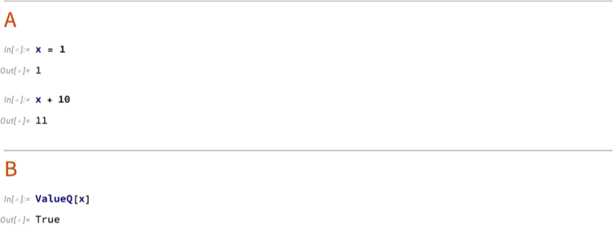

## Applications

`MarkdownToNotebook` fills every Wolfram Repository definition notebook from plain markdown, so authors never edit notebook cell styles by hand. The samples below live under [`examples/`](https://github.com/sw1sh/MarkdownToNotebook/tree/main/examples) in the repository; `examples/build.wls` builds each one and `DeployResource`-style `CloudDeploy[ResourceObject[nb], …, Permissions -> "Public"]`s it under a stable public URL, so every link below resolves to the live deployed notebook.

### Function Resource

The [`ReverseAddSequence`](https://github.com/sw1sh/MarkdownToNotebook/blob/main/examples/ReverseAddSequence.md) document is a complete [Function Repository](https://resources.wolframcloud.com/FunctionRepository/) submission - usage signature, examples, options, and the function body itself - kept in one markdown file. Converting it fills the official `FunctionResource` notebook with its docked Deploy/Submit toolbar, and the build step deploys it [publicly to the cloud](https://www.wolframcloud.com/obj/nikm/DeployedResources/FunctionResource/ReverseAddSequence). The `#| screenshot: true` cell option rasterizes the produced notebook and `#| tear: 200` gives it a torn-paper screenshot look, keeping the top 200 points of output visible above the tear:

```wl
MarkdownToNotebook["https://raw.githubusercontent.com/sw1sh/MarkdownToNotebook/refs/heads/main/examples/ReverseAddSequence.md"]
```


### Paclet

The published [Wolfram/AccessibleColors](https://resources.wolframcloud.com/PacletRepository/resources/Wolfram/AccessibleColors/) paclet - `PacletInfo.wl`, the guide page, every symbol reference page, and the Paclet Repository submission notebook - is built this way end to end. Here its guide page is converted straight from the markdown on [GitHub](https://github.com/sw1sh/AccessibleColors):

```wl
MarkdownToNotebook["https://raw.githubusercontent.com/sw1sh/AccessibleColors/main/docs/Guides/AccessibleColors.md"]
```

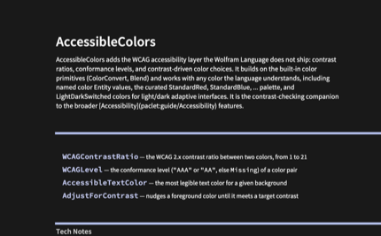

### Example

The `Example` template fills the [Example Repository](https://resources.wolframcloud.com/ExampleRepository/) definition notebook. The [`PrimeSpiralPoints`](https://github.com/sw1sh/MarkdownToNotebook/blob/main/examples/PrimeSpiralPoints.md) sample ships a `"Points"` content element and a short gallery of derived plots; deployed [here](https://www.wolframcloud.com/obj/nikm/DeployedResources/Example/PrimeSpiralPoints):

```wl
MarkdownToNotebook["https://raw.githubusercontent.com/sw1sh/MarkdownToNotebook/refs/heads/main/examples/PrimeSpiralPoints.md"]
```

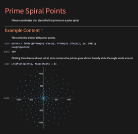

---

The [Discrete-Time Quantum Walk](https://github.com/sw1sh/MarkdownToNotebook/blob/main/examples/QuantumWalk.md) sample is a longer Example doc: it derives the Hadamard-coin walk, plots the two-horned interference distribution against the classical Gaussian, and bundles the simulator as a `"Step"` content function; deployed [here](https://www.wolframcloud.com/obj/nikm/DeployedResources/Example/Discrete-TimeQuantumWalkonaLine):

```wl
MarkdownToNotebook["https://raw.githubusercontent.com/sw1sh/MarkdownToNotebook/refs/heads/main/examples/QuantumWalk.md"]
```

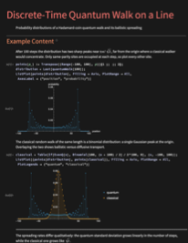

### Data

The `Data` template fills the [Data Repository](https://resources.wolframcloud.com/DataRepository/) definition notebook. The [Seventeen Wallpaper Groups](https://github.com/sw1sh/MarkdownToNotebook/blob/main/examples/WallpaperGroups.md) sample bundles the classification table, the point-group and lattice columns, and a worked Euler-characteristic check; deployed [here](https://www.wolframcloud.com/obj/nikm/DeployedResources/Data/SeventeenWallpaperGroups):

```wl
MarkdownToNotebook["https://raw.githubusercontent.com/sw1sh/MarkdownToNotebook/refs/heads/main/examples/WallpaperGroups.md"]
```

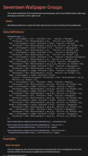

### Prompt

The `Prompt` template fills the [Prompt Repository](https://resources.wolframcloud.com/PromptRepository/) definition notebook for one of three resource types - `Persona`, `Function`, or `Modifier`. The [`AdaLovelace`](https://github.com/sw1sh/MarkdownToNotebook/blob/main/examples/AdaLovelace.md) sample is a Persona prompt whose `## Prompt` section is the system message and whose `## Chat Examples` and `## Basic Examples` invoke the persona through [LLMSynthesize](https://reference.wolfram.com/language/ref/LLMSynthesize.html) and [ChatEvaluate](https://reference.wolfram.com/language/ref/ChatEvaluate.html); deployed [here](https://www.wolframcloud.com/obj/nikm/DeployedResources/Prompt/AdaLovelace):

```wl
MarkdownToNotebook["https://raw.githubusercontent.com/sw1sh/MarkdownToNotebook/refs/heads/main/examples/AdaLovelace.md"]
```

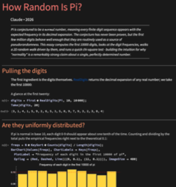

### Demonstration

The `Demonstration` template fills the [Demonstrations Project](https://demonstrations.wolfram.com/) authoring notebook, complete with its docked HELP / SAVE / UPDATE THUMBNAIL AND SNAPSHOTS / TEST IMAGE SIZE / UPLOAD toolbar. The [Bloch Sphere with a Quantum Gate Sequence](https://github.com/sw1sh/MarkdownToNotebook/blob/main/examples/BlochSphereGates.md) sample uses one `## Caption` paragraph, the `## Initialization` definitions (the gate matrices and the Bloch projection), a single `## Manipulate` cell, and three `## Snapshots` panels - the structure the Demonstrations review requires:

```wl
MarkdownToNotebook["https://raw.githubusercontent.com/sw1sh/MarkdownToNotebook/refs/heads/main/examples/BlochSphereGates.md"]
```

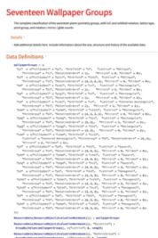

## Properties and Relations

The Wolfram Language already reads markdown into a plain notebook - <code>[Import](https://reference.wolfram.com/language/ref/Import.html)["doc.md", "Notebook"]</code>, or <code>[ImportString](https://reference.wolfram.com/language/ref/ImportString.html)[markdown, {"Markdown", "Notebook"}]</code> for a string. `MarkdownToNotebook` builds on that idea and adds the resource layer: the layout chosen from frontmatter, the metadata slots, cell options, and evaluated and cached example cells. The built-in import of the same snippet gives just the bare cells (it does parse inline TeX math, the same `$x$` convention used here):

```wl
ImportString["# Title\n\nText with inline math $\\sin x$.", {"Markdown", "Notebook"}]
```

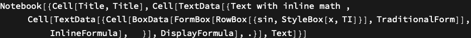

`FunctionResource` then fills the same template [CreateNotebook](https://reference.wolfram.com/language/ref/CreateNotebook.html)["FunctionResource"] opens (publishable with [ResourceSubmit](https://reference.wolfram.com/language/ref/ResourceSubmit.html)), and `Symbol`/`Guide` fill the DocumentationTools templates `DocumentationBuild` turns into reference pages.

## Possible Issues

A string that is neither a URL nor an existing file is treated as raw markdown, so a mistyped path silently parses as content rather than erroring:

```wl
MarkdownToNotebook["nonexistent.md", "Association"]["Sections"]
```

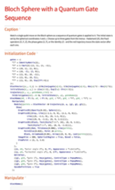

## Neat Examples

The neatest example is this very document: running the function on its own GitHub source produces the notebook itself, the one you are reading (its `## Definition` even inlines `MarkdownToNotebook.wl` from the same GitHub directory, so the one URL is self-contained). The example converts its own source, so it passes `"Evaluate" -> False` to leave that copy's example cells unevaluated rather than re-run this very example without end:

```wl
NotebookPut[MarkdownToNotebook["https://raw.githubusercontent.com/sw1sh/MarkdownToNotebook/refs/heads/main/MarkdownToNotebook.md", "Evaluate" -> False]]
```

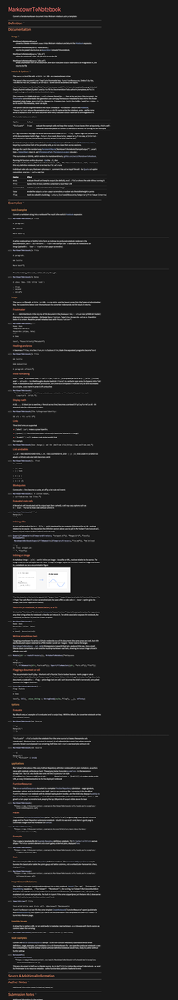

Because this very document is itself such a literate source - its `## Definition` inlines `MarkdownToNotebook.wl` and its frontmatter is the resource metadata - running the function on it reproduces this definition notebook, so the function publishes itself.

## Tests

Each `wl` cell in this section is an explicit `VerificationTest[code, expected, TestID -> …]` expression that becomes one Input cell in the resource's `VerificationTests` slot (the docked *Run Tests* button evaluates them). These are the regressions the converter has hit; `tests.wls` in the repo runs the same cells out-of-band by parsing this section, so the in-notebook button and the CI script run the same assertions from a single source.

Basic conversion returns a `Notebook` expression:

```wl
VerificationTest[
    Head @ MarkdownToNotebook["# Hi\n\nA paragraph."],
    Notebook,
    TestID -> "basic conversion returns a Notebook"
]
```

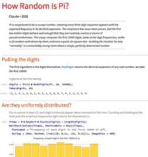

A `<code>[Symbol](https://reference.wolfram.com/language/ref/Symbol.html)</code>` reference in a Usage signature carries a paclet link on the head (regression: the link silently disappeared when the `<code>` rule was rewritten to wrap the whole span in one `InlineFormula` instead of recursing on the inside):

```wl
VerificationTest[
    ! FreeQ[
        MarkdownToNotebook["---\nTemplate: Symbol\nName: Range\nContext: System`\nPaclet: System\nURI: System/ref/Range\n---\n\n## Usage\n\n<code>[Range]()[$n$]</code> gives a list."],
        ButtonBox["Range", BaseStyle -> "Link", ___]
    ],
    True,
    TestID -> "<code>[Symbol]()…</code> in Usage carries a paclet link on the head"
]
```

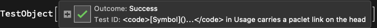

A bullet list with indented continuation lines folds each continuation into the preceding item, so a three-bullet list with two-line continuations is three items, not six (regression: the list parser used to break at the continuation, producing alternating one-item lists and stray paragraphs):

```wl
VerificationTest[
    Length @ Cases[
        MarkdownToNotebook["## Demo\n\n- First bullet\n  that wraps.\n- Second bullet\n  also wraps.\n- Third bullet."],
        Cell[_, "Notes" | "Item" | "Bullet", ___],
        Infinity
    ],
    3,
    TestID -> "multi-line bullets fold into single items (3, not 6)"
]
```

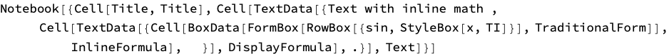

The `"PreserveSource"` option defaults to `False`, so a notebook the converter writes does *not* carry the source in its `TaggingRules`:

```wl
VerificationTest[
    FreeQ[MarkdownToNotebook["# Hi"], "MarkdownToNotebook" -> _],
    True,
    TestID -> "\"PreserveSource\" defaults to False - no stash in TaggingRules"
]
```

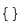

With `"PreserveSource" -> True`, the source is stashed under the `"MarkdownToNotebook"` tagging key and the inverse round-trips it byte-exactly:

```wl
VerificationTest[
    With[{src = "## Demo\n\nA paragraph.\n"},
        First[
            Cases[
                MarkdownToNotebook[src, "PreserveSource" -> True],
                ("MarkdownToNotebook" -> v_) :> v,
                Infinity
            ],
            <||>
        ]["Source"] === src
    ],
    True,
    TestID -> "\"PreserveSource\" -> True stashes the source under \"MarkdownToNotebook\""
]
```

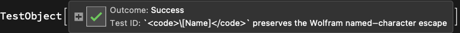
