This document is the source of truth for the resource function it describes. The frontmatter above is the [Function Repository](https://resources.wolframcloud.com/FunctionRepository/) metadata; the Definition section below inlines the implementation from a local `.wl` file; and the example cells are evaluated (with caching) to build the resource's documentation. Running the function on this very file reproduces its own definition notebook, so it publishes itself.

## Definition

The implementation lives in a separate `.wl` file so it has full IDE and lint support. The cell below inlines it at conversion time via the `file` option, a general mechanism: any code cell with `#| file: path` is replaced by the contents of that local file or URL, resolved relative to this document.

```wl
#| file: MarkdownToNotebook.wl
```

## Details & Options

- The *source* is a local file path, an `http(s)` URL, or a raw markdown string.
- The layout is the document's own `Template` frontmatter key - `FunctionResource`, `Symbol`, `Guide`, `TechNote`, `Paclet`, or `Default` - so the source declares its own layout.
- `FunctionResource` fills the official `FunctionResourceDefinition.nb` template (keeping its docked Deploy/Submit toolbar); `Symbol` and `Guide` fill the DocumentationTools authoring templates; `Default` maps headings and code to standard notebook styles.
- The *frontmatter* is a YAML-style `key: value` header fenced by `---` lines at the very top of the document - the [front matter](https://jekyllrb.com/docs/front-matter/) convention static-site generators use - carrying the resource metadata. Its keys mirror the chosen template's slots (`Name`, `Description`, `Keywords`, `Categories`, `ContributedBy`, `SeeAlso`, `Links`, ...), so the author fills metadata, never cell styles.
- The optional second argument selects the result: omitted (or `"Notebook"`) returns the [`Notebook`], `"Association"` returns the parsed structure, a `.nb` file name writes the notebook, and a `.md` file name writes a *markdown twin* - the same document with every evaluated output rasterized to an image beside it.
- The function takes one option:

| Option | Default |  |
|---|---|---|
| `"Evaluate"` | `True` | evaluate the example cells and keep their output; `False` leaves them as input only, which a self-referential document passes to convert its own source without re-running its own examples |

- A `Flag` frontmatter key flags the whole document and a code cell's `#| flag:` option flags that cell, with one of the documentation build's flags - `Future`, `Excised`, `Obsolete`, `Temporary`, `Preview`, or `Internal` - the front end's Futurize / Excise toolbar buttons, written as the build's banner cell.
- Evaluated example outputs are cached as a [`PersistentSymbol`] per cell at the `"Local"` [`PersistenceLocation`], keyed by a cumulative hash of the preceding cells, so re-runs reuse them across sessions.
- Manage that cache the standard way: [`PersistentObjects`]["MarkdownToNotebook/ExampleOutput/*", "Local"] lists it, [`DeleteObject`] clears it, and [`$PersistencePath`] / [`PersistenceLocation`] relocate it.
- The source lives on GitHub, which renders the markdown directly: [github.com/sw1sh/MarkdownToNotebook](https://github.com/sw1sh/MarkdownToNotebook).
- Running the function on this document - [`Get`] the `.wl`, then `MarkdownToNotebook["MarkdownToNotebook.md", "MarkdownToNotebook.nb"]` - reproduces this very definition notebook; that is the loop `build.wls` runs.

Individual code cells carry their own options as `#|` comment lines at the top of the cell - the [Quarto](https://quarto.org/docs/computations/execution-options.html) cell-option convention - one `key: value` per line:

| Option | Effect |
|---|---|
| `eval` | evaluate the cell and keep its output (the default); `eval: false` shows the code without running it |
| `file` | replace the cell body with the contents of a local file or URL |
| `screenshot` | rasterize a produced notebook to an inline image |
| `tear` | render the output as a torn-paper screenshot; a number sets the visible height in points |
| `flag` | mark the cell with a build flag - `Future`, `Excised`, `Obsolete`, `Temporary`, `Preview`, or `Internal` |

## Usage

`MarkdownToNotebook[source]` converts a literate-markdown *source* into a Wolfram notebook and returns the [`Notebook`] expression.

`MarkdownToNotebook[source, "Association"]` returns the parsed structure as an [`Association`] instead of the notebook.

`MarkdownToNotebook[source, file]` writes the notebook to *file* and returns the file; a `.md` *file* instead writes a markdown twin of the document with each evaluated output rasterized beside it.

## Basic Examples

Convert a markdown string into a notebook. The result is the explicit [`Notebook`] expression:

```wl
MarkdownToNotebook["# Title\n\nA paragraph.\n\n## Section\n\nMore text."]
```

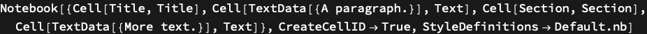

---

A whole notebook has no faithful inline form, so to show the produced notebook rendered in the documentation, add `#| screenshot: true` to the example cell - it rasterizes the notebook to an image (pair with `#| tear: true` for a torn-paper screenshot):

```wl
#| screenshot: True
MarkdownToNotebook["# Title\n\nA paragraph.\n\n## Section\n\nMore text."]
```

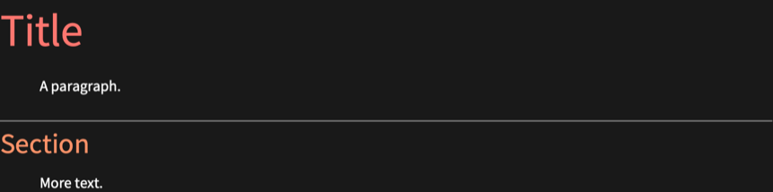

---

Prose formatting, inline code, and lists all carry through:

```wl
#| screenshot: True
MarkdownToNotebook["# Notes\n\nA *key* idea, with inline `code`:\n\n- first\n- second\n- third"]
```

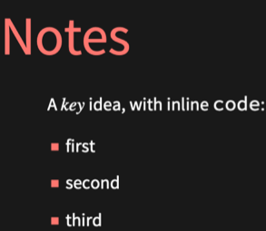

## Scope

The *source* is a file path, an `http(s)` URL, or a raw string, and the layout comes from the `Template` frontmatter key. The subsections below cover the markdown the converter understands and the results it returns.

### Frontmatter

A `---` - delimited block at the very top of the document is the *frontmatter*: `key: value` lines (a YAML-ish header) that carry the resource metadata - the `Name`, `Description`, `Template`, `Keywords`, and so on. Everything below it is content. Read the parsed metadata back with `"Association"`:

```wl
MarkdownToNotebook["---\nName: Demo\nTemplate: Default\nKeywords: [alpha, beta]\n---\n# Demo\n\ntext", "Association"]["Metadata"]
```


### Headings and prose

`#` becomes a `Title`, `##` a `Section`, `###` a `Subsection`; blank-line-separated paragraphs become `Text`:

```wl
#| screenshot: True
MarkdownToNotebook["# Title\n\n## Section\n\n### Subsection\n\nA paragraph of text."]
```

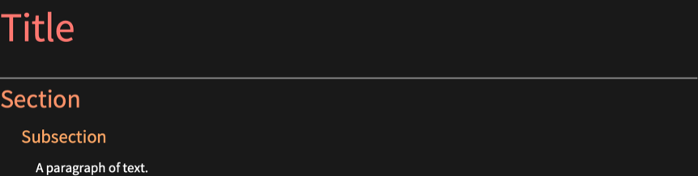

### Inline formatting

Inline `` `code` `` is formatted code, `*emphasis*` is italic, a double-backtick ``literal`` is a verbatim span, and a `$x$` span is inline TeX math:

```wl
#| screenshot: True
MarkdownToNotebook["Inline `Range[3]`, *emphasis*, ``verbatim``, and the math $\\sqrt{a^2 + b^2}$."]
```

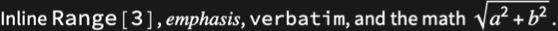

### Links

`[label](url)` is a prose hyperlink; a backticked label with no target - `` [`Symbol`] `` or `` [`Symbol`]() `` - infers a documentation reference; `` [`Symbol`](url) `` links explicitly:

```wl
#| screenshot: True
MarkdownToNotebook["See [`Range`] and the [Wolfram site](https://www.wolfram.com)."]
```


### Lists and tables

`-`, `*`, or `+` lines become items, and a GitHub-style pipe table becomes a grid:

```wl
#| screenshot: True
MarkdownToNotebook["- one\n- two\n\n| x | y |\n|---|---|\n| 1 | 2 |"]
```

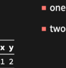

### Evaluated code cells

A fenced `wl` cell is evaluated and its output kept (then cached); a cell may carry options such as `#| eval: false` to show code without running it:

```wl
#| screenshot: True
MarkdownToNotebook["```wl\nRange[5]^2\n```"]
```

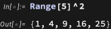

### Inlining a file

A code cell whose first line is `#| file: path` is replaced by the contents of that local file or URL, resolved relative to the source - the mechanism the Definition section above uses to pull in `MarkdownToNotebook.wl`. Here a snippet written to disk is inlined and evaluated:

```wl
#| screenshot: True
Export[FileNameJoin[{$TemporaryDirectory, "snippet.wl"}], "Range[5]^2", "Text"]; NotebookPut[MarkdownToNotebook[Export[FileNameJoin[{$TemporaryDirectory, "inc.md"}], "## Inlined\n\n```wl\n#| file: snippet.wl\n```", "Text"]]]
```

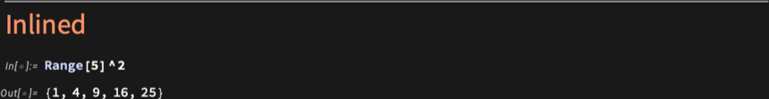

### Inlining an image

A markdown image `` inlines an image - a local file or URL, resolved relative to the source. The image's *title* is a raw cell-style override: here `"ExampleImage"` styles the function's headline image (markdown in, a notebook out) as a documentation figure:

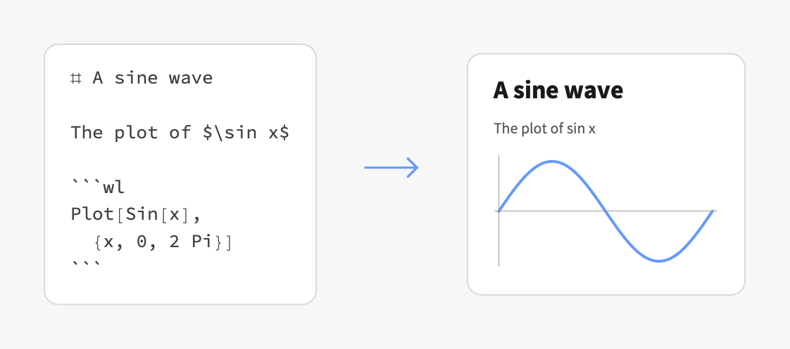

The title defaults to `Output`; the special title `"papertear"` keeps `Output` and adds the front end's Convert To > Paper Tear cell effect for a torn-screenshot look (the same effect a code cell's `#| tear:` option gives its output, used under Applications below).

### Returning a notebook, an association, or a file

Omitted (or `"Notebook"`) returns the [`Notebook`]; `"Association"` returns the parsed structure for inspection; a `.nb` file name writes the notebook and returns it. The whole association exposes the notebook, the metadata, the section list, and the chosen template:

```wl
MarkdownToNotebook["---\nName: Demo\nKeywords: [alpha, beta]\n---\n# Demo", "Association"]
```

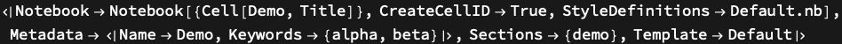

### Writing a markdown twin

A `.md` file name writes a GitHub-renderable *twin* of the document - the same prose and code, but with each evaluated output rasterized to a PNG beside it (under an `images/` folder next to the target). This very repository's [`MarkdownToNotebook-out.md`](MarkdownToNotebook-out.md) is the twin of this document, produced this way. Here a small literate doc is converted to a twin and the resulting markdown read back, showing the output image spliced in after its code cell:

```wl
Module[{dir = CreateDirectory[]}, MarkdownToNotebook["## Squares\n\n```wl\nRange[5]^2\n```", FileNameJoin[{dir, "twin.md"}]]; Import[FileNameJoin[{dir, "twin.md"}], "Text"]]
```

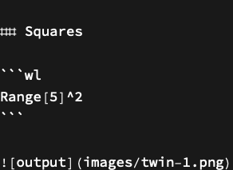

### Flagging a document or cell

The documentation build's *flags* - the front end's Futurize / Excise toolbar buttons - mark a page or cell as `Future`, `Excised`, `Obsolete`, `Temporary`, `Preview`, or `Internal`. A `Flag` frontmatter key flags the whole document; a code cell's `#| flag:` option flags that one cell. Each becomes the build's banner cell, here pulled back out of a flagged document:

```wl
Cases[MarkdownToNotebook["---\nFlag: Future\n---\n# Demo\n\ntext"], Cell[_, style_String /; StringEndsQ[style, "Flag"], ___], Infinity]
```

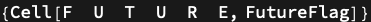

## Options

### Evaluate

By default every `wl` example cell is evaluated and its output kept. With the default, the converted notebook carries the evaluated output:

```wl
#| screenshot: True
MarkdownToNotebook["## Squares\n\n```wl\nRange[5]^2\n```"]
```

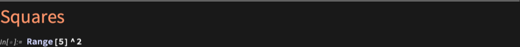

---

`"Evaluate" -> False` builds the notebook from the same source but leaves the example cells unevaluated - the input stays, the output is dropped. A self-referential document (one whose example converts its own source) passes it so converting itself does not re-run its own examples without end:

```wl
#| screenshot: True
MarkdownToNotebook["## Squares\n\n```wl\nRange[5]^2\n```", "Evaluate" -> False]
```


## Applications

Generate a paclet's entire documentation set, the guide page, the symbol reference pages, and a publishable [Function Repository](https://resources.wolframcloud.com/FunctionRepository/) definition, from plain markdown, so authors never edit notebook cell styles by hand. The published [Wolfram/AccessibleColors](https://resources.wolframcloud.com/PacletRepository/resources/Wolfram/AccessibleColors/) paclet is built this way end to end. Here its guide page is converted straight from the markdown on [GitHub](https://github.com/sw1sh/AccessibleColors); the `#| screenshot: true` cell option rasterizes the produced notebook and `#| tear: 150` gives it a torn-paper screenshot look, keeping the top 150 points of output visible above the tear:

```wl
#| screenshot: True
#| tear: 150
MarkdownToNotebook["https://raw.githubusercontent.com/sw1sh/AccessibleColors/main/docs/Guides/AccessibleColors.md"]
```

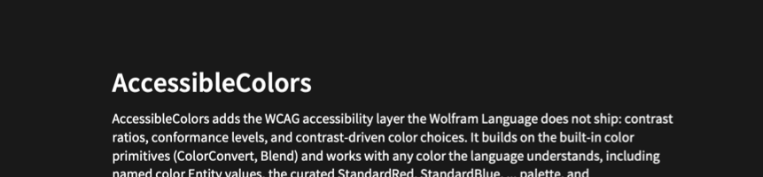

## Properties and Relations

The Wolfram Language already reads markdown into a plain notebook - [`Import`]["doc.md", "Notebook"], or [`ImportString`][markdown, {"Markdown", "Notebook"}] for a string. `MarkdownToNotebook` builds on that idea and adds the resource layer: the layout chosen from frontmatter, the metadata slots, cell options, and evaluated and cached example cells. The built-in import of the same snippet gives just the bare cells (it does parse inline TeX math, the same `$x$` convention used here):

```wl
ImportString["# Title\n\nText with inline math $\\sin x$.", {"Markdown", "Notebook"}]
```

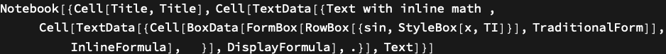

`FunctionResource` then fills the same template [`CreateNotebook`]["FunctionResource"] opens (publishable with [`ResourceSubmit`]), and `Symbol`/`Guide` fill the DocumentationTools templates `DocumentationBuild` turns into reference pages.

## Possible Issues

A string that is neither a URL nor an existing file is treated as raw markdown, so a mistyped path silently parses as content rather than erroring:

```wl
MarkdownToNotebook["nonexistent.md", "Association"]["Sections"]
```

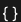

## Neat Examples

The neatest example is this very document: running the function on its own GitHub source produces the notebook itself, the one you are reading (its `## Definition` even inlines `MarkdownToNotebook.wl` from the same GitHub directory, so the one URL is self-contained). The example converts its own source, so it passes `"Evaluate" -> False` to leave that copy's example cells unevaluated rather than re-run this very example without end:

```wl
NotebookPut[MarkdownToNotebook["https://raw.githubusercontent.com/sw1sh/MarkdownToNotebook/refs/heads/main/MarkdownToNotebook.md", "Evaluate" -> False]]
```


Because this very document is itself such a literate source - its `## Definition` inlines `MarkdownToNotebook.wl` and its frontmatter is the resource metadata - running the function on it reproduces this definition notebook, so the function publishes itself.
