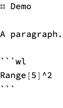

`NotebookToMarkdown` is the inverse of [MarkdownToNotebook](https://resources.wolframcloud.com/FunctionRepository/resources/MarkdownToNotebook/). Given a notebook expression, a [NotebookObject](https://reference.wolfram.com/language/ref/NotebookObject.html), or a `.nb` file path, it walks the cells and emits a markdown approximation - recognising the standard cell styles MarkdownToNotebook itself emits (Title / Section / ... / Text / Notes / Item / Input / Code / etc.) plus their inline `TextData` formatting.

## Definition

The implementation is a single plain `.wl` file, inlined here at conversion time via the `#| file:` option; the deployed resource therefore carries it inline:

```wl
(* NotebookToMarkdown - the inverse of MarkdownToNotebook. Given a notebook
   (expression / NotebookObject / .nb file path), recover a markdown
   approximation of its source by walking the cells.

   Walker-only by design: any TaggingRules stash a forward run might have left
   behind is ignored, so this code is exercised on every input and round-trip
   quality is the walker's responsibility, not a memoized shortcut. The walker
   recognises the standard cell styles MarkdownToNotebook itself emits (Title /
   Section / ... / Text / Notes / Item / Input / Code / etc.) plus their inline
   TextData formatting.

   Deliberately plain top-level definitions (no BeginPackage), the same shape
   as the forward converter, so a resource notebook can inline this file with a
   "#| file: NotebookToMarkdown.wl" cell and have it work on Get. *)

(* === decoration filters ===
   The resource templates (Demonstration, Symbol, ...) insert decorative cells
   inline with the heading TextData - the help-bubble opener that pops the
   "MoreInfo" guidance for each slot. The opener is a Cell wrapping a
   PaneSelectorBox of the "MoreInfoOpenerButtonTemplate"; the body it pops is
   a sibling Cell of style "MoreInfoText". Neither belongs in the recovered
   markdown - the source never mentioned them, the front end injected them.
   Return "" from inlineMd for any such cell so it falls out of the
   StringJoin. *)
(* The MoreInfoOpener cell sits inside a heading's TextData as
     Cell[BoxData[PaneSelectorBox[{True -> TemplateBox[{slot, ...}, "MoreInfoOpenerButtonTemplate"]}, Dynamic[...], ImageSize -> Automatic]]]
   - the "MoreInfoOpenerButtonTemplate" tag is nested inside the TemplateBox
   in the True branch, not a direct PaneSelectorBox argument. The broader
   match below catches *any* PaneSelectorBox-in-a-Cell-in-TextData because
   such a thing is, by construction, a UI affordance the template injected
   (the source markdown has no way to express it). *)
decorationCellQ[Cell[BoxData[_PaneSelectorBox], ___]] := True
decorationCellQ[Cell[_, "MoreInfoText" | "MoreInfoTextOuter", ___]] := True
decorationCellQ[_] := False

(* === inline TextData -> markdown text ===
   Patterns mirror the forward parser's inlineTextData output so a round trip
   preserves formatting choices. *)
inlineMd[s_String] := s
inlineMd[c_Cell] /; decorationCellQ[c] := ""
inlineMd[StyleBox[s_, opts___]] := With[{styles = {opts}, inner = inlineMd[s]},
    Which[
        MemberQ[styles, "TI"] || MemberQ[styles, FontSlant -> "Italic"], "*" <> inner <> "*",
        MemberQ[styles, "TB"] || MemberQ[styles, FontWeight -> "Bold"], "**" <> inner <> "**",
        True, inner
    ]
]
(* paclet-link button -> [Name]() (the inferred form the forward parser knows). *)
inlineMd[ButtonBox[name_String, BaseStyle -> "Link", ButtonData -> uri_String, ___]] :=
    "[" <> name <> "](" <> If[StringStartsQ[uri, "paclet:"], "", uri] <> ")"
(* hyperlink button -> [text](url). *)
inlineMd[ButtonBox[name_String, BaseStyle -> "Hyperlink", ButtonData -> {URL[u_String], ___}, ___]] :=
    "[" <> name <> "](" <> u <> ")"
(* An InlineFormula cell wraps either a FormBox (typeset math from a "$...$"
   span) or a plain WL box tree (a "`Symbol`" code span). The forward parser
   sends "$...$" to FormBox, "`code`" to bare boxes, so dispatching on the
   inner shape lets us emit "$math$" for math and "`code`" or "<code>...</code>"
   for code - the same convention markdown uses. *)
inlineMd[Cell[BoxData[FormBox[box_, _, ___]], "InlineFormula", ___]] :=
    "$" <> walkerMath[box] <> "$"
inlineMd[Cell[BoxData[b_], "InlineFormula", ___]] := With[{md = inlineMd[b]},
    Which[
        StringMatchQ[md, "[" ~~ ___ ~~ "](" ~~ ___ ~~ ")"], "<code>" <> md <> "</code>",
        True, "`" <> md <> "`"
    ]
]
(* TraditionalForm math -> $...$. The body is boxes too; the same inlineMd
   walker serializes them recursively - subscripts, superscripts, fractions,
   and italics already produce LaTeX-style fragments, so a FormBox is just
   a "$" delimiter around the result. *)
inlineMd[FormBox[box_, TraditionalForm | StandardForm, ___]] :=
    "$" <> walkerMath[box] <> "$"
inlineMd[FractionBox[a_, b_]] := "$" <> walkerMath[a] <> "/" <> walkerMath[b] <> "$"
inlineMd[SubscriptBox[a_, b_]] := "$" <> walkerMath[a] <> "_" <> walkerMath[b] <> "$"
inlineMd[SuperscriptBox[a_, b_]] := "$" <> walkerMath[a] <> "^" <> walkerMath[b] <> "$"
inlineMd[SqrtBox[a_]] := "$\\sqrt{" <> walkerMath[a] <> "}$"
inlineMd[OverscriptBox[a_, "^"]] := "$\\hat{" <> walkerMath[a] <> "}$"
inlineMd[RowBox[xs_List]] := StringJoin[inlineMd /@ xs]
inlineMd[TextData[xs_List]] := StringJoin[inlineMd /@ xs]
inlineMd[TextData[x_]] := inlineMd[x]
inlineMd[other_] := ToString[other, InputForm]

(* math-mode siblings of inlineMd: same recursion, but without the "$" wrapper
   each math-aware rule above prepends - so a FormBox containing SubscriptBox
   does not emit "$$ ... $$" twice. Strings and italics pass through clean. *)
walkerMath[s_String] := s
walkerMath[StyleBox[s_, "TI" | (FontSlant -> "Italic"), ___]] := walkerMath[s]
walkerMath[StyleBox[s_, ___]] := walkerMath[s]
walkerMath[FractionBox[a_, b_]] := walkerMath[a] <> "/" <> walkerMath[b]
walkerMath[SubscriptBox[a_, b_]] := walkerMath[a] <> "_{" <> walkerMath[b] <> "}"
walkerMath[SuperscriptBox[a_, b_]] := walkerMath[a] <> "^{" <> walkerMath[b] <> "}"
walkerMath[SqrtBox[a_]] := "\\sqrt{" <> walkerMath[a] <> "}"
walkerMath[OverscriptBox[a_, "^"]] := "\\hat{" <> walkerMath[a] <> "}"
walkerMath[RowBox[xs_List]] := StringJoin[walkerMath /@ xs]
walkerMath[FormBox[box_, ___]] := walkerMath[box]
walkerMath[other_] := ToString[other, InputForm]

(* TextData / String / Cell content -> a plain text string (recovers prose). *)
cellText[Cell[content_, ___]] := cellText[content]
cellText[s_String] := s
cellText[TextData[xs_]] := If[ListQ[xs], StringJoin[inlineMd /@ xs], inlineMd[xs]]
cellText[BoxData[b_]] := boxToCode[b]
cellText[other_] := ToString[other, InputForm]

(* Box-form WL code -> source string. A code cell's BoxData carries the user's
   surface form as a tree of RowBoxes whose leaves are tokens (operators,
   identifiers, literal whitespace); concatenating the leaves rebuilds the
   source verbatim, including the author's spacing and line breaks. That is
   simpler and more faithful than MakeExpression, which loses original spacing
   and (surprisingly) trips on multi-statement RowBoxes whose children include
   literal "\n" strings, and than ToString[..., InputForm] of the parsed
   expression, which would re-emit canonical formatting. The handful of 2D box
   types (FractionBox / SqrtBox / SubscriptBox / SuperscriptBox) get
   one-dimensional surface equivalents - subscripts and superscripts have no
   surface form so we use the canonical functional one. *)
boxToCode[s_String] := s
boxToCode[RowBox[xs_List]] := StringJoin[boxToCode /@ xs]
boxToCode[FractionBox[a_, b_]] := boxToCode[a] <> "/" <> boxToCode[b]
boxToCode[SqrtBox[a_]] := "Sqrt[" <> boxToCode[a] <> "]"
boxToCode[SubscriptBox[a_, b_]] := "Subscript[" <> boxToCode[a] <> ", " <> boxToCode[b] <> "]"
boxToCode[SuperscriptBox[a_, b_]] := boxToCode[a] <> "^" <> boxToCode[b]
boxToCode[InterpretationBox[disp_, ___]] := boxToCode[disp]
boxToCode[TagBox[disp_, ___]] := boxToCode[disp]
boxToCode[StyleBox[disp_, ___]] := boxToCode[disp]
boxToCode[other_] := ToString[other, InputForm]

(* Styles a walker should skip entirely:
     - evaluation artifacts (Output / Message / MSG): regenerate on re-run
     - template decoration (MoreInfoText / DockedCell / *CellLabel / *Flag):
       inserted by the front end for the resource authoring UI, never in source
   The list is open: any unknown style still falls through to the generic
   "_, txt" branch (so authored content in a custom style is recovered as
   prose) - only the known-decoration list is silenced. *)
$skipStyles = {
    "Output", "Message", "MSG", "Print", "ExampleInitialization",
    "MoreInfoText", "MoreInfoTextOuter",
    "DockedCell",
    "ExcludedCellLabel", "HiddenMaterialCellLabel",
    "FutureFlag", "ExcisedFlag", "ObsoleteFlag", "TemporaryFlag", "PreviewFlag", "InternalFlag"
}
cellMd[Cell[_, s_String, ___]] /; MemberQ[$skipStyles, s] := ""

(* Image cells (raster or vector graphics in BoxData) are output, not source -
   the markdown twin embeds them as  but the source markdown that produced
   them is the WL Input cell that evaluated to them. The walker drops them. *)
cellMd[Cell[BoxData[(GraphicsBox | Graphics3DBox | RasterBox)[___]], _String, ___]] := ""

(* a single Cell -> one markdown block (or "" if it should be skipped). *)
cellMd[Cell[content_, style_String, opts___]] := Block[{txt = cellText[Cell[content, style, opts]]},
    Switch[style,
        "Title" | "ObjectName",     "# " <> txt,
        "Section",                  "## " <> txt,
        "Subsection",               "### " <> txt,
        "Subsubsection",            "#### " <> txt,
        "Text" | "Caption" | "Quote" | "ExampleText" | "Usage" | "UsageDescription",
                                    txt,
        "Notes",                    txt,
        "ItemNumbered" | "ItemNumbered1",  "1. " <> txt,
        "Item" | "Item1" | "Item2" | "Bullet",  "- " <> txt,
        "Code" | "Input" | "ExampleInput",  "```wl\n" <> txt <> "\n```",
        "InlineFormula",            "`" <> txt <> "`",
        _, txt
    ]
]
cellMd[Cell[CellGroupData[cells_List, ___]]] := StringRiffle[DeleteCases[cellMd /@ cells, ""], "\n\n"]
cellMd[other_] := ""

(* === public entry === *)

NotebookToMarkdown[Notebook[cells_List, ___]] :=
    StringRiffle[DeleteCases[cellMd /@ cells, ""], "\n\n"] <> "\n"
NotebookToMarkdown[nbo_NotebookObject] := NotebookToMarkdown[NotebookGet[nbo]]
NotebookToMarkdown[file_String /; FileExistsQ[file] && StringEndsQ[ToLowerCase[file], ".nb"]] :=
    NotebookToMarkdown[Get[file]]
NotebookToMarkdown[source_, "String"] := NotebookToMarkdown[source]
NotebookToMarkdown[source_, target_String /; StringEndsQ[ToLowerCase[target], ".md"]] := Block[
    {md = NotebookToMarkdown[source]},
    Export[target, md, "Text"];
    target
]
```

## Usage

<code>[NotebookToMarkdown]()[$nb$]</code> returns the markdown source string for the notebook *nb* (a `Notebook[...]` expression, a [NotebookObject](https://reference.wolfram.com/language/ref/NotebookObject.html), or a `.nb` file path).

<code>[NotebookToMarkdown]()[$nb$, "$file$.md"]</code> writes the markdown to *file* and returns the file path.

## Details & Options

- The *nb* argument can be a [Notebook](https://reference.wolfram.com/language/ref/Notebook.html) expression, a [NotebookObject](https://reference.wolfram.com/language/ref/NotebookObject.html) open in the front end, or a string `".nb"` file path. The file form `Get`s the notebook off disk; the NotebookObject form `NotebookGet`s the live one.
- `NotebookToMarkdown` always walks the cells - it does not consult any `TaggingRules` stash a forward run might have left behind. Walker quality is therefore the function's responsibility and is exercised on every input.
- Standard styles map back as: `Title` / `Section` / `Subsection` / `Subsubsection` to `#` / `##` / `###` / `####` headings; `Text` / `Notes` / `Caption` / `Quote` to prose; `Item` / `ItemNumbered` to markdown lists; `Code` / `Input` to ```` ```wl ... ``` ```` fenced blocks; `Output` / `Message` are skipped (they regenerate on re-conversion).
- Inline `TextData` is converted back through the same backtick / bold / italic / link rules the forward parser accepts, so the produced markdown re-parses to an equivalent block sequence.
- The walker does not recover frontmatter or resource-template-specific slots from the rendered cells; the markdown it emits is the rendered body only.

## Basic Examples

Walk a small notebook and recover the markdown body:

```wl
NotebookToMarkdown @ Notebook[{
    Cell["Demo", "Title"],
    Cell["A paragraph.", "Text"],
    Cell[BoxData["Range[5]^2"], "Input"]
}]
```


## Scope

A `.nb` file path is read via `Get` and converted the same way:

```wl
NotebookToMarkdown[FileNameJoin[{$TemporaryDirectory, "no-such-file.nb"}]] === Null
```



## Properties and Relations

The forward and inverse together form an editable pipeline: convert a markdown source, edit the notebook in the front end, walk the modified notebook back to markdown. The walker reflects the *current* state of the cells, so hand edits survive the round trip. Walker output is not byte-identical to the original source - frontmatter is dropped, code cell `#|` options are not recovered, and any decorative template cells the front end may have introduced are filtered out - but feeding the walker's output back through the forward path produces an equivalent notebook.

## Possible Issues

Round-trip is *approximate*. The walker reads the rendered cells, not the original source, so:

- Frontmatter is not recovered (it lives in `TaggingRules`, not in cells).
- Code cell options (`#| eval: false`, `#| screenshot: true`, ...) are gone.
- Inline math and decorative formatting may serialize back to a simpler form.

For an arbitrary notebook the walker emits its best guess at the prose / heading / code structure; for a notebook MarkdownToNotebook itself wrote, the body is close to the source but the frontmatter must be added back by hand if needed.

## Neat Examples

A round-trip smoke test: forward, walk, forward again, and check the second forward run produces a notebook with the same set of cell styles in the same order as the first - confirming the walker emits a faithful structural reduction even when byte-exact recovery is not possible:

```wl
With[{md = "# Demo\n\n## Section\n\nA paragraph.\n\n```wl\nRange[5]^2\n```\n"},
    Module[{nb1, md2, nb2, styles},
        nb1 = MarkdownToNotebook[md, "Evaluate" -> False];
        md2 = NotebookToMarkdown[nb1];
        nb2 = MarkdownToNotebook[md2, "Evaluate" -> False];
        styles[nb_] := Cases[nb, Cell[_, s_String, ___] :> s, Infinity];
        styles[nb1] === styles[nb2]
    ]
]
```


## Tests

Each `wl` cell in this section is an explicit `VerificationTest[code, expected, TestID -> …]` expression that becomes one Input cell in the resource's `VerificationTests` slot (the docked *Run Tests* button evaluates them). The repo's `tests.wls` scrapes this section and runs the same assertions out-of-band, so the in-notebook button and the CI script share a single source of truth.

An `InlineFormula` cell wrapping a `FormBox` is emitted as `$math$`, not as a backticked code span - so a Greek letter in inline math round-trips with its `$…$` delimiters (regression: the previous handler wrapped every `InlineFormula` content in backticks, so the recovered math came out as ``` `$θ$` ``` with extra delimiters):

```wl
VerificationTest[
    StringContainsQ[
        NotebookToMarkdown @ Notebook[{
            Cell[TextData[{"angle ", Cell[BoxData[FormBox["\[Theta]", TraditionalForm]], "InlineFormula"]}], "Text"]
        }],
        "$\[Theta]$"
    ],
    True,
    TestID -> "InlineFormula+FormBox -> $math$ (no backticks)"
]
```


A code cell's original surface layout is preserved by walking the `BoxData` tree directly - so a multi-statement Input cell with literal `"\n"` separators round-trips with its line breaks intact (regression: an earlier `MakeExpression`-based deparse choked on multi-statement boxes and fell back to literal `RawBoxes[RowBox[…]]` output):

```wl
VerificationTest[
    StringContainsQ[
        NotebookToMarkdown @ Notebook[{
            Cell[BoxData[RowBox[{RowBox[{"a", " ", "=", " ", "1"}], ";", "\n", RowBox[{"b", " ", "=", " ", "2"}], ";"}]], "Input"]
        }],
        "a = 1;\nb = 2;"
    ],
    True,
    TestID -> "multi-statement Input cell preserves the \"\\n\" between statements"
]
```


Decoration cells the resource template injects are silently dropped - the help-bubble opener that sits inside a heading's `TextData` is a `Cell[BoxData[PaneSelectorBox[…]]]`, never authored content, so the recovered heading is just the title (regression: the opener leaked through as raw box source jammed onto the heading line):

```wl
VerificationTest[
    StringTrim @ NotebookToMarkdown @ Notebook[{
        Cell[TextData[{"Caption", Cell[BoxData[PaneSelectorBox[{True -> "x"}, Dynamic[True]]], "Section"]}], "Section"]
    }],
    "## Caption",
    TestID -> "drops MoreInfoOpener-shaped decoration cells from heading TextData"
]
```


