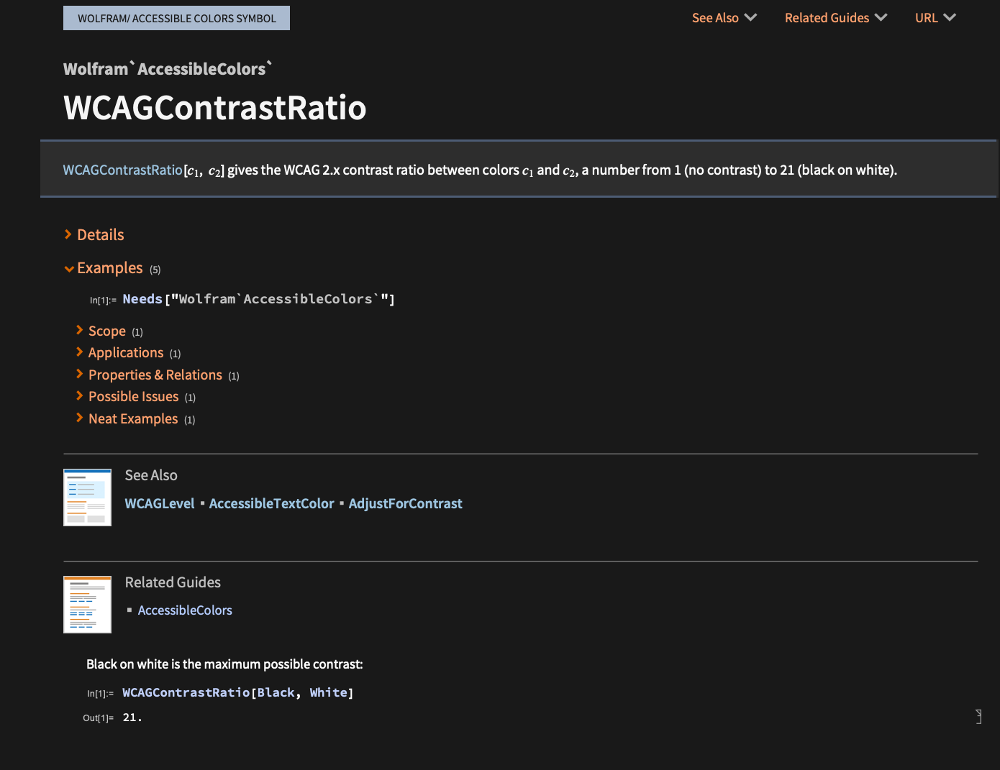
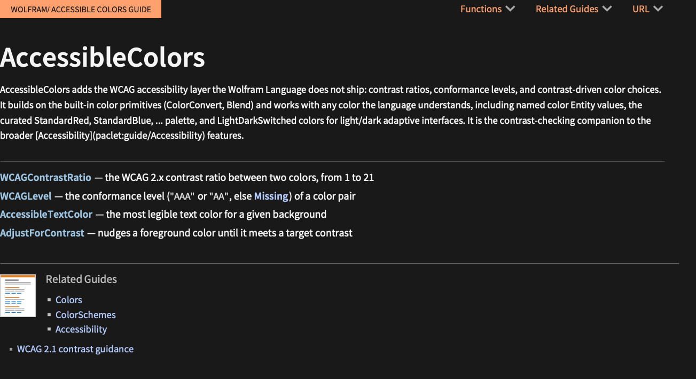
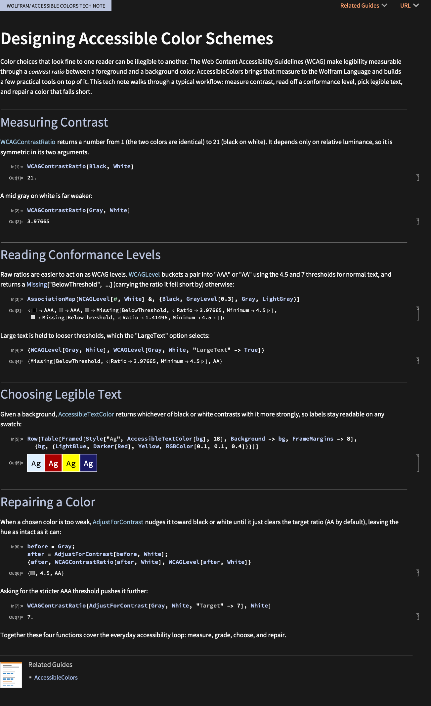

# Documentation pages (Symbol / Guide / TechNote)

These compile to the same authoring notebooks the Documentation Tools palette
produces, then build with `DocumentationBuild`. The palette's job (insert
sections, format inline code, make links) is done from markdown structure.

## Conventions across all doc pages

These rules apply equally to Symbol pages, Guides, and TechNotes. A per-paclet
guide may *override* one of them (e.g. LeanLink's
[`DOC_GUIDE.md`](https://github.com/sw1sh/LeanLink/blob/main/docs/DOC_GUIDE.md)
inverts the per-section reset for state-threading tutorials) - read the paclet's
own doc guide first if it has one.

### Symbols are autolinked, never bare backticks

Every symbol the page mentions - **built-in** (`[Range]()`, `[Dataset]()`,
`[FunctionCompile]()`) and **paclet** - is a link, not a backticked code word.
The convention is:

- **Bare mention** is the inferred-link form `[Range]()` (empty parens; the
  converter resolves it to the symbol's ref page). It renders as `Range` in
  code-link style and clicks through to the ref page.
- **Inline call** is code-styled **and** linked: write
  <code>[Range]()[*n*]</code>, not `` `Range[n]` `` and not plain `[Range]()`.
  Markdown forbids nested formatting inside a backtick span but processes
  markdown inside an inline `<code>` element, so the link and italics render
  *inside* the code style.
- **Backticks `` ` ` ``** are reserved for things that are **not** symbols: a
  string literal (`` `"Open"` ``), a theorem/constant name (`` `"mul_comm"` ``),
  an option value (`` `"ProjectDir"` ``), a tactic / source fragment
  (`` `"intro P"` ``, `` `∀ (P : Prop), P → P` ``), or a path
  (`` `LeanLink/Assets/` ``).
- If you link a paclet symbol whose `docs/Symbols/<Name>.md` page does not
  exist yet, **create the page in the same pass** - else the link does not
  resolve at build time and the docked Check flags it.

### Argument names are italics, not math

In a `## Usage` signature and in prose, write argument names in *italics*:
<code>[Range]()[*n*]</code>, <code>[Map]()[*f*, *list*]</code>. **Do not** use
the `$x$` math form for an argument name - it renders as ugly inline LaTeX.
Genuine mathematics in prose - a proposition like $\forall n \in \mathbb{N}$
in a tutorial - stays in `$...$`; that is math, not an argument name. (The
Symbol skill uses `$x_i$` for subscripted args; `*x_i*` works for that too.)

### Cells: no ceremony, one output each

- **No `Needs[…]`.** MTN reads the frontmatter `Context:` and loads the
  paclet automatically before evaluating any cell, so an example never needs
  <code>Needs[\"Publisher\`PacletName\`\"]</code>.
- **One output per cell.** Never pack two computations into one cell to save
  a paragraph - split them into two captioned demonstrations (see
  [docs/examples.md](examples.md) for the rule and the nuance around lists
  that *are* the demonstration).
- **Bare `[Association]()` does not render cleanly.** If the natural output
  is an `<|...|>`, project it through `[Dataset]()` (the natural shape for
  a record), `[Normal]()`, or `[Keys]()`, depending on what the reader
  needs to see. Strings, numbers, lists, `[Failure]()` objects, summary
  boxes, and graphics all serialise to the notebook fine; an Association
  does not.

### State threads only when you opt in - `EvaluateSeparator: None`

The default `EvaluateSeparator: Automatic` resets the evaluation context at
every heading and `---` delimiter, so a binding set in `## Basic Examples`
is **not** visible in `## Scope`. This is right for a reference page: each
section reads as a self-contained block.

A multi-part tutorial that imports a heavy environment up front and queries
it section by section flips this: add `EvaluateSeparator: None` to the
frontmatter, import the environment once at the top, and re-use the binding
through every later section. Do **not** reuse one name for two different
environments across sections (the later binding silently wins for the whole
notebook).

### `<!-- => expected -->` hints are author-facing only

A `<!-- => ... -->` comment after a `wl` cell documents the expected output
for the reader of the source. MTN strips HTML comments **before** evaluating,
so the hint is **never checked against the real output**. That is exactly why
the doc-build loop is *build* + *read back the actual `.nb`* - the hint
records what you *expect*, the build produces what is *real*. A stale hint is
worse than no hint: probe each example against the live paclet first and
paste the actual result in.

### Headless rasterization is selective

A headless `wl` build can rasterize graphics (`[Plot]()`, `[Graph]()`,
`[BarChart]()`) but **cannot** rasterize typeset boxes - a `[Rasterize]()` of
a `[RawBoxes]()` / `[Style]()` expression comes back all white. If a page needs
to show typeset math or a formatted box, verify it by exporting a PDF and
running `sips` over it, not by trusting an inline `Rasterize` of the source.
The build pipeline pins the front end to Light so that the graph outputs which
*do* rasterize are not inverted - keep that in mind if you author a paclet
guide that wants Dark.

### Gate heavy examples

Some examples need resources that may be absent on a given build machine - a
mathlib4 checkout, a downloaded dataset, a sister paclet. Gate them so the
build degrades to an explanatory string instead of an error:

```wl
If[ FileExistsQ["~/path/to/mathlib"],
    realComputation[],
    "(Run `lake exe cache get && lake build ...` first.)"
]
```

Never hardcode an absolute home path in a way that errors when it is
missing. Slow scans (walking thousands of files) are fine in a tutorial but
keep them out of `## Basic Examples` on a Symbol page.

## Symbol (function reference page)



````md
---
Template: Symbol
Name: WCAGContrastRatio
Context: Wolfram`AccessibleColors`
Paclet: Wolfram/AccessibleColors
URI: Wolfram/AccessibleColors/ref/WCAGContrastRatio
Keywords: [contrast, WCAG]
SeeAlso: [WCAGLevel, AccessibleTextColor]
RelatedGuides: [AccessibleColors]
---

## Usage

`WCAGContrastRatio[c1, c2]` gives the ratio between colors `c1` and `c2`.

## Details & Options

Prose, possibly referencing `ColorConvert` and option `c1`.

## Basic Examples

Prose lead-in:

```wl
WCAGContrastRatio[Black, White]
```
````

| Markdown | Palette / cell | Notebook |
|---|---|---|
| `# Name` / `Name:` | New Function Page | `ObjectName` |
| `## Usage` line, leading `` `Call[a,b]` `` | Double Usage Line | `Usage` cell: `ModInfo` + linked-call `InlineFormula` + description |
| `## Details & Options` prose | Details & Options / Note | `Notes` |
| `## Basic Examples` + `wl` cells | Insert Text + Input | `PrimaryExamplesSection`, `ExampleText`, `Input`/`Output` |
| `Context:` | (load paclet) | `ExamplesInitializationSection` -> `Needs["Context`"]` |
| `SeeAlso: [..]` | Links ▸ Link to Function Page | `SeeAlsoSection` with `paclet:Pub/Name/ref/X` links |
| `RelatedGuides: [..]` | Links ▸ Link to Guide | `MoreAboutSection` |
| `URI:` / `Keywords:` | Metadata / Keywords sections | build metadata + `Keywords` |

Examples are evaluated (cached) and spliced as `Output` cells. The first `wl`
example lands under `PrimaryExamplesSection`. A `wl` cell may be followed by an
`<!-- => ... -->` comment recording the expected output; comments are stripped
on conversion, so they document the source without affecting the build.

A Symbol page has **no** `Description:` field. Unlike a Guide, the function
summary comes from the `## Usage` line, so frontmatter carries only metadata
(`Name`, `Context`, `Paclet`, `URI`, `Keywords`, `SeeAlso`, `RelatedGuides`).

Extended example sections (`## Scope`, `## Options`, `## Applications`,
`## Properties and Relations`, `## Possible Issues`, `## Neat Examples`) are
populated under the "More Examples" group: each maps to its `ExampleSection`
title (an `InterpretationBox` counter cell that resets the `In[]`/`Out[]`
numbering), wrapped in a `CellGroupData` with the section's prose, examples and
tables. Sections with no content are dropped (built pages omit empty sections).

## Guide



```md
---
Template: Guide
Name: AccessibleColors
Paclet: Wolfram/AccessibleColors
URI: Wolfram/AccessibleColors/guide/AccessibleColors
Keywords: [...]
RelatedGuides: [...]
Links: [...]
---

## Abstract

One paragraph.

## Functions

- `WCAGContrastRatio` the contrast ratio between two colors
- `WCAGLevel` the conformance level of a color pair
```

| Markdown | Notebook |
|---|---|
| `Name:` / `Title:` | `GuideTitle` |
| `## Abstract` (or `Description:`) | `GuideAbstract` |
| `## Functions` list | `GuideFunctionsSection` with one `GuideText` per item, led by an `InlineGuideFunction` chip |
| `RelatedGuides:` | `GuideMoreAbout` |
| `Links:` | `GuideRelatedLinks` |
| `Keywords:` | `Keywords` |

The `## Functions` list (the palette's *Inline Listing*) renders one `GuideText`
cell per `- `` `Symbol` `` description` item: the leading inline-code symbol
becomes a linked `InlineGuideFunction` chip and the rest is its description.

## TechNote (Tutorial)



Built from `TechNoteBaseTemplateExt` (-> `TechNotePageStylesExt`). A tech note is
free-flowing, so the body is mapped directly rather than into fixed sections:

```md
---
Template: TechNote
Name: DesigningAccessibleColorSchemes
Title: Designing Accessible Color Schemes
Context: Wolfram`AccessibleColors`
Paclet: Wolfram/AccessibleColors
URI: Wolfram/AccessibleColors/tutorial/DesigningAccessibleColorSchemes
Keywords: [...]
RelatedGuides: [AccessibleColors]
---

Intro paragraph.

## Measuring Contrast

prose, then a `wl` cell.
```

| Markdown | Notebook |
|---|---|
| `Title:` (falls back to `Name:`) | `Title` |
| `## Heading` / `###` / `####` | `Section` / `Subsection` / `Subsubsection` |
| prose | `Text` |
| `wl` cells | `Input` / evaluated `Output` |
| tables / lists | `GridBox` / `Item` |
| `RelatedGuides:` | `TutorialMoreAbout` (Related Guides) |
| `RelatedTutorials:` | `RelatedTutorials` (Related Tech Notes) |
| `Keywords:` | `Keywords`; `URI:` -> `tutorial/...` |

`Name` is the file/URI id (no spaces); `Title` is the displayed heading.

## Build and inspect

A doc page is a **twin**: the `.md` source and the evaluated `.nb` that MTN
builds from it. A page is not done until you have built it **and read back
every output cell** - the rendered evaluation is the truth; the source is
the recipe. Use the `wl` CLI (not `wolframscript`; its init can wedge kernels
under concurrency):

```
wl -f build_docs.wls
```

A typical paclet's `build_docs.wls` discovers every `docs/**/*.md`, so a new
file builds with no wiring. It calls the **deployed** MarkdownToNotebook
cloud resource so the build needs cloud access:

```wl
mtn = ResourceFunction[ResourceObject[
    "https://www.wolframcloud.com/obj/nikm/DeployedResources/Function/MarkdownToNotebook"]];
mtn["docs/Symbols/Foo.md", "Documentation/English/ReferencePages/Symbols/Foo.nb",
    "EvaluateSeparator" -> None]  (* or Automatic; see Conventions *)
```

To iterate on one page without rebuilding the whole set, bind `mtn` at the
console and call it directly on the single `.md` you are working on. The
evaluation cache lives in PersistentObjects under
`MarkdownToNotebook/ExampleOutput/<DocName>/<NNN>-<hash>`, keyed by the
cumulative source up to each cell, so untouched cells are read from cache;
edit a cell and only it (plus anything depending on it) re-evaluates.

After MTN produces the `.nb`, build the published page with
`DocumentationBuild`:

```wl
Needs["DocumentationBuild`"];
UsingFrontEnd @ DocumentationBuildNotebook[None, Get["…/Symbols/X.nb"]]
```

`UsingFrontEnd` is required: the Build/Preview path reads metadata via
`CurrentValue` and resolves links in the front end. Running it inside
`LocalSubmit` (a separate kernel) isolates the front-end session.

If the shim a paclet depends on (a native dylib, a sister paclet, a tool on
`$PATH`) is missing, the build will fail loudly rather than emit blank cells
- that is intended. Restore the dependency before re-running.
