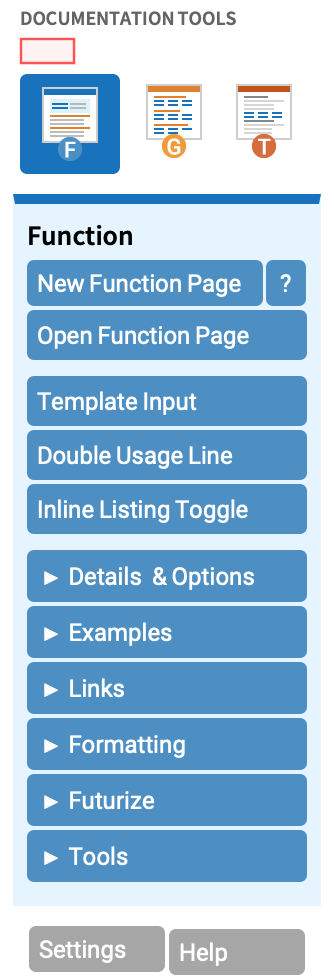

# Documentation Tools palette button catalog

Every button in the Documentation Tools palette (`File > Palettes >
Documentation Tools`, source at
`<install>/AddOns/Applications/DocumentationTools/FrontEnd/Palettes/DocumentationTools.nb`)
with its visible label, the package function it calls, and the
`MarkdownToNotebook` equivalent (markdown source, frontmatter key, or
`#|` cell option). Status: **[done]**, **[partial]**, **[todo]**.

Each button's `ButtonData` is `Part[{Hold[action], "LabelKey", "TooltipKey", ...}, 1]`
where `LabelKey` looks up `FrontEndResource["DocumentationToolsStrings", "LabelKey"]`.
The labels here are the resolved English strings; the actions are
`DocumentationTools``-context calls. Cell styles in the right-hand columns
(`Section`, `ExampleSection`, `2ColumnTableMod`, ...) are the cells the
action drops into the page.

The palette has four tabs (Function / Guide / Tech Note / Overview) that
share most of their button rows; the per-tab differences are noted under
each section.

## Page (top-of-tab)

The first row of each tab. The tab selector at the very top is implemented
as `CurrentValue[ButtonNotebook[], {TaggingRules, "CurrentPaletteTab"}] = n`
where `n` is `1`/`2`/`3`/`4` for Function/Guide/TechNote/Overview.

| Button | Action (`DocumentationTools``…) | Markdown / frontmatter | Status |
|---|---|---|---|
| New Function Page | `TestCurrentPacletApplicationDirectory[PreCreateNewPageDialog["Reference"]]` | `Template: Symbol` + `Name:` + `Paclet:` + `URI:` | done |
| New Guide Page | `TestCurrentPacletApplicationDirectory[PreCreateNewPageDialog["Guide"]]` | `Template: Guide` + `Name:` + `Paclet:` + `URI:` | done |
| New Tech Note | `TestCurrentPacletApplicationDirectory[PreCreateNewPageDialog["TechNote"]]` | `Template: TechNote` + `Name:` + `Paclet:` + `URI:` | done |
| New Overview Page | `TestCurrentPacletApplicationDirectory[PreCreateNewPageDialog["Overview"]]` | `Template: Overview` (not yet supported) | todo |
| Open Function Page (list) | `TestCurrentPacletApplicationDirectory[OpenPageDialog["Symbol"]]` | `examples/build.wls` over `docs/Symbols/*.md` | done |
| Open Guide Page (list) | `TestCurrentPacletApplicationDirectory[OpenPageDialog["Guide"]]` | `examples/build.wls` over `docs/Guides/*.md` | done |
| Open Tech Note (list) | `TestCurrentPacletApplicationDirectory[OpenPageDialog["Tutorial"]]` | `examples/build.wls` over `docs/TechNotes/*.md` | done |
| Sample Function Page | `NotebookOpen[{$DocumentationToolsDir, "FrontEnd", "TextResources", "FunctionExample.nb"}]` | the AccessibleColors paclet pages | n/a (sample) |
| Sample Guide Page | `NotebookOpen[..., "GuideExample.nb"]` | the AccessibleColors paclet guides | n/a (sample) |
| Sample Tech Note Page | `NotebookOpen[..., "TechNoteExample.nb"]` | the AccessibleColors paclet tech notes | n/a (sample) |
| Generate Function Pages | `TestCurrentPacletApplicationDirectory[ChoosePacletAndCreateReferencePages[]]` | `examples/build.wls` builds every page in `docs/Symbols/` | done |
| Generate Overview | `TestCurrentPacletApplicationDirectory[GenerateOverviewDialog[]]` | `Template: Overview` (not yet supported) | todo |
| Rename Symbol | `TestCurrentPacletApplicationDirectory[GenerateRenameSymbolDialog[]]` | rename the file and the `Name:` / `URI:` frontmatter | n/a (rename) |
| Replace Paclet Base | `ReplacePacletNameInPacletDocumentation[]` | edit the `Paclet:` / `URI:` frontmatter | n/a (rename) |

## Insert (Function Page tab)

| Button | Action (`DocumentationTools``…) | Cell style | Markdown | Status |
|---|---|---|---|---|
| Template Input | `FunctionTemplateToggle` | toggles `InlineFormula` ↔ plain | `` `code` `` (the default) | done |
| Default Format | `RestoreDefault` | parse selection as input | (default for `` `code` ``) | done |
| Literal Input | `FunctionTemplate["Plain"]` | `Cell[BoxData[…], "InlineFormula"]` literal | `` `"literal string"` `` | done |
| Italic Input | `StyleApply["TI"]` | `StyleBox[…, "TI"]` | `*arg*` (markdown italic) | done |
| Code Inline | `StyleApply["InlineCode"]` | `StyleBox[…, "InlineCode"]` | `` ``code`` `` (double backtick) | done |
| Plain Text | `StyleApply["TR"]` | `StyleBox[…, "TR"]` | plain prose run | done |
| Traditional Math | `TraditionalFormCell` | `Cell[BoxData[FormBox[…, TraditionalForm]], "InlineFormula"]` | `$math$` | done |
| Annotate | `AnnotationInsert[]` | `TooltipBox` annotation | n/a (authoring aid) | n/a |
| Annotation ↑ / ↓ | `AnnotationSearch["Up" \| "Down"]` | nav between annotations | n/a (authoring aid) | n/a |
| Annotation 🗑 | `AnnotationRemove[CalledFromFrameLabel -> True]` | strips a `TooltipBox` | n/a (authoring aid) | n/a |
| Double Usage Line | `DoubleUsageLinesInsert` | a `Usage` cell with `ModInfo` + `InlineFormula` + text | `## Usage` paragraph led by `` `Call[a,b]` `` | done |
| Note | `StyleInsert["Notes"]` | `Notes` cell | `## Details & Options` bullet | done |
| Section (in example) | `StyleInsert["ExampleSection"]` | `ExampleSection` cell | `## Heading` inside `## Examples` | done |
| Subsection (in example) | `StyleInsert["ExampleSubsection"]` | `ExampleSubsection` cell | `### Heading` inside an example section | done |
| Subsubsection (in example) | `StyleInsert["ExampleSubsubsection"]` | `ExampleSubsubsection` cell | `#### Heading` | done |
| Insert Text | `StyleInsert["ExampleText"]` | `ExampleText` cell | prose paragraph inside `## Basic Examples` | done |
| Insert Delimiter | `DocDelimiter["Reference"]` | `ExampleDelimiter` cell (a thin separator line) | `---` (thematic break between sibling examples) | done |

## Insert (Guide Page tab)

| Button | Action (`DocumentationTools``…) | Cell style | Markdown | Status |
|---|---|---|---|---|
| Subsection | `StyleInsert["GuideFunctionsSubsection"]` | `GuideFunctionsSubsection` cell | `### Heading` in the functions section | done |
| Delimiter | `DocDelimiter["Guide"]` | `ExampleDelimiter` | `---` | done |
| Text | `StyleInsert["GuideText"]` | `GuideText` cell | prose paragraph | done |
| 1 Line Function Listing | `SetPacletApplyFunction["DocumentationTools`OneLineFunction[]", …]` | rewrites the guide's listing to one symbol per line | `## Functions` list (default) | done |
| Functions Inline Listing | `SetPacletApplyFunction["DocumentationTools`InlineListingToggle[\"TargetStyle\" -> Automatic]", …]` | rewrites the guide's listing to inline chip style | `## Functions` list with `InlineGuideFunction` chips | done |
| Inline Listing Toggle | `SetPacletApplyFunction["DocumentationTools`InlineListingToggle[\"TargetStyle\" -> Automatic]", …]` | toggles a per-symbol entry between block and chip | (the converter handles either form) | done |

## Insert (Tech Note tab)

| Button | Action (`DocumentationTools``…) | Cell style | Markdown | Status |
|---|---|---|---|---|
| Section | `StyleInsert["Section"]` | `Section` cell | `## Heading` | done |
| Subsection | `StyleInsert["Subsection"]` | `Subsection` cell | `### Heading` | done |
| Text | `StyleInsert["Text"]` | `Text` cell | prose paragraph | done |
| Example Group | a NotebookWrite of `Cell["XXXX", "MathCaption"]` + `Cell[BoxData[…], "Input"]` + `Cell[…, "Output"]` group | grouped Example | a fenced `wl` block under a leading prose caption | done |
| Example Caption | `StyleInsert["MathCaption"]` | `MathCaption` cell | one-line prose right before an `wl` block (becomes `MathCaption` / `CodeText`) | done |

## Insert (Overview tab)

| Button | Action (`DocumentationTools``…) | Cell style | Markdown | Status |
|---|---|---|---|---|
| TOC Chapter | `StyleInsert["TOCChapter"]` | `TOCChapter` | `## Heading` in an Overview page | todo (template) |
| TOC Section | `StyleInsert["TOCSection"]` | `TOCSection` | `### Heading` | todo |
| TOC Subsection | `StyleInsert["TOCSubsection"]` | `TOCSubsection` | `#### Heading` | todo |
| TOC Subsubsection | `StyleInsert["TOCSubsubsection"]` | `TOCSubsubsection` | (level 5) | todo |

## Links

| Button | Action (`DocumentationTools``…) | Markdown | Status |
|---|---|---|---|
| Link to Function | `AuxiliaryCustomLinkSelection["Reference"]` | `[Name](paclet:Pub/Pkg/ref/Name)` or the inferred `[Name]()` | done |
| Link to Function … (Browse file) | `PreCustomLinkSelectionToFile["Reference"]` | same; opens a file picker for the ref target | done |
| Link to Guide | `AuxiliaryCustomLinkSelection["Guide"]` | `[Title](paclet:Pub/Pkg/guide/Title)` | done |
| Link to Guide … (Browse file) | `PreCustomLinkSelectionToFile["Guide"]` | same; file picker | done |
| Link to Tech Note | `AuxiliaryCustomLinkSelection["Tutorial"]` | `[Title](paclet:Pub/Pkg/tutorial/Title)` | done |
| Link to Tech Note … (Browse file) | `PreCustomLinkSelectionToFile["Tutorial"]` | same; file picker | done |
| Link to URL | `CustomLink[Target -> "URL"]` | `[text](https://…)` (`Hyperlink` `ButtonBox`) | done |
| Custom URI | `CustomLink[PacletInteractive -> True]` | `[text](paclet:…)` (arbitrary `paclet:` URI) | done |
| Make Link | `LinkSelection[]` | linkify the current selection inline (build resolves the head) | done |
| Make Sel | `InsertLink["PreserveSelectionContent" -> True]` | wraps the selection in an inferred `[Name]()` link | done |
| Edit Link | `ButtonEdit[]` | re-author the markdown link target | n/a |

## Tables (3-column table-mod, options table, definition box)

`MarkdownToNotebook` reads the GitHub-flavored pipe table
(`\| a \| b \|` rows + `\|---\|---\|` separator) into a single `Cell` of
style `2ColumnTableMod` or `3ColumnTableMod` (depending on column count) -
the same cell the palette inserts here. The cells in each table column
are `Cell[…, "TableText"]` (text) or `Cell[…, "ModInfo"]` (the
modification-indicator column on the left).

| Button | Action (`DocumentationTools``…) | Cell style | Markdown | Status |
|---|---|---|---|---|
| Insert Custom Table | `TableInsertDialog[]` | grid of `2ColumnTableMod` / `3ColumnTableMod` cells | pipe table under `## Details & Options` | done |
| 2-column table (icons col-1 / col-2) | `TableInsert[2]` (code-only) / `TableInsert[3]` (text+code) | 2-col `…TableMod` grid | a 2-column pipe table | done |
| 2-column text table (text-1 / text-2 / text-3 / col-3) | `TableInsert[2 \| 3 \| 4, PlaceholderObject -> {Cell["      ", "ModInfo"], Cell["XXXX", "TableText"]}]` | n-col `…TableMod` grid with `TableText` cells | a 2/3/4-column pipe table whose cells are prose | done |
| Add Row | `TableAddRow[]` | extra row of the same shape | add a new `\| … \| … \|` line | done (re-author rows) |
| Sort Table | `TableSort[]` | sorts grid rows by the first column | resort the markdown rows by hand | done (re-author rows) |
| Merge Tables | `TableMerge[]` | merges two adjacent table cells into one | author one table instead of two | done (re-author rows) |
| Span First Column | `TableSpanToggle[]` | first-column cell spans the row (long-name overflow) | not representable in pipe tables; keep names short | partial |
| Options Table | `OptionsTableCreate[]` | special `OptionsTable` grid keyed by `Options[Symbol]` | a markdown pipe table under `## Options` | done |
| Options for Function | `OptionHeadingsInspector[]` | dialog enumerating options of a target symbol | author the pipe-table options yourself | done |

## Definition box (2-/3-column definition table — Tech Note tab)

A different beast from the option/notes tables above: a `DefinitionBox`
holds inline `Cell`s with leading `ModInfo` columns, used in tech notes to
explain a multi-form construct.

| Button | Action (`DocumentationTools``…) | Cell style | Markdown | Status |
|---|---|---|---|---|
| 2 Column | `Module[{nb = InputNotebook[]}, NotebookWrite[nb, Cell[BoxData[GridBox[…]], "2ColumnTableMod"]]]` | `2ColumnTableMod` | a 2-column pipe table | done |
| 3 Column | (same, 3-column variant) | `3ColumnTableMod` | a 3-column pipe table | done |
| Add Row (definition box) | `TableAddRow` | extra row, same shape | add a `\| … \| … \|` line | done (re-author rows) |
| Merge | `TableMerge` | merges adjacent definition-box cells | author one table | done (re-author rows) |

## Flags (Futurize / Status)

| Button | Action (`DocumentationTools``…) | Cell style | Markdown | Status |
|---|---|---|---|---|
| Futurize Selection | `InputNotebookDocumentationToolsType[StyleAppend["FutureExample"]]` | tags the cell with `"FutureExample"` | `#\| flag: future` (`FutureFlag` cell on the cell) | done |
| Futurize Whole Page | `InputNotebookDocumentationToolsType[SymbolStatusSet["Future"]]` | sets the page-level `"Future"` status | `Flag: future` (document-level `FutureFlag` banner) | done |

## Quick reference: the action functions

| Function | Effect | Used by |
|---|---|---|
| `DocumentationTools`StyleInsert[s]` | drop a new `Cell["", s]` of the named style | every Section / Subsection / Text button |
| `DocumentationTools`StyleApply[s]` | wrap the selection in `StyleBox[…, s]` | Italic / Code Inline / Plain Text |
| `DocumentationTools`FunctionTemplateToggle` | toggle `InlineFormula` on the selection | Template Input |
| `DocumentationTools`TableInsert[n, opts…]` | insert an n-column `…TableMod` grid | every Insert Table button |
| `DocumentationTools`TableInsertDialog[]` | dialog wrapper for `TableInsert` | Insert Custom Table |
| `DocumentationTools`TableAddRow[]` | extend a table by one row of the same shape | Add Row (both Tables tab and Definition Box) |
| `DocumentationTools`TableSort[]` | sort table rows by first column | Sort Table |
| `DocumentationTools`TableMerge[]` | merge two adjacent tables / definition boxes | Merge Tables, Merge |
| `DocumentationTools`TableSpanToggle[]` | toggle first-column spanning | Span First Column |
| `DocumentationTools`OptionsTableCreate[]` | dialog → `OptionsTable` grid keyed by `Options[…]` | Options Table |
| `DocumentationTools`OptionHeadingsInspector[]` | enumerate a symbol's options for authoring | Options for Function |
| `DocumentationTools`DocDelimiter["Reference" \| "Guide"]` | insert a separator cell | Insert Delimiter |
| `DocumentationTools`AuxiliaryCustomLinkSelection["Reference" \| "Guide" \| "Tutorial"]` | wrap selection in a `paclet:` link | every Link to … button |
| `DocumentationTools`PreCustomLinkSelectionToFile[type]` | file-picker version of the link button | every Link to … (file) variant |
| `DocumentationTools`CustomLink[Target -> "URL"]` | wrap selection in a `Hyperlink` | Link to URL |
| `DocumentationTools`InsertLink["PreserveSelectionContent" -> True]` | wrap the current selection in a link | Make Sel |
| `DocumentationTools`LinkSelection[]` | linkify the current selection | Make Link |
| `DocumentationTools`ButtonEdit[]` | edit the current link target | Edit Link |
| `DocumentationTools`DoubleUsageLinesInsert` | insert a `Usage` cell shaped like the docs' two-line usage | Double Usage Line |
| `DocumentationTools`TraditionalFormCell` | wrap the selection in `FormBox[…, TraditionalForm]` | Traditional Math |
| `DocumentationTools`AnnotationInsert[]` / `AnnotationSearch[dir]` / `AnnotationRemove` | author / navigate / remove annotations | Annotate (and arrows) |
| `DocumentationTools`SetPacletApplyFunction[code, …]` | apply a transformation across every page of the paclet | 1 Line / Inline Listing / Inline Listing Toggle |
| `DocumentationTools`PreCreateNewPageDialog[type]` | "New Page" dialog | every New … Page button |
| `DocumentationTools`OpenPageDialog[type]` | "Open Page" dialog (lists pages of the paclet) | every Open … Page button |
| `DocumentationTools`ChoosePacletAndCreateReferencePages[]` | bulk-create reference pages for every symbol in a paclet | Generate Function Pages |
| `DocumentationTools`GenerateOverviewDialog[]` | dialog → overview page from the paclet's docs | Generate Overview |
| `DocumentationTools`GenerateRenameSymbolDialog[]` | rename a symbol across the paclet (page + URI + references) | Rename Symbol |
| `DocumentationTools`ReplacePacletNameInPacletDocumentation[]` | bulk-replace publisher/paclet name across `URI:` and `Paclet:` | Replace Paclet Base |
| `DocumentationTools`InputNotebookDocumentationToolsType[f]` | run `f` on the input notebook iff it is a known doc page | Futurize Selection / Whole Page |
| `DocumentationTools`StyleAppend["FutureExample"]` | tag a single cell with the Future flag | Futurize Selection (inner) |
| `DocumentationTools`SymbolStatusSet["Future"]` | set the doc page's `Future` status banner | Futurize Whole Page (inner) |
| `DocumentationTools`TestCurrentPacletApplicationDirectory[expr]` | run `expr` only if the input notebook is inside a paclet application | every paclet-aware button (wraps it) |

## Things the palette does that markdown doesn't yet have

- **`Overview` template** is not yet mapped (no `Template: Overview` /
  `TOCChapter`-style sections).
- **`SetPacletApplyFunction` bulk transforms** (rewrite every page's
  function listing) - the markdown source is the truth, so the equivalent
  is a sed over the `docs/Guides/*.md` files.
- **`AnnotationInsert` / `AnnotationSearch`** (authoring annotations) -
  authoring-time only, no doc-page artifact, so not represented.
- **`Span First Column`** - GitHub-flavored pipe tables don't span cells;
  if a label needs the spanning width the table is the wrong fit.
