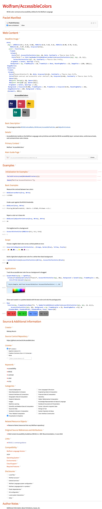

# Resource definition notebooks (FunctionResource / Paclet / Example)

These fill the official definition template from
`DefinitionNotebookClient`DefinitionTemplate[...]` and keep its stylesheet and
docked **Deploy / Submit / Check** toolbar, so the `.nb` is publishable as-is.
Each `TemplateSlot` in the template is replaced by cells built from the markdown
(`template //. TemplateSlot[name, …] :> fillSlot[name, …]`).

## FunctionResource (Wolfram Function Repository)



````md
---
Template: FunctionResource
Name: MyFunction
Description: ...
ContributedBy: Jane Doe
Keywords: [a, b]
Categories: [Notebook Documents & Presentation]
OperatingSystems: [Windows, MacOSX, Unix]
Environments: [Session, Script]
CloudSupport: true
WolframVersion: 14.0+
EntrySymbol: MyFunction
---

## Definition

```wl
#| file: MyFunction.wl
```

## Usage

`MyFunction[x]` does the thing.

## Details & Options

Notes prose.

## Basic Examples

```wl
MyFunction[1]
```
````

| Markdown / frontmatter | Template slot | Toolbar action it feeds |
|---|---|---|
| `Name` | `Name` (Title) | name |
| `Description` | `Description` | short description |
| `## Definition` `wl` cells | `Function` (Input) | the function source |
| `## Usage` prose | `Usage` | usage lines |
| `## Details & Options` | `Notes` | Details & Options |
| `## Basic Examples`/`## Scope`/... | `Examples` (Basic Examples, Scope, ...) | evaluated example cells |
| `Keywords` | `Keywords` | keyword items |
| `Categories` | `Categories` | category checkboxes (`CheckboxesCell`) |
| `OperatingSystems`/`Environments`/`CloudSupport`/`Features` | `Compatibility*` | compatibility checkboxes |
| `WolframVersion` | `CompatibilityWolframLanguageVersionRequired` | required version |
| `Sources` | `Source/Reference Citation` | citation items |
| `Links` | `Links` | external links |
| `ContributedBy` | `Contributed By` | author |
| (section) `## Author Notes` | `Author Notes` | reviewer notes |

The example-section taxonomy (`## Basic Examples`, `## Scope`, `## Options`,
`## Applications`, `## Properties and Relations`, `## Possible Issues`,
`## Neat Examples`) maps to the template's example subsections. Checkbox slots
are built with `DefinitionNotebookClient`CheckboxesCell` so the `"CheckboxData"`
blob (a `BaseEncode`d `Compress` of `<|"Property"->…,"Checked"->…|>`) is correct.

**Toolbar**: the docked `MainGridTemplate`/`ToolsGridTemplate` provide
**Deploy**, **Submit**, **Check** (= `DefinitionNotebookClient`CheckDefinitionNotebook`,
expects a `File[…]` or `NotebookObject`). The markdown only supplies the
metadata; the buttons act on the filled notebook.

**Check status**: `SeeAlso` fills the *Related Symbols* slot (so it no longer
leaves the placeholder string that `Check` flagged as `NotAValidSymbolName`).
`Check` run headless via `CheckDefinitionNotebook[File[…]]` may still report
`DefinitionMissing` for a definition that inlines a whole multi-symbol package;
the definition is in fact valid (running the scraper's own steps -
`evaluateCell` in `FunctionResource`$ResourceFunctionTempContext` then
`minimalDefinition`) yields a non-empty `DefinitionList`, and the interactive
Deploy/Submit path (what `bootstrap.wls` uses) builds it cleanly.

## Paclet (Paclet Repository)

Same mechanism with `DefinitionTemplate["Paclet"]`, but the slot names differ
from the Function template. The markdown maps as:

| Markdown | Paclet slot | Notebook |
|---|---|---|
| `Name` (publisher-prefixed, e.g. `Wolfram/AccessibleColors`) | `Name` | title |
| `Description` (must match `PacletInfo.wl`) | `Description` | short description |
| `## Usage` prose | `LongDescription` | landing-page text (inline `` `code` `` templated) |
| `## Details & Options` | `Details` | `Notes` |
| `## Basic Examples` / `## Scope` / ... | `ExampleNotebook` | `Subsection` + `Text` + `Input`/`Output` |
| `## Hero Image` | `HeroImage` | landing image (see below) |
| `Context` | `PrimaryContext` | primary context |
| `MainGuide` (guide page name) | `MainGuidePageString` -> `MainGuidePage` | main-guide chooser tagging rule |
| `License` (e.g. `MIT`) | `SelectedLicenseID` | license radio button |
| `Categories` (`[list]`, names must match the template) | `Categories` | category checkbox grid (`CheckboxesCell`, `ResourceType -> "Paclet"`) |
| `Sources` (`[list]`) | `Source/Reference Citation` | source / reference items |
| `WolframVersion` | `CompatibilityWolframLanguageVersionRequired` | required version |
| `SourceControlURL` | `SourceControlURL` | source link |
| `Links` (labeled `[text](url)`) | `Links` | related links |
| `RelatedResources` (`[list]`) | `Related Resource Objects` | related resource items |
| `Keywords`, `ContributedBy` | same | metadata |

Frontmatter: `Name`, `Description`, `Context`, `Paclet`, `PacletDirectory`,
`MainGuide`, `License`, `WolframVersion`, `Categories`, `Sources`,
`SourceControlURL`, `Keywords`, `Links`, `ContributedBy`. Examples load the
paclet (`Context`) via the `ExampleInitialization` cells and demonstrate it.

`Disclosures` are the nine standalone checkboxes the Paclet template ships
with in its **Disclosures** section. Unlike `Categories`,
`CompatibilityFeatures` etc. (single `CheckboxesCell` grids that the resource
system auto-populates from its own item list), each disclosure is its own
`CheckboxBox` cell with a fixed name and tooltip:

| Frontmatter token         | Display label              | Trigger                                                                                                  |
|---------------------------|----------------------------|----------------------------------------------------------------------------------------------------------|
| `LocalFiles`              | Local files                | creates / deletes / modifies / imports local files (loading-time IO excepted)                            |
| `ExternalServices`        | External services          | calls non-Wolfram network services (REST APIs, web scraping, sockets, ...)                               |
| `LocalSystemInteractions` | Local system interactions  | shells out to external processes, reads the clipboard, controls another app, accesses sensors            |
| `OSConfiguration`         | OS configuration           | modifies OS-level settings (environment variables, scheduled tasks, registry, ...)                       |
| `PacletDependencies`      | Paclet dependencies        | requires other paclets to be installed                                                                   |
| `WLSystemConfiguration`   | WL system configuration    | mutates the kernel environment - `$ContextPath`, `$Path`, persistent values, persistent objects, ...     |
| `WLSystemSymbols`         | WL system symbols          | defines or `Set`s values on `` System` `` symbols (or another paclet's context)                          |
| `WolframAccount`          | Wolfram account            | uses Wolfram ID, the user's cloud account / cloud objects, Wolfram credits, scheduled cloud tasks, WolframAlpha calls |
| `Other`                   | Other                      | any disclosure not covered above (give a description in the section's text area)                         |

Authors list the applicable ones in the frontmatter (matches the existing
list-style keys like `Categories`):

```
Disclosures: [LocalFiles, ExternalServices]
```

M2N walks the produced Paclet notebook for `CheckboxBox[False, {False, name}]`
cells whose tag matches one of the names in `Disclosures` and flips them to
`CheckboxBox[True, {True, name}]`. The accompanying text area of each
disclosure (where the author would normally describe *what* the paclet does
in that category) can be filled by writing a `## Disclosures` section with
subheadings matching the display labels - though that authoring path is
optional; an unchecked disclosure stays empty, a checked one with no body
just shows the canonical tooltip.

`PrimaryContext`, `MainGuidePage` and the license radio are
driven through `TemplateExpression`/`TemplateIf` and scalar slots, resolved in
the first pass (see above). `MyPublisherID/MyPaclet` strings that remain are the
template's ⓘ help-tooltip examples, not unfilled slots.

The example sub-sections in `ExampleNotebook` are literal cells (not a slot), so
they are built rather than slot-filled; the `ExampleInitialization` group (the
`PacletDirectoryLoad` + `Needs` cells) is preserved from the template. The hero
image is the `## Hero Image` section's evaluated output, kept with its code in a
`CellGroupData[{code, image}, {2}]` group (shows the image, collapses the code).

The Paclet template wraps its directory / main-guide / context metadata in
`TemplateExpression` and `TemplateIf` (not plain `TemplateSlot`). These are
resolved in a first pass *before* the cell-based slot fill, in stages: slots
substituted first (so a `TemplateIf` condition like `StringQ[TemplateSlot[…]]`
tests the real value), then `TemplateIf` collapses, then `TemplateExpression`
unwraps and its body (`DeleteMissing` / `ToBoxes` / …) evaluates. The
`PacletDirectory` frontmatter key flows into the directory tagging rule, so the
notebook carries no unresolved template heads and `CheckDefinitionNotebook` runs
clean - except for `PacletDirectoryMissing`, which the docked **Choose**
toolbar button clears by scanning the directory to populate the manifest /
`PacletFiles` panel (an interactive publish-time step, not static metadata).

## Example (Wolfram Example Repository)

Same mechanism with `DefinitionTemplate["Example"]`. An Example resource exposes
named *content elements* (fetched with `ResourceData`) plus worked examples, so the
markdown maps as:

| Markdown | Example slot | Notebook |
|---|---|---|
| `Name` | `Name` | title |
| `Description` | `Description` | short description |
| `## Content` (executable cells) | `ContentElements` | `Input` cells tagged `DefaultContent` |
| `## Examples` (prose + code) | `Examples` | `Text` + `Input`/`Output` (filled directly, no subsection wrapper) |
| `## Hero Image` | `HeroImage` | landing image (`CellGroupData[{code, image}, {2}]`) |
| `Categories` (`[list]`; names must match the template) | `Categories` | category checkbox grid (`ResourceType -> "Example"`) |
| `RelatedSymbols` (`[list]`) | `RelatedSymbols` | related symbol items |
| `RelatedResources` (`[list]`) | `Related Resource Objects` | related resource items |
| `Sources` (`[list]`) | `Source/Reference Citation` | source / reference items |
| `Links` (labeled `[text](url)`) | `Links` | related links |
| `WolframVersion` | `CompatibilityWolframLanguageVersionRequired` | required version |
| `Keywords` | `Keywords` | metadata |
| `ContributedBy` | `ContributorInformation` | contributor |

The defining cells go under `## Content`: each `wl` cell becomes an `Input` cell
carrying the `DefaultContent` tag the scraper needs (content cells are included
whether or not they carry `#| eval: false`, since the assignment itself only resolves
in the deployed notebook). A common pattern is a helper definition (evaluated, so the
examples can reuse it) followed by the literal content assignments
(`ResourceData[ResourceObject[EvaluationNotebook[]], "name"] = value`, marked
`#| eval: false` because `ResourceObject[EvaluationNotebook[]]` has no meaning in a
headless convert session). Unlike the Function
template's named example sections, the Example template has a single `Examples` slot,
so a plain `## Examples` section fills it directly (intro prose as `Text`, computations
as `Input`/`Output`). The Example resource's category labels differ from the Function
ones (e.g. `Visualization & Graphics`, `Puzzles and Recreation`, `Machine Learning`);
set `Categories` to one or more of them - an empty grid is a submission hint.

## Prompt (Wolfram Prompt Repository)

Same mechanism with `DefinitionTemplate["Prompt"]`. A Prompt resource is one of
three types (`Persona`, `Function`, `Modifier`); the layout below is the same
for all three, with each type using a different subset of the optional slots.

| Markdown | Prompt slot | Notebook |
|---|---|---|
| `Name` | `Name` | title (noun for Persona, verb for Function, past-tense verb for Modifier) |
| `Description` | `Description` | one-line description |
| `PromptType` (`Persona` / `Function` / `Modifier`) | drives Categories list | one of the type-specific category sets |
| `## Prompt` (plain prose) | `PromptTemplate` | the actual prompt body; `` `{arg}` `` becomes a `TemplateSlot` for Function prompts |
| `## Persona Icon` (one `wl` cell) | `PersonaIcon` | avatar shown in Chat Notebooks |
| `## Cell Processing Function` (one `wl` cell) | `CellProcessingFunction` | applied to each user input cell before the model sees it |
| `## Cell Post Evaluation Function` (one `wl` cell) | `CellPostEvaluationFunction` | applied to each model output cell |
| `## Output Interpreter` (one `wl` cell) | `PromptInterpreter` | function applied to the model's reply (Function prompts only) |
| `## Usage` (prose paragraphs) | `Usage` | usage statements |
| `## Details & Options` (notes) | `Notes` | details and options |
| `## LLM Tools` (one `wl` cell) | `Tools` | `LLMTool[...]` list |
| `## LLM Configuration` (one `wl` cell) | `LLMConfigurationExtra` | extra `LLMConfiguration` options |
| `## Chat Examples` (multiple `wl` cells) | `SampleChat` | chat-style example invocations |
| `## Basic Examples`, `## Scope`, ... | `Examples` | the standard example sections |
| `Categories` (`[list]`; type-specific names) | `Categories` | category checkbox grid (`ResourceType -> "Prompt"`) |
| `Keywords` | `Keywords` | metadata |
| `Topics` (`[list]`) | `Topics` | topic items |
| `RelatedSymbols` (`[list]`) | `Related Symbols` | related symbol items |
| `RelatedResources` (`[list]`) | `Related Resource Objects` | related prompt items |
| `Sources` (`[list]`) | `Source/Reference Citation` | source / reference items |
| `Links` (labeled `[text](url)`) | `Links` | related links |
| `ContributedBy` | `ContributorInformation` | contributor |

The optional Chat-Related Features (Persona Icon, Cell Processing Function, Cell
Post Evaluation Function) and Programmatic Features (Output Interpreter) are
sections from which only the *first* code block is pulled into the corresponding
slot; the rest of the section is ignored, so a section without a code block
leaves the slot at its default. Persona prompts typically fill the Chat-Related
slots and leave Output Interpreter empty; Function prompts do the opposite;
Modifier prompts usually leave both empty and only fill the `## Prompt` body and
the example sections.

Examples that load the deployed resource (`LLMPrompt["MyPromptName"]`) cannot
evaluate before publication, and `LLMSynthesize` / `ChatEvaluate` need an
active LLM connection at evaluation time, so mark these cells `#| eval: false`
so the build does not error; once the prompt is published and the LLM is
configured, the cells run as written. (Do not write them against
`LLMPrompt[ResourceObject[EvaluationNotebook[]]]` - `EvaluationNotebook[]` is
the *user's* notebook at call time, not the deployed resource, so the lookup
fails both headlessly and at runtime in a chat session.)

## Demonstration (Wolfram Demonstrations Project)

Same mechanism with `DefinitionTemplate["Demonstration"]`. A Demonstration is
built around exactly one `Manipulate[...]`; the markdown maps as:

| Markdown | Demonstration slot | Notebook |
|---|---|---|
| `Name` | `Name` | Title Case title; URL slug is derived from it |
| `## Caption` (3-5 sentence prose) | `CaptionCells` | the page caption shown under the thumbnail |
| `## Initialization` (one `wl` cell) | `InitializationCode` | helper definitions; pair with `SaveDefinitions -> True` on the Manipulate |
| `## Manipulate` (one `wl` cell) | `ManipulateGroup` | the Manipulate Input cell + its evaluated panel Output |
| `## Snapshots` (3+ `wl` cells) | `SnapshotGroup` | the required snapshots (one per cell) |
| `## Details` (prose) | `DetailCells` | extended description, formulas, snapshot captions |
| `## References` (prose, numbered items) | `ReferenceCells` | numbered references |
| `AuthorNames` (or `ContributedBy`) | `AuthorNames` | contributor line |
| `Keywords` | `Keywords` | metadata |
| `Categories` (`[list]`; Topics taxonomy) | `Categories` | category checkbox grid (`ResourceType -> "Demonstration"`) |
| `RelatedDemonstrations` (`[list]`) | `RelatedDemonstrations` | linked related Demos |
| `Links` (labeled `[text](url)`) | `ExternalLinks` | related links |
| `SubmissionNotes` | `SubmissionNotes` | private note for the reviewer |
| `ARSupport` (true/false) | `CompatibilityARSupport` | AR support checkbox |

The `## Manipulate` slot uniquely needs the **evaluated** output of the
Manipulate (the live panel) below its Input cell, so the conversion uses the
same example-evaluation pass the other templates do and inlines the cached
output as the cell's Output. The `## Snapshots` slot is filled by one Input cell
per `wl` block in the section; the Demonstrations Project rules require at least
three. Both `## Initialization` and `## Manipulate` should be a single `wl` cell
each (only the first is used).

## Self-hosting

A document whose frontmatter is `Template: FunctionResource`, whose `## Definition`
inlines its own `.wl`, and whose frontmatter is the resource metadata reproduces
its own definition notebook via `MarkdownToNotebook[file]` - see `build.wls` (the
converter publishing itself).
