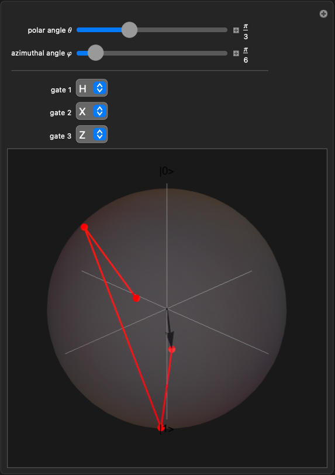
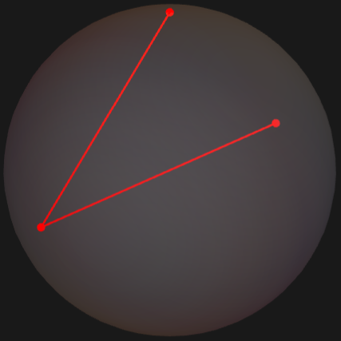
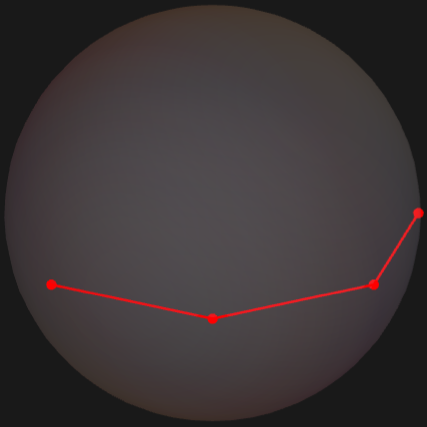
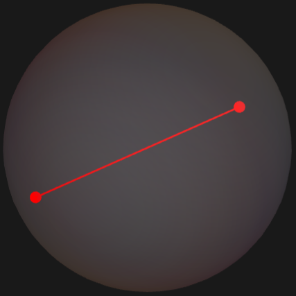

## Caption

Watch a single qubit move on the Bloch sphere as a sequence of quantum gates is applied to it. The initial state is set by the spherical coordinates $\theta$ and $\varphi$. Choose up to three gates from the menus - Hadamard ($H$), the Pauli operators ($X$, $Y$, $Z$), the phase gates ($S$, $T$), or the identity ($I$) - and the red trajectory traces the state vector after each one.

## Initialization

The eight single-qubit gates are stored as an [Association](https://reference.wolfram.com/language/ref/Association.html) of $2 \times 2$ unitary matrices; `blochVector` projects a pure state $|\psi\rangle = a|0\rangle + b|1\rangle$ onto the unit sphere by computing the Bloch coordinates $(2\Re(a^* b),\ 2\Im(a^* b),\ |a|^2 - |b|^2)$; `trajectory` folds the gates over the initial state and returns every intermediate vector.

```wl
gates = <|
    "I" -> IdentityMatrix[2],
    "H" -> 1/Sqrt[2] {{1, 1}, {1, -1}},
    "X" -> {{0, 1}, {1, 0}},
    "Y" -> {{0, -I}, {I, 0}},
    "Z" -> {{1, 0}, {0, -1}},
    "S" -> {{1, 0}, {0, I}},
    "T" -> {{1, 0}, {0, Exp[I Pi/4]}}
|>;
blochVector[{a_, b_}] := {2 Re[Conjugate[a] b], 2 Im[Conjugate[a] b], Abs[a]^2 - Abs[b]^2};
initialState[\[Theta]_, \[CurlyPhi]_] := {Cos[\[Theta]/2], Exp[I \[CurlyPhi]] Sin[\[Theta]/2]};
trajectory[\[Theta]_, \[CurlyPhi]_, gateNames_List] :=
    FoldList[gates[#2] . #1 &, initialState[\[Theta], \[CurlyPhi]], gateNames];
```

## Manipulate

```wl
Manipulate[
    Module[{points = blochVector /@ trajectory[\[Theta], \[CurlyPhi], {g1, g2, g3}]},
        Show[
            Graphics3D[{Opacity[0.15], Sphere[]}],
            Graphics3D[{Gray, Line[{{-1.1, 0, 0}, {1.1, 0, 0}}],
                              Line[{{0, -1.1, 0}, {0, 1.1, 0}}],
                              Line[{{0, 0, -1.1}, {0, 0, 1.1}}]}],
            Graphics3D[{Black, Text[Style["|0>", 14], {0, 0, 1.2}],
                               Text[Style["|1>", 14], {0, 0, -1.2}]}],
            Graphics3D[{Red, Thickness[0.006], Line[points],
                        PointSize[0.025], Point /@ points,
                        Black, Arrowheads[0.04], Arrow[{{0, 0, 0}, Last[points]}]}],
            ImageSize -> 380, SphericalRegion -> True, Boxed -> False,
            ViewPoint -> {2, 2, 1.4}
        ]
    ],
    {{\[Theta], Pi/3, "polar angle \[Theta]"}, 0, Pi, Appearance -> "Labeled"},
    {{\[CurlyPhi], Pi/6, "azimuthal angle \[CurlyPhi]"}, 0, 2 Pi, Appearance -> "Labeled"},
    Delimiter,
    {{g1, "H", "gate 1"}, Keys[gates], ControlType -> PopupMenu},
    {{g2, "X", "gate 2"}, Keys[gates], ControlType -> PopupMenu},
    {{g3, "Z", "gate 3"}, Keys[gates], ControlType -> PopupMenu},
    SaveDefinitions -> True
]
```



## Snapshots

Apply $H$, then $X$, then $Z$ to a state pointing along the polar axis; the trajectory walks around the equator:

```wl
Show[
    Graphics3D[{Opacity[0.15], Sphere[]}],
    Graphics3D[{Red, Thickness[0.006],
        Line[blochVector /@ trajectory[0, 0, {"H", "X", "Z"}]],
        PointSize[0.025], Point /@ (blochVector /@ trajectory[0, 0, {"H", "X", "Z"}])}],
    ImageSize -> 320, SphericalRegion -> True, Boxed -> False, ViewPoint -> {2, 2, 1.4}
]
```



---

The $T$ gate rotates by $\pi/4$ around $\hat z$; three of them in a row reach the same point a single $S$ would (since $T^2 = S$):

```wl
Show[
    Graphics3D[{Opacity[0.15], Sphere[]}],
    Graphics3D[{Red, Thickness[0.006],
        Line[blochVector /@ trajectory[Pi/2, 0, {"T", "T", "T"}]],
        PointSize[0.025], Point /@ (blochVector /@ trajectory[Pi/2, 0, {"T", "T", "T"}])}],
    ImageSize -> 320, SphericalRegion -> True, Boxed -> False, ViewPoint -> {2, 2, 1.4}
]
```



---

$Y$ flips a state across the $\hat x$ axis; applied to $|+\rangle = \frac{1}{\sqrt 2}(|0\rangle + |1\rangle)$ it lands on $-|+\rangle$ (same Bloch point with a global phase):

```wl
Show[
    Graphics3D[{Opacity[0.15], Sphere[]}],
    Graphics3D[{Red, Thickness[0.006],
        Line[blochVector /@ trajectory[Pi/2, 0, {"Y"}]],
        PointSize[0.04], Point /@ (blochVector /@ trajectory[Pi/2, 0, {"Y"}])}],
    ImageSize -> 320, SphericalRegion -> True, Boxed -> False, ViewPoint -> {2, 2, 1.4}
]
```



## Details

A pure single-qubit state $|\psi\rangle = \cos(\theta/2)|0\rangle + e^{i\varphi}\sin(\theta/2)|1\rangle$ is fully described by a point on the unit sphere - the *Bloch sphere* - whose Cartesian coordinates are $(\sin\theta\cos\varphi, \sin\theta\sin\varphi, \cos\theta)$. The north pole is $|0\rangle$ and the south pole is $|1\rangle$; states on the equator are equal superpositions with the azimuth $\varphi$ giving the relative phase.

A single-qubit quantum gate is a $2 \times 2$ unitary matrix, and its action on $|\psi\rangle$ is a rotation of the Bloch vector. Each gate in the menu corresponds to a fixed-axis rotation: the Pauli gates $X$, $Y$, $Z$ are $\pi$-rotations about their respective axes; the Hadamard gate $H$ is a $\pi$-rotation about the axis $(\hat x + \hat z)/\sqrt 2$ that swaps the computational and Hadamard bases; the phase gates $S$ and $T$ are $\pi/2$ and $\pi/4$ rotations about $\hat z$.

The red line in the visualization is the *trajectory* of the Bloch vector as each gate is applied in sequence; the black arrow is the final state. The path therefore shows both *where* the qubit ends up and *how it got there*, which is invisible in any final-state-only picture.

## References

[1] M. A. Nielsen and I. L. Chuang, *Quantum Computation and Quantum Information*, 10th Anniversary Edition, Cambridge: Cambridge University Press, 2010.

[2] J. Preskill, [*Lecture Notes for Physics 219: Quantum Computation*](http://theory.caltech.edu/~preskill/ph219/), California Institute of Technology, 2018.

[3] F. Bloch, "Nuclear Induction," *Physical Review*, **70**(7-8), 1946 pp. 460-474.
