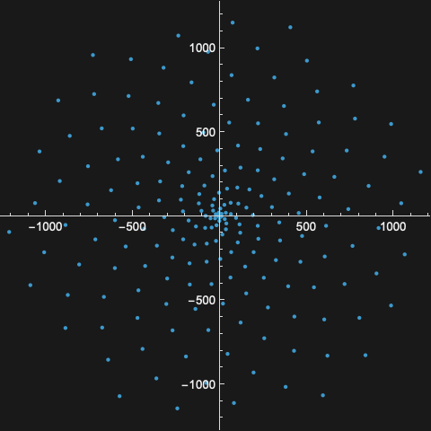
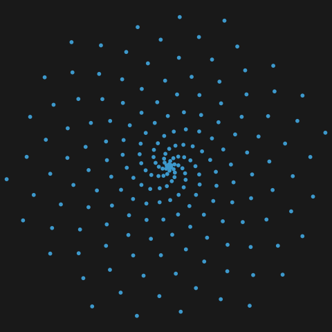

## Content

The resource exposes one content element, `"Points"`: the polar coordinates $(p_n \cos n, p_n \sin n)$ for the first 200 primes $p_n$, fetched with [ResourceData](https://reference.wolfram.com/language/ref/ResourceData.html):

```wl
ResourceData[ResourceObject[EvaluationNotebook[]], "Points"] = Table[{Prime[n] Cos[n], Prime[n] Sin[n]}, {n, 200}];
```

> CheckDefinitionNotebook::shdw: 
>    Symbol CheckDefinitionNotebook appears in multiple contexts 
>     {ResourceSystemClient`DefinitionNotebook`, DefinitionNotebookClient`}
>     ; definitions in context ResourceSystemClient`DefinitionNotebook`
>      may shadow or be shadowed by other definitions.

> CheckForUpdates::shdw: 
>    Symbol CheckForUpdates appears in multiple contexts 
>     {ResourceSystemClient`DefinitionNotebook`, DefinitionNotebookClient`}
>     ; definitions in context ResourceSystemClient`DefinitionNotebook`
>      may shadow or be shadowed by other definitions.

> CurrentTemplateVersion::shdw: 
>    Symbol CurrentTemplateVersion appears in multiple contexts 
>     {ResourceSystemClient`DefinitionNotebook`, DefinitionNotebookClient`}
>     ; definitions in context ResourceSystemClient`DefinitionNotebook`
>      may shadow or be shadowed by other definitions.

> DefinitionTemplateLocation::shdw: 
>    Symbol DefinitionTemplateLocation appears in multiple contexts 
>     {ResourceSystemClient`DefinitionNotebook`, DefinitionNotebookClient`}
>     ; definitions in context ResourceSystemClient`DefinitionNotebook`
>      may shadow or be shadowed by other definitions.

> DeployResource::shdw: 
>    Symbol DeployResource appears in multiple contexts 
>     {ResourceSystemClient`DefinitionNotebook`, DefinitionNotebookClient`}
>     ; definitions in context ResourceSystemClient`DefinitionNotebook`
>      may shadow or be shadowed by other definitions.

> DisplayStripe::shdw: 
>    Symbol DisplayStripe appears in multiple contexts 
>     {ResourceSystemClient`DefinitionNotebook`, DefinitionNotebookClient`}
>     ; definitions in context ResourceSystemClient`DefinitionNotebook`
>      may shadow or be shadowed by other definitions.

> EquivalentResourcePropertyQ::shdw: 
>    Symbol EquivalentResourcePropertyQ appears in multiple contexts 
>     {ResourceSystemClient`DefinitionNotebook`, DefinitionNotebookClient`}
>     ; definitions in context ResourceSystemClient`DefinitionNotebook`
>      may shadow or be shadowed by other definitions.

> GeneralValidator::shdw: 
>    Symbol GeneralValidator appears in multiple contexts 
>     {ResourceSystemClient`DefinitionNotebook`, DefinitionNotebookClient`}
>     ; definitions in context ResourceSystemClient`DefinitionNotebook`
>      may shadow or be shadowed by other definitions.

> GetHiddenString::shdw: 
>    Symbol GetHiddenString appears in multiple contexts 
>     {ResourceSystemClient`DefinitionNotebook`, DefinitionNotebookClient`}
>     ; definitions in context ResourceSystemClient`DefinitionNotebook`
>      may shadow or be shadowed by other definitions.

> IgnoredCellPatterns::shdw: 
>    Symbol IgnoredCellPatterns appears in multiple contexts 
>     {ResourceSystemClient`DefinitionNotebook`, DefinitionNotebookClient`}
>     ; definitions in context ResourceSystemClient`DefinitionNotebook`
>      may shadow or be shadowed by other definitions.

> InsertResourceObjectIcon::shdw: 
>    Symbol InsertResourceObjectIcon appears in multiple contexts 
>     {ResourceSystemClient`DefinitionNotebook`, DefinitionNotebookClient`}
>     ; definitions in context ResourceSystemClient`DefinitionNotebook`
>      may shadow or be shadowed by other definitions.

> NotebookBoxReplacements::shdw: 
>    Symbol NotebookBoxReplacements appears in multiple contexts 
>     {ResourceSystemClient`DefinitionNotebook`, DefinitionNotebookClient`}
>     ; definitions in context ResourceSystemClient`DefinitionNotebook`
>      may shadow or be shadowed by other definitions.

> NotebookCompatibilityTestCode::shdw: 
>    Symbol NotebookCompatibilityTestCode appears in multiple contexts 
>     {ResourceSystemClient`DefinitionNotebook`, DefinitionNotebookClient`}
>     ; definitions in context ResourceSystemClient`DefinitionNotebook`
>      may shadow or be shadowed by other definitions.

> NotebookOutDatedQ::shdw: 
>    Symbol NotebookOutDatedQ appears in multiple contexts 
>     {ResourceSystemClient`DefinitionNotebook`, DefinitionNotebookClient`}
>     ; definitions in context ResourceSystemClient`DefinitionNotebook`
>      may shadow or be shadowed by other definitions.

> NotebookTemplateVersion::shdw: 
>    Symbol NotebookTemplateVersion appears in multiple contexts 
>     {ResourceSystemClient`DefinitionNotebook`, DefinitionNotebookClient`}
>     ; definitions in context ResourceSystemClient`DefinitionNotebook`
>      may shadow or be shadowed by other definitions.

> PostProcessScrapedInfo::shdw: 
>    Symbol PostProcessScrapedInfo appears in multiple contexts 
>     {ResourceSystemClient`DefinitionNotebook`, DefinitionNotebookClient`}
>     ; definitions in context ResourceSystemClient`DefinitionNotebook`
>      may shadow or be shadowed by other definitions.

> PreviewResource::shdw: 
>    Symbol PreviewResource appears in multiple contexts 
>     {ResourceSystemClient`DefinitionNotebook`, DefinitionNotebookClient`}
>     ; definitions in context ResourceSystemClient`DefinitionNotebook`
>      may shadow or be shadowed by other definitions.

> PublisherIDCreationURL::shdw: 
>    Symbol PublisherIDCreationURL appears in multiple contexts 
>     {ResourceSystemClient`DefinitionNotebook`, DefinitionNotebookClient`}
>     ; definitions in context ResourceSystemClient`DefinitionNotebook`
>      may shadow or be shadowed by other definitions.

> SaveDocumentationNotebook::shdw: 
>    Symbol SaveDocumentationNotebook appears in multiple contexts 
>     {ResourceSystemClient`DefinitionNotebook`, DefinitionNotebookClient`}
>     ; definitions in context ResourceSystemClient`DefinitionNotebook`
>      may shadow or be shadowed by other definitions.

> ScrapeResourceInformation::shdw: 
>    Symbol ScrapeResourceInformation appears in multiple contexts 
>     {ResourceSystemClient`DefinitionNotebook`, DefinitionNotebookClient`}
>     ; definitions in context ResourceSystemClient`DefinitionNotebook`
>      may shadow or be shadowed by other definitions.

> ScrapeSection::shdw: 
>    Symbol ScrapeSection appears in multiple contexts 
>     {ResourceSystemClient`DefinitionNotebook`, DefinitionNotebookClient`}
>     ; definitions in context ResourceSystemClient`DefinitionNotebook`
>      may shadow or be shadowed by other definitions.

> SpecifyUpdateVersionDialog::shdw: 
>    Symbol SpecifyUpdateVersionDialog appears in multiple contexts 
>     {ResourceSystemClient`DefinitionNotebook`, DefinitionNotebookClient`}
>     ; definitions in context ResourceSystemClient`DefinitionNotebook`
>      may shadow or be shadowed by other definitions.

> StandardizeTemplateFile::shdw: 
>    Symbol StandardizeTemplateFile appears in multiple contexts 
>     {ResourceSystemClient`DefinitionNotebook`, DefinitionNotebookClient`}
>     ; definitions in context ResourceSystemClient`DefinitionNotebook`
>      may shadow or be shadowed by other definitions.

> SubmitRepository::shdw: 
>    Symbol SubmitRepository appears in multiple contexts 
>     {ResourceSystemClient`DefinitionNotebook`, DefinitionNotebookClient`}
>     ; definitions in context ResourceSystemClient`DefinitionNotebook`
>      may shadow or be shadowed by other definitions.

> SubmitRepositoryUpdate::shdw: 
>    Symbol SubmitRepositoryUpdate appears in multiple contexts 
>     {ResourceSystemClient`DefinitionNotebook`, DefinitionNotebookClient`}
>     ; definitions in context ResourceSystemClient`DefinitionNotebook`
>      may shadow or be shadowed by other definitions.

> TestResourcePropertyEquivalence::shdw: 
>    Symbol TestResourcePropertyEquivalence appears in multiple contexts 
>     {ResourceSystemClient`DefinitionNotebook`, DefinitionNotebookClient`}
>     ; definitions in context ResourceSystemClient`DefinitionNotebook`
>      may shadow or be shadowed by other definitions.

> ToggleToolbar::shdw: 
>    Symbol ToggleToolbar appears in multiple contexts 
>     {ResourceSystemClient`DefinitionNotebook`, DefinitionNotebookClient`}
>     ; definitions in context ResourceSystemClient`DefinitionNotebook`
>      may shadow or be shadowed by other definitions.

> UnInheritCellTaggingRules::shdw: 
>    Symbol UnInheritCellTaggingRules appears in multiple contexts 
>     {ResourceSystemClient`DefinitionNotebook`, DefinitionNotebookClient`}
>     ; definitions in context ResourceSystemClient`DefinitionNotebook`
>      may shadow or be shadowed by other definitions.

> UpdateDefinitionNotebook::shdw: 
>    Symbol UpdateDefinitionNotebook appears in multiple contexts 
>     {ResourceSystemClient`DefinitionNotebook`, DefinitionNotebookClient`}
>     ; definitions in context ResourceSystemClient`DefinitionNotebook`
>      may shadow or be shadowed by other definitions.

> ViewDocumentationNotebook::shdw: 
>    Symbol ViewDocumentationNotebook appears in multiple contexts 
>     {ResourceSystemClient`DefinitionNotebook`, DefinitionNotebookClient`}
>     ; definitions in context ResourceSystemClient`DefinitionNotebook`
>      may shadow or be shadowed by other definitions.

> ViewExampleNotebook::shdw: 
>    Symbol ViewExampleNotebook appears in multiple contexts 
>     {ResourceSystemClient`DefinitionNotebook`, DefinitionNotebookClient`}
>     ; definitions in context ResourceSystemClient`DefinitionNotebook`
>      may shadow or be shadowed by other definitions.

> ViewStyleGuidelines::shdw: 
>    Symbol ViewStyleGuidelines appears in multiple contexts 
>     {ResourceSystemClient`DefinitionNotebook`, DefinitionNotebookClient`}
>     ; definitions in context ResourceSystemClient`DefinitionNotebook`
>      may shadow or be shadowed by other definitions.

> $ButtonsDisabled::shdw: 
>    Symbol $ButtonsDisabled appears in multiple contexts 
>     {ResourceSystemClient`DefinitionNotebook`, DefinitionNotebookClient`}
>     ; definitions in context ResourceSystemClient`DefinitionNotebook`
>      may shadow or be shadowed by other definitions.

> $DebugNotebookFunctions::shdw: 
>    Symbol $DebugNotebookFunctions appears in multiple contexts 
>     {ResourceSystemClient`DefinitionNotebook`, DefinitionNotebookClient`}
>     ; definitions in context ResourceSystemClient`DefinitionNotebook`
>      may shadow or be shadowed by other definitions.

> $DebugSuggestions::shdw: 
>    Symbol $DebugSuggestions appears in multiple contexts 
>     {ResourceSystemClient`DefinitionNotebook`, DefinitionNotebookClient`}
>     ; definitions in context ResourceSystemClient`DefinitionNotebook`
>      may shadow or be shadowed by other definitions.

> $DisabledHints::shdw: 
>    Symbol $DisabledHints appears in multiple contexts 
>     {ResourceSystemClient`DefinitionNotebook`, DefinitionNotebookClient`}
>     ; definitions in context ResourceSystemClient`DefinitionNotebook`
>      may shadow or be shadowed by other definitions.

> $HiddenStrings::shdw: 
>    Symbol $HiddenStrings appears in multiple contexts 
>     {ResourceSystemClient`DefinitionNotebook`, DefinitionNotebookClient`}
>     ; definitions in context ResourceSystemClient`DefinitionNotebook`
>      may shadow or be shadowed by other definitions.

> $IgnoredProperties::shdw: 
>    Symbol $IgnoredProperties appears in multiple contexts 
>     {ResourceSystemClient`DefinitionNotebook`, DefinitionNotebookClient`}
>     ; definitions in context ResourceSystemClient`DefinitionNotebook`
>      may shadow or be shadowed by other definitions.

> $IncludeComments::shdw: 
>    Symbol $IncludeComments appears in multiple contexts 
>     {ResourceSystemClient`DefinitionNotebook`, DefinitionNotebookClient`}
>     ; definitions in context ResourceSystemClient`DefinitionNotebook`
>      may shadow or be shadowed by other definitions.

> $IncludeExcluded::shdw: 
>    Symbol $IncludeExcluded appears in multiple contexts 
>     {ResourceSystemClient`DefinitionNotebook`, DefinitionNotebookClient`}
>     ; definitions in context ResourceSystemClient`DefinitionNotebook`
>      may shadow or be shadowed by other definitions.

> $LastValidations::shdw: 
>    Symbol $LastValidations appears in multiple contexts 
>     {ResourceSystemClient`DefinitionNotebook`, DefinitionNotebookClient`}
>     ; definitions in context ResourceSystemClient`DefinitionNotebook`
>      may shadow or be shadowed by other definitions.

> $MaxHintsToDisplay::shdw: 
>    Symbol $MaxHintsToDisplay appears in multiple contexts 
>     {ResourceSystemClient`DefinitionNotebook`, DefinitionNotebookClient`}
>     ; definitions in context ResourceSystemClient`DefinitionNotebook`
>      may shadow or be shadowed by other definitions.

> $OverrideFunctions::shdw: 
>    Symbol $OverrideFunctions appears in multiple contexts 
>     {ResourceSystemClient`DefinitionNotebook`, DefinitionNotebookClient`}
>     ; definitions in context ResourceSystemClient`DefinitionNotebook`
>      may shadow or be shadowed by other definitions.

> $StripeProgressDisplay::shdw: 
>    Symbol $StripeProgressDisplay appears in multiple contexts 
>     {ResourceSystemClient`DefinitionNotebook`, DefinitionNotebookClient`}
>     ; definitions in context ResourceSystemClient`DefinitionNotebook`
>      may shadow or be shadowed by other definitions.

> ClickToCopyButton::shdw: 
>    Symbol ClickToCopyButton appears in multiple contexts 
>     {ResourceSystemClient`DefinitionNotebook`, DefinitionNotebookClient`}
>     ; definitions in context ResourceSystemClient`DefinitionNotebook`
>      may shadow or be shadowed by other definitions.

> CollectHint::shdw: 
>    Symbol CollectHint appears in multiple contexts 
>     {ResourceSystemClient`DefinitionNotebook`, DefinitionNotebookClient`}
>     ; definitions in context ResourceSystemClient`DefinitionNotebook`
>      may shadow or be shadowed by other definitions.

> DisableInspection::shdw: 
>    Symbol DisableInspection appears in multiple contexts 
>     {ResourceSystemClient`DefinitionNotebook`, DefinitionNotebookClient`}
>     ; definitions in context ResourceSystemClient`DefinitionNotebook`
>      may shadow or be shadowed by other definitions.

> EvaluatableCells::shdw: 
>    Symbol EvaluatableCells appears in multiple contexts 
>     {ResourceSystemClient`DefinitionNotebook`, DefinitionNotebookClient`}
>     ; definitions in context ResourceSystemClient`DefinitionNotebook`
>      may shadow or be shadowed by other definitions.

> GetAllCellIDs::shdw: 
>    Symbol GetAllCellIDs appears in multiple contexts 
>     {ResourceSystemClient`DefinitionNotebook`, DefinitionNotebookClient`}
>     ; definitions in context ResourceSystemClient`DefinitionNotebook`
>      may shadow or be shadowed by other definitions.

> GetCellID::shdw: 
>    Symbol GetCellID appears in multiple contexts 
>     {ResourceSystemClient`DefinitionNotebook`, DefinitionNotebookClient`}
>     ; definitions in context ResourceSystemClient`DefinitionNotebook`
>      may shadow or be shadowed by other definitions.

> HintedQ::shdw: Symbol HintedQ appears in multiple contexts 
>     {ResourceSystemClient`DefinitionNotebook`, DefinitionNotebookClient`}
>     ; definitions in context ResourceSystemClient`DefinitionNotebook`
>      may shadow or be shadowed by other definitions.

> InspectionFunction::shdw: 
>    Symbol InspectionFunction appears in multiple contexts 
>     {ResourceSystemClient`DefinitionNotebook`, DefinitionNotebookClient`}
>     ; definitions in context ResourceSystemClient`DefinitionNotebook`
>      may shadow or be shadowed by other definitions.

> NotebookResourceType::shdw: 
>    Symbol NotebookResourceType appears in multiple contexts 
>     {ResourceSystemClient`DefinitionNotebook`, DefinitionNotebookClient`}
>     ; definitions in context ResourceSystemClient`DefinitionNotebook`
>      may shadow or be shadowed by other definitions.

> RegisterAutoSuggestFunctions::shdw: 
>    Symbol RegisterAutoSuggestFunctions appears in multiple contexts 
>     {ResourceSystemClient`DefinitionNotebook`, DefinitionNotebookClient`}
>     ; definitions in context ResourceSystemClient`DefinitionNotebook`
>      may shadow or be shadowed by other definitions.

> RegisterFunctionOverride::shdw: 
>    Symbol RegisterFunctionOverride appears in multiple contexts 
>     {ResourceSystemClient`DefinitionNotebook`, DefinitionNotebookClient`}
>     ; definitions in context ResourceSystemClient`DefinitionNotebook`
>      may shadow or be shadowed by other definitions.

> RegisterHiddenString::shdw: 
>    Symbol RegisterHiddenString appears in multiple contexts 
>     {ResourceSystemClient`DefinitionNotebook`, DefinitionNotebookClient`}
>     ; definitions in context ResourceSystemClient`DefinitionNotebook`
>      may shadow or be shadowed by other definitions.

> RegisterHint::shdw: 
>    Symbol RegisterHint appears in multiple contexts 
>     {ResourceSystemClient`DefinitionNotebook`, DefinitionNotebookClient`}
>     ; definitions in context ResourceSystemClient`DefinitionNotebook`
>      may shadow or be shadowed by other definitions.

> RegisterHintText::shdw: 
>    Symbol RegisterHintText appears in multiple contexts 
>     {ResourceSystemClient`DefinitionNotebook`, DefinitionNotebookClient`}
>     ; definitions in context ResourceSystemClient`DefinitionNotebook`
>      may shadow or be shadowed by other definitions.

> RegisterScrapingFunction::shdw: 
>    Symbol RegisterScrapingFunction appears in multiple contexts 
>     {ResourceSystemClient`DefinitionNotebook`, DefinitionNotebookClient`}
>     ; definitions in context ResourceSystemClient`DefinitionNotebook`
>      may shadow or be shadowed by other definitions.

> RegisterScrapingProperties::shdw: 
>    Symbol RegisterScrapingProperties appears in multiple contexts 
>     {ResourceSystemClient`DefinitionNotebook`, DefinitionNotebookClient`}
>     ; definitions in context ResourceSystemClient`DefinitionNotebook`
>      may shadow or be shadowed by other definitions.

> RegisterValidationFunction::shdw: 
>    Symbol RegisterValidationFunction appears in multiple contexts 
>     {ResourceSystemClient`DefinitionNotebook`, DefinitionNotebookClient`}
>     ; definitions in context ResourceSystemClient`DefinitionNotebook`
>      may shadow or be shadowed by other definitions.

> RepositoryRegistrations::shdw: 
>    Symbol RepositoryRegistrations appears in multiple contexts 
>     {ResourceSystemClient`DefinitionNotebook`, DefinitionNotebookClient`}
>     ; definitions in context ResourceSystemClient`DefinitionNotebook`
>      may shadow or be shadowed by other definitions.

> ScrapeAbort::shdw: 
>    Symbol ScrapeAbort appears in multiple contexts 
>     {ResourceSystemClient`DefinitionNotebook`, DefinitionNotebookClient`}
>     ; definitions in context ResourceSystemClient`DefinitionNotebook`
>      may shadow or be shadowed by other definitions.

> SetFailureLevel::shdw: 
>    Symbol SetFailureLevel appears in multiple contexts 
>     {ResourceSystemClient`DefinitionNotebook`, DefinitionNotebookClient`}
>     ; definitions in context ResourceSystemClient`DefinitionNotebook`
>      may shadow or be shadowed by other definitions.

> ShowProgress::shdw: 
>    Symbol ShowProgress appears in multiple contexts 
>     {ResourceSystemClient`DefinitionNotebook`, DefinitionNotebookClient`}
>     ; definitions in context ResourceSystemClient`DefinitionNotebook`
>      may shadow or be shadowed by other definitions.

> StringTemplateInput::shdw: 
>    Symbol StringTemplateInput appears in multiple contexts 
>     {ResourceSystemClient`DefinitionNotebook`DocumentationTools`, 
>      DefinitionNotebookClient`}; definitions in context 
>     ResourceSystemClient`DefinitionNotebook`DocumentationTools`
>      may shadow or be shadowed by other definitions.

> LiteralInput::shdw: 
>    Symbol LiteralInput appears in multiple contexts 
>     {ResourceSystemClient`DefinitionNotebook`DocumentationTools`, 
>      DefinitionNotebookClient`}; definitions in context 
>     ResourceSystemClient`DefinitionNotebook`DocumentationTools`
>      may shadow or be shadowed by other definitions.

> StringLiteralInput::shdw: 
>    Symbol StringLiteralInput appears in multiple contexts 
>     {ResourceSystemClient`DefinitionNotebook`DocumentationTools`, 
>      DefinitionNotebookClient`}; definitions in context 
>     ResourceSystemClient`DefinitionNotebook`DocumentationTools`
>      may shadow or be shadowed by other definitions.

> DelimiterInsert::shdw: 
>    Symbol DelimiterInsert appears in multiple contexts 
>     {ResourceSystemClient`DefinitionNotebook`DocumentationTools`, 
>      DefinitionNotebookClient`}; definitions in context 
>     ResourceSystemClient`DefinitionNotebook`DocumentationTools`
>      may shadow or be shadowed by other definitions.

> SubscriptInsert::shdw: 
>    Symbol SubscriptInsert appears in multiple contexts 
>     {ResourceSystemClient`DefinitionNotebook`DocumentationTools`, 
>      DefinitionNotebookClient`}; definitions in context 
>     ResourceSystemClient`DefinitionNotebook`DocumentationTools`
>      may shadow or be shadowed by other definitions.

> TableInsert::shdw: 
>    Symbol TableInsert appears in multiple contexts 
>     {ResourceSystemClient`DefinitionNotebook`DocumentationTools`, 
>      DefinitionNotebookClient`}; definitions in context 
>     ResourceSystemClient`DefinitionNotebook`DocumentationTools`
>      may shadow or be shadowed by other definitions.

> TableRowInsert::shdw: 
>    Symbol TableRowInsert appears in multiple contexts 
>     {ResourceSystemClient`DefinitionNotebook`DocumentationTools`, 
>      DefinitionNotebookClient`}; definitions in context 
>     ResourceSystemClient`DefinitionNotebook`DocumentationTools`
>      may shadow or be shadowed by other definitions.

> TableSort::shdw: 
>    Symbol TableSort appears in multiple contexts 
>     {ResourceSystemClient`DefinitionNotebook`DocumentationTools`, 
>      DefinitionNotebookClient`}; definitions in context 
>     ResourceSystemClient`DefinitionNotebook`DocumentationTools`
>      may shadow or be shadowed by other definitions.

> TableMerge::shdw: 
>    Symbol TableMerge appears in multiple contexts 
>     {ResourceSystemClient`DefinitionNotebook`DocumentationTools`, 
>      DefinitionNotebookClient`}; definitions in context 
>     ResourceSystemClient`DefinitionNotebook`DocumentationTools`
>      may shadow or be shadowed by other definitions.

> CommentInsert::shdw: 
>    Symbol CommentInsert appears in multiple contexts 
>     {ResourceSystemClient`DefinitionNotebook`DocumentationTools`, 
>      DefinitionNotebookClient`}; definitions in context 
>     ResourceSystemClient`DefinitionNotebook`DocumentationTools`
>      may shadow or be shadowed by other definitions.

> CommentToggle::shdw: 
>    Symbol CommentToggle appears in multiple contexts 
>     {ResourceSystemClient`DefinitionNotebook`DocumentationTools`, 
>      DefinitionNotebookClient`}; definitions in context 
>     ResourceSystemClient`DefinitionNotebook`DocumentationTools`
>      may shadow or be shadowed by other definitions.

> ExclusionToggle::shdw: 
>    Symbol ExclusionToggle appears in multiple contexts 
>     {ResourceSystemClient`DefinitionNotebook`DocumentationTools`, 
>      DefinitionNotebookClient`}; definitions in context 
>     ResourceSystemClient`DefinitionNotebook`DocumentationTools`
>      may shadow or be shadowed by other definitions.

> FunctionLinkButton::shdw: 
>    Symbol FunctionLinkButton appears in multiple contexts 
>     {ResourceSystemClient`DefinitionNotebook`DocumentationTools`, 
>      DefinitionNotebookClient`}; definitions in context 
>     ResourceSystemClient`DefinitionNotebook`DocumentationTools`
>      may shadow or be shadowed by other definitions.

> ResourceSystemClient`$CommenterID::shdw: 
>    Symbol $CommenterID appears in multiple contexts 
>     {ResourceSystemClient`, DefinitionNotebookClient`}
>     ; definitions in context ResourceSystemClient`
>      may shadow or be shadowed by other definitions.

> ResourceObject::noas: 
>    The argument ResourceSystemClient`DefinitionNotebook`ScrapeResource[
>      Missing[NotAvailable], NotebookObject[<<Messages>>]] should be the name
>      or id of an existing resource or an Association defining a new resource.

> Set::write: Tag ResourceData in ResourceData[$Failed, Points] is Protected.

## Examples

The content is a list of 200 planar points:

```wl
points = Table[{Prime[n] Cos[n], Prime[n] Sin[n]}, {n, 200}];
Length[points]
```


Plotting them traces a loose spiral, since consecutive primes grow almost linearly while the angle winds around:

```wl
ListPlot[points, AspectRatio -> 1]
```



## Hero Image

```wl
ListPlot[Table[{Prime[n] Cos[n], Prime[n] Sin[n]}, {n, 200}], AspectRatio -> 1, Axes -> False, PlotStyle -> PointSize[0.012]]
```


